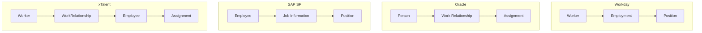

# Benchmark Analysis

> **Core HR (CO) Module** | vs Workday, SAP SuccessFactors, Oracle HCM Cloud
> Date: 2026-01-19

---

## Overview

This analysis compares xTalent Core HR architecture against three enterprise HCM leaders. Focus on data model design, not feature completeness.

---

## Comparative Summary

| Capability | Workday | SAP SF | Oracle | **xTalent** |
|------------|---------|--------|--------|-------------|
| **Worker Model** | Worker + Employment | Employee only | Person + Work Relationship | Worker + WorkRelationship + Employee |
| **Worker Types** | 2 (Employee, CW) | 1 (Employee) | 3 (Emp, CW, NW) | **4** (Emp, Contng, Contr, NW) |
| **Position Management** | Yes | Yes | Yes | Yes (planned) |
| **Job Management** | Yes | Yes | Yes | Yes (planned) |
| **Multi-Entity** | Global company | Multi-country | Multi-org | Multi-legal entity |
| **Effective Dating** | SCD-2 | SCD-2 | SCD-2 | SCD-2 |
| **Vietnam Compliance** | ❌ Limited | ❌ Limited | ❌ Limited | **✅ Native** |

---

## Detailed Comparison

### 1. Person/Worker Model

| Vendor | What | Why | xTalent Alignment |
|--------|------|-----|-------------------|
| **Workday** | Worker-centric with separate Employment | Clean separation of identity from employment | ✅ Same concept |
| **Oracle** | Single Person with Work Relationship | Unified record with flexible relationships | ✅ Similar, adds Employee layer |
| **SAP SF** | Employee-centric with Job Info | Simpler but less flexible | ⚠️ xTalent more flexible |

**xTalent Advantage**: Adds Employee entity between WorkRelationship and Assignment, enabling Vietnam-specific data (BHXH number, employee code) without conflating with identity or relationship type.

### 2. Worker Relationship Types

| Type | Workday | Oracle | SAP SF | **xTalent** |
|------|---------|--------|--------|-------------|
| Employee | ✅ | ✅ | ✅ | ✅ EMPLOYEE |
| Contingent Worker | ✅ | ✅ | ⚠️ Ext | ✅ CONTINGENT |
| Contractor | ⚠️ CW | ⚠️ CW | ❌ | ✅ CONTRACTOR |
| Non-Worker | ❌ | ✅ | ❌ | ✅ NON_WORKER |

**xTalent Advantage**: 4 distinct types vs competitors' 2-3 types, enabling cleaner business rules.

### 3. Position vs Job Management

| Aspect | Workday | Oracle | SAP SF | xTalent |
|--------|---------|--------|--------|---------|
| Position Management | ✅ Per Sup Org | ✅ Core feature | ✅ Optional | ✅ Planned |
| Job Management | ✅ Per Sup Org | ✅ Core feature | ✅ Default | ✅ Planned |
| Hybrid (both) | ✅ Yes | ✅ Yes | ⚠️ Limited | ✅ Planned |

**Recommendation**: Implement both models, allow configuration per BusinessUnit like Workday.

### 4. Contract Management

| Aspect | Workday | Oracle | SAP SF | **xTalent** |
|--------|---------|--------|--------|-------------|
| Contract types | Generic | Generic | Generic | **Vietnam-specific** |
| Duration limits | Configurable | Configurable | Configurable | **36 months hard rule** |
| Renewal tracking | ✅ | ✅ | ✅ | **2-renewal limit** |
| Probation rules | Basic | Basic | Basic | **By job level** |

**xTalent Advantage**: Native Vietnam Labor Code compliance, not configurable add-on.

---

## Negative Benchmarking

### What Competitors AVOID (and Why)

| What They Avoid | Vendor | Why | xTalent Decision |
|-----------------|--------|-----|------------------|
| **4+ Worker Types** | All | Complexity, rarely needed | ✅ Keep 4 - Vietnam needs clear CONTRACTOR category |
| **Separate Contract Entity** | Workday | Embedded in Employment | ✅ Keep separate - Vietnam contracts are legal documents |
| **Probation as Entity** | All | Treated as employment attribute | ✅ Agree - probation is Contract attribute |
| **Facility Hierarchy > 3 levels** | All | Diminishing value | ✅ Maintain 3 levels (Place→Location→WorkLocation) |
| **Complex Org Hierarchies** | SAP | Performance issues | ⚠️ Consider - limit hierarchy depth |

### Known Limitations to Avoid

| Limitation | Vendor | Issue | xTalent Mitigation |
|------------|--------|-------|-------------------|
| **Rigid contract types** | SAP | Hard to localize | Use flexible ContractTemplate |
| **Single employment model** | SAP | Can't mix Position/Job mgmt | Support both models |
| **Complex effective dating** | Oracle | Hard to query | Clear isCurrentFlag pattern |
| **Supervisor by person** | Workday | Changes with transfer | Use supervisorAssignmentId (not personId) |

---

## Design Philosophy Comparison

### Workday's Philosophy

> "Business Objects represent real-world entities with behaviors"

- Object-oriented data model
- Configurable business processes
- Worker as central concept

**xTalent Alignment**: ✅ Same philosophy - entities with actions, relationships, lifecycle

### Oracle's Philosophy

> "Flexible employment models for diverse workforce"

- Two-tier and three-tier models
- Work Relationship as key concept
- Multi-assignment support

**xTalent Alignment**: ✅ WorkRelationship concept identical

### SAP's Philosophy

> "Position Management for structured organizations"

- MDF-based configuration
- Job Information centrality
- Data propagation from Position

**xTalent Alignment**: ✅ Position → Assignment propagation similar

---

## Capability Lineage

### Core V1 (All Vendors Have)

- Worker/Employee identity
- Position management
- Basic assignment
- Org hierarchy
- Location management

### Evolution V2+ (Differentiators)

| Capability | Workday | Oracle | SAP | xTalent |
|------------|---------|--------|-----|---------|
| Skills graph | V2+ | V2+ | V3+ | Phase 1 ✅ |
| Career paths | V2+ | V2+ | V2+ | Phase 3 |
| Talent marketplace | V3+ | V3+ | V4+ | Phase 4 |
| AI-powered matching | V4+ | V4+ | V4+ | Future |

---

## Benchmark Matrix Summary

| Dimension | Workday | SAP SF | Oracle | xTalent | Notes |
|-----------|---------|--------|--------|---------|-------|
| **Data Model** | ⭐⭐⭐⭐⭐ | ⭐⭐⭐ | ⭐⭐⭐⭐ | ⭐⭐⭐⭐ | xTalent matches Workday philosophy |
| **Worker Types** | ⭐⭐⭐ | ⭐⭐ | ⭐⭐⭐⭐ | ⭐⭐⭐⭐⭐ | xTalent most comprehensive |
| **Localization** | ⭐⭐⭐ | ⭐⭐⭐ | ⭐⭐⭐ | ⭐⭐⭐⭐⭐ | Vietnam native |
| **Contract Mgmt** | ⭐⭐⭐ | ⭐⭐⭐ | ⭐⭐⭐ | ⭐⭐⭐⭐⭐ | Labor Code compliance |
| **Skills** | ⭐⭐⭐⭐⭐ | ⭐⭐⭐⭐ | ⭐⭐⭐⭐ | ⭐⭐⭐ | xTalent Phase 1 complete |
| **Integration** | ⭐⭐⭐⭐⭐ | ⭐⭐⭐⭐ | ⭐⭐⭐⭐ | ⭐⭐⭐ | Event patterns defined |

---

## Recommendations from Benchmarking

1. **Keep**: Worker → WorkRelationship → Employee hierarchy (matches Workday/Oracle)
2. **Keep**: 4 WorkRelationship types (more comprehensive than competitors)
3. **Add**: Hybrid Position/Job management like Workday
4. **Avoid**: Probation as contract type (treat as attribute)
5. **Avoid**: Deep org hierarchies (limit to 10 levels)
6. **Enhance**: Contract management with rule engine (exceeds competitors)
