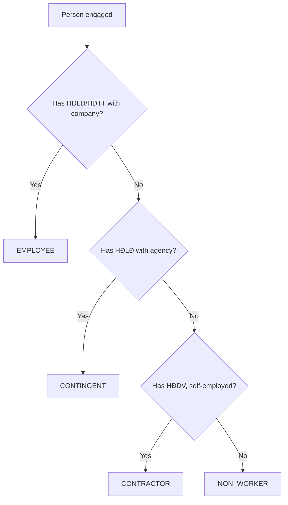

# Feature Analysis

> **Core HR (CO) Module** | WHY / WHAT / WHEN for Key Capabilities
> Date: 2026-01-19

---

## Overview

This document provides detailed analysis for key Core HR features using WHY (driver), WHAT (specification), and WHEN (phase) framework.

---

## 1. Worker Identity Management

| Aspect | Details |
|--------|---------|
| **WHY** | **Strategic**: Single source of truth for person identity across all HR modules |
| **Justification** | Prevents duplicate records, enables cross-entity employment, supports alumni tracking |
| **Priority** | Phase 1 ✅ Complete |

### WHAT: Feature Specification

| Input | Logic | Output |
|-------|-------|--------|
| Personal information (name, DOB, nationality) | Validate age ≥ 15, generate immutable ID | Worker record with UUID |
| Skill/Competency data | Validate against masters | WorkerSkill, WorkerCompetency records |
| Family/Dependent info | Link to Worker or create new | WorkerRelationship records |

### Edge Cases

| Case | Handling |
|------|----------|
| Duplicate detection | Match on name + DOB, present candidates |
| Name change (marriage) | Update via action, audit trail |
| Deceased worker | Status = inactive, trigger archive process |

### Blast Radius

| If This Changes | Impact |
|-----------------|--------|
| Worker ID | 🔴 High - breaks all employment links |
| Name fields | 🟡 Medium - payroll, contracts affected |
| DOB | 🟡 Medium - anniversary, retirement planning |

---

## 2. WorkRelationship Type Management

| Aspect | Details |
|--------|---------|
| **WHY** | **Regulatory**: Correct classification determines labor law applicability, SI/tax obligations |
| **Justification** | Vietnam Labor Code applies differently to employees vs contractors |
| **Priority** | Phase 2 (High Priority) |

### WHAT: Feature Specification

| Input | Logic | Output |
|-------|-------|--------|
| workerId, legalEntityCode, relationshipTypeCode | Validate: one active per type per entity | WorkRelationship |
| type = EMPLOYEE | Create Employee record | Employee linked to WorkRelationship |
| type = CONTINGENT/CONTRACTOR/NON_WORKER | No Employee record | WorkRelationship only |

### Type Decision Tree



### Change Readiness

| Change Type | Effort | Risk |
|-------------|--------|------|
| Add new type | 🟡 Medium | New type rarely needed |
| Convert type | 🔴 High | Triggers terminate/rehire workflow |
| Suspend relationship | 🟢 Low | Standard action |

---

## 3. Contract Management

| Aspect | Details |
|--------|---------|
| **WHY** | **Regulatory**: Vietnam Labor Code 2019 mandates specific contract types, durations, renewal limits |
| **Justification** | Non-compliance = contract void, legal penalties |
| **Priority** | Phase 2 (High Priority) |

### WHAT: Feature Specification

| Input | Logic | Output |
|-------|-------|--------|
| contractTypeCode, startDate, endDate | Validate: FIXED_TERM ≤ 36 months | Contract record |
| parentContractId, renewalType | Check: max 2 renewals before INDEFINITE | Linked Contract |
| probationDays, jobLevelCode | Validate: probation ≤ limit for level | Contract with probation attribute |

### Contract Type Rules

| Type | Duration | Auto-Convert | Renewal Limit |
|------|----------|--------------|---------------|
| INDEFINITE | No limit | - | - |
| FIXED_TERM | Max 36 months | After 30 days no new contract | 2 consecutive |

### Probation Validation Matrix

| Job Level | Max Days | Salary Min |
|-----------|----------|------------|
| Executive (Enterprise Law) | 180 | 85% |
| Professional (College+) | 60 | 85% |
| Skilled (Intermediate) | 30 | 85% |
| Other | 6 | 85% |

### Dependency Impact

| Upstream | This Feature | Downstream |
|----------|--------------|------------|
| Employee (requires) | Contract | Payroll (salary source) |
| ContractTemplate | Contract | Tax (category) |
| JobLevel | Contract (probation) | Benefits (eligibility) |

---

## 4. Assignment Management

| Aspect | Details |
|--------|---------|
| **WHY** | **Operational**: Links employee to organizational structure for reporting, cost allocation, work rules |
| **Justification** | Core of org chart, headcount, manager relationships |
| **Priority** | Phase 2 (High Priority) |

### WHAT: Feature Specification

| Input | Logic | Output |
|-------|-------|--------|
| employeeId, positionId, businessUnitId | Validate: position available, BU valid | Assignment |
| supervisorAssignmentId | Validate: no cycles in reporting chain | Linked Assignment |
| primaryLocationId | Link to WorkLocation | Assignment with location |

### Multi-Assignment Scenarios

| Scenario | Primary | Secondary | FTE |
|----------|---------|-----------|-----|
| Standard | Engineering | - | 1.0 |
| Matrix | Engineering | Project X | 0.8 + 0.2 |
| Transition | Old Role (ending) | New Role (starting) | 1.0 → 1.0 |

### Edge Cases

| Case | Handling |
|------|----------|
| Position over-filled | Block if maxIncumbents reached |
| Supervisor reports to subordinate | Block - cycle detected |
| Remote worker | WorkLocation = REMOTE type |
| Transfer mid-month | End old assignment, start new - prorate payroll |

---

## 5. Legal Entity Management

| Aspect | Details |
|--------|---------|
| **WHY** | **Regulatory**: Tax, statutory reporting, labor law jurisdictions determined by legal entity |
| **Justification** | Vietnam requires separate reporting per MST (tax ID) |
| **Priority** | Phase 2 |

### WHAT: Feature Specification

| Input | Logic | Output |
|-------|-------|--------|
| code, nameVi, typeId, countryCode | Validate: unique code, unique taxId per country | LegalEntity |
| parentId | Build hierarchy path | LegalEntity with path |
| representatives | Require at least one for activation | EntityRepresentative links |

### Entity Type Implications

| Type | Statutory | Payroll | Employees |
|------|-----------|---------|-----------|
| COMPANY | Full | Yes | Yes |
| BRANCH | Limited | Yes | Yes |
| SUBSIDIARY | Full (separate) | Yes | Yes |
| REPRESENTATIVE | None | No | No |

---

## 6. Business Unit Management

| Aspect | Details |
|--------|---------|
| **WHY** | **Operational**: Cost center allocation, org structure visibility |
| **Justification** | Separate legal structure (LegalEntity) from operational structure (BusinessUnit) |
| **Priority** | Phase 2 |

### WHAT: Feature Specification

| Input | Logic | Output |
|-------|-------|--------|
| code, name, legalEntityId, parentId | Validate: hierarchy consistency | BusinessUnit |
| costCenterCode | Link to finance | BusinessUnit with cost center |

---

## 7. Position Management

| Aspect | Details |
|--------|---------|
| **WHY** | **Strategic**: Headcount planning, budgeting, recruiting pipeline |
| **Justification** | Workday Position Management model for controlled staffing |
| **Priority** | Phase 3 |

### WHAT: Feature Specification

| Input | Logic | Output |
|-------|-------|--------|
| jobId, businessUnitId, maxIncumbents | Validate: job exists, BU exists | Position |
| positionId on Assignment | Decrement available slots | Assignment fills position |

### Position vs Job Comparison

| Aspect | Job | Position |
|--------|-----|----------|
| Abstraction | Generic role | Specific seat |
| Reusability | Many positions | One position |
| Headcount | Not tracked | Tracked |
| Example | "Software Engineer" | "SE #1234 in Team A" |

---

## 8. Eligibility Engine

| Aspect | Details |
|--------|---------|
| **WHY** | **Operational**: Rule-based eligibility for benefits, programs, leave types |
| **Justification** | Complex eligibility rules (tenure, level, location) require engine |
| **Priority** | Phase 4 |

### WHAT: Feature Specification

| Input | Logic | Output |
|-------|-------|--------|
| EligibilityProfile definition | Parse conditions | Stored ruleset |
| Employee context | Evaluate rules real-time | EligibilityEvaluation result |

### Rule Example

```yaml
profile: annual_leave_15_days
conditions:
  AND:
    - workRelationship.type: EMPLOYEE
    - employee.tenure_months: ">= 12"
    - contract.type: INDEFINITE
result:
  entitled_days: 15
```

---

## WHY-WHAT-WHEN Matrix Summary

| Feature | WHY (Driver) | WHAT (Core Logic) | WHEN (Phase) |
|---------|--------------|-------------------|--------------|
| Worker Identity | Strategic | UUID, validation, skills | L1 ✅ |
| WorkRelationship Type | Regulatory | 4-type classification | L1 |
| Contract Management | Regulatory | Type limits, probation rules | L1 |
| Assignment Management | Operational | Position + Location link | L1 |
| Legal Entity | Regulatory | Tax jurisdiction, statutory | L1 |
| Business Unit | Operational | Cost center, hierarchy | L1 |
| Position Management | Strategic | Headcount control | L2 |
| Job Catalog | Strategic | Role standardization | L2 |
| Career Paths | Strategic | Talent development | L3 |
| Eligibility Engine | Operational | Rule-based decisions | L3 |
| Talent Marketplace | Strategic | Internal mobility | L4 |
