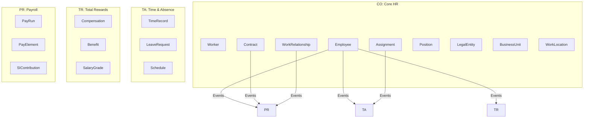
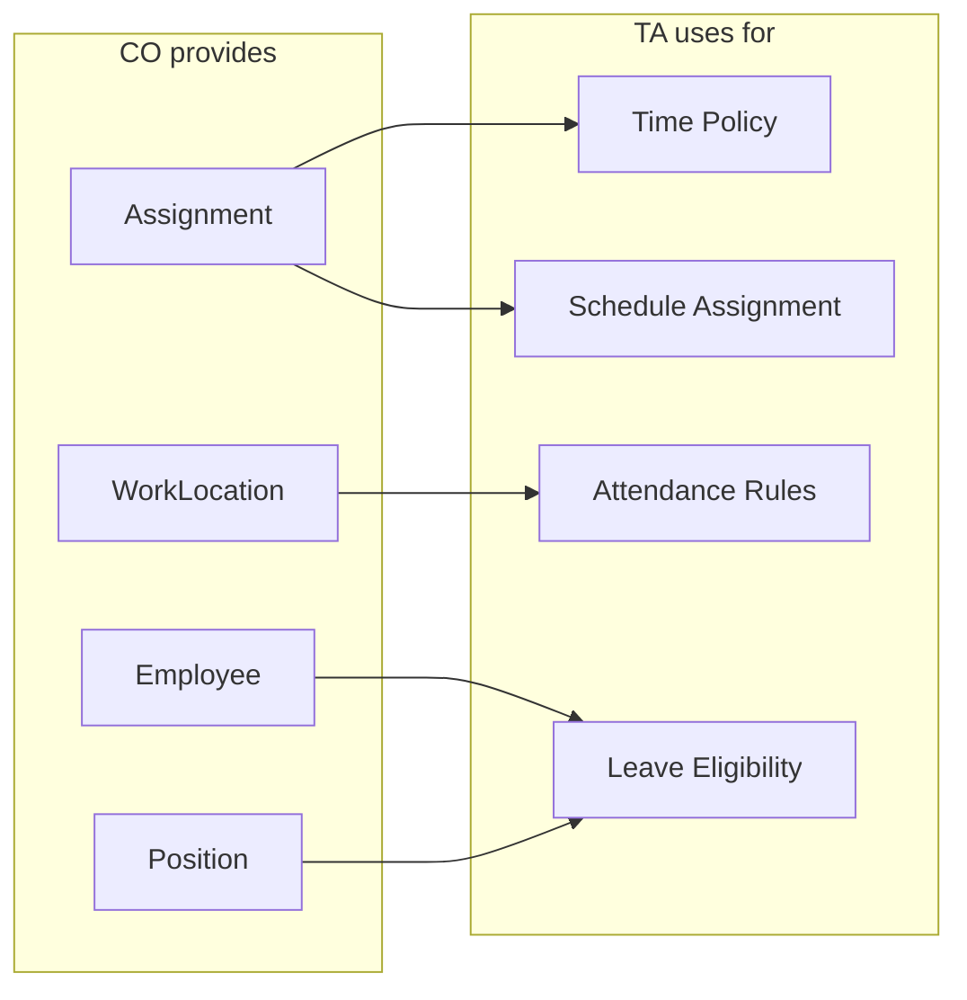
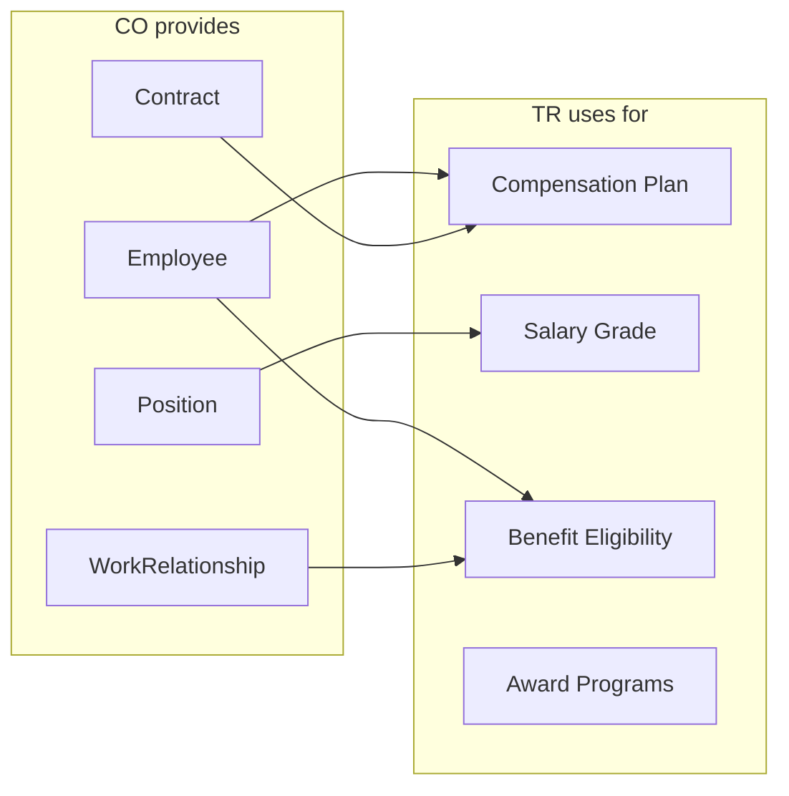
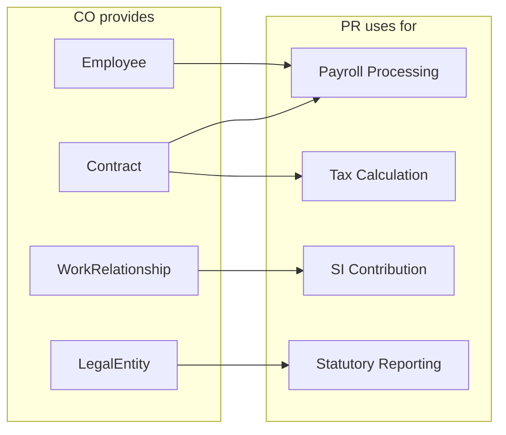
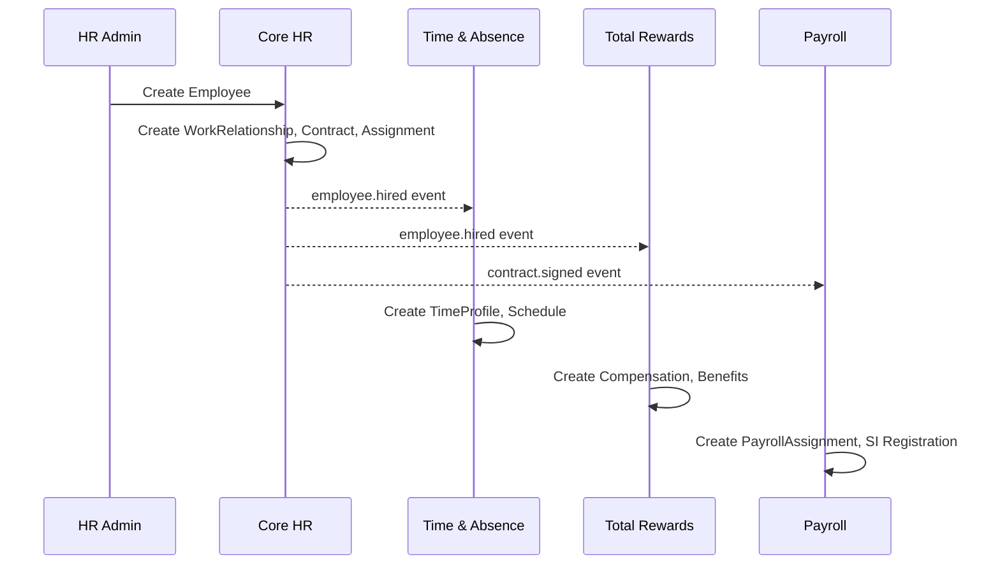
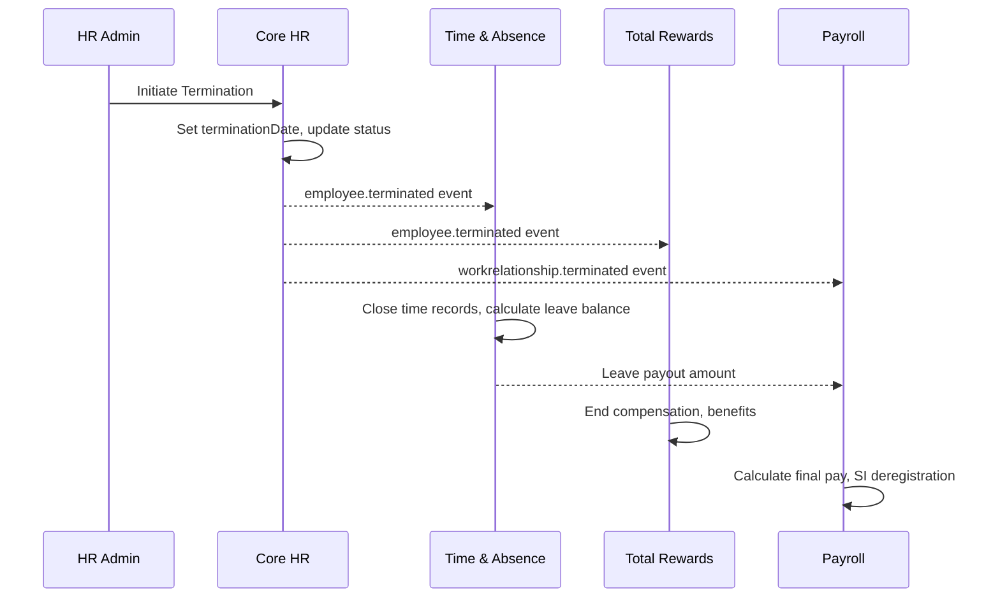

# Integration Map

> **Core HR (CO) Module** | Cross-Module Integration Architecture
> Date: 2026-01-19

---

## Overview

Core HR (CO) is the foundation module providing employee data to Time & Absence (TA), Total Rewards (TR), and Payroll (PR). This document defines integration patterns, event contracts, and data dependencies.



---

## Integration Patterns

### Pattern 1: API Sync (Real-time Queries)

| Use Case | Consumer | CO Endpoint | Data |
|----------|----------|-------------|------|
| Employee lookup | TA, TR, PR | `GET /employees/{id}` | Employee, Worker name |
| Position info | TR | `GET /positions/{id}` | Job, SalaryGrade |
| Assignment details | TA | `GET /assignments/{id}` | WorkLocation, Schedule |
| Manager lookup | All | `GET /assignments/{id}/supervisor` | Supervisor chain |

### Pattern 2: Event-Driven (Async Notifications)

| Event | Publisher | Consumers | Use Case |
|-------|-----------|-----------|----------|
| `employee.hired` | CO | TA, TR, PR | New employee setup |
| `employee.terminated` | CO | TA, TR, PR | Exit processing |
| `assignment.created` | CO | TA | Time rules assignment |
| `assignment.ended` | CO | TA | Stop time tracking |
| `contract.signed` | CO | PR | Salary setup |
| `contract.renewed` | CO | PR | Salary adjustment |
| `workrelationship.terminated` | CO | PR | Final pay processing |

### Pattern 3: Batch (Bulk Transfers)

| Use Case | From | To | Frequency |
|----------|------|-------|-----------|
| Headcount report | CO | Finance | Daily |
| Statutory report | CO | Government | Monthly |
| SI registration | CO | BHXH Portal | On-demand |
| Payroll data sync | CO | PR | Per pay period |

---

## Event Contract Specifications

### Event: employee.hired

```yaml
event: employee.hired
version: "1.0"
producer: CO
consumers: [TA, TR, PR]

payload:
  employeeId: string
  workerId: string
  legalEntityCode: string
  employeeCode: string
  hireDate: date
  workerCategoryCode: string
  employeeClassCode: string
  
  # Assignment context
  assignmentId: string
  positionId: string
  businessUnitId: string
  workLocationId: string
  managerId: string
  
  # Contract context
  contractId: string
  contractTypeCode: string
  probationEndDate: date?

consumer_actions:
  TA:
    - Create TimeProfile for employee
    - Assign default schedule based on WorkLocation
    - Initialize leave balances
  TR:
    - Create Compensation record
    - Determine benefit eligibility
    - Link to SalaryGrade via Position
  PR:
    - Create PayrollAssignment
    - Register for SI/tax
    - Add to next PayRun
```

### Event: employee.terminated

```yaml
event: employee.terminated
version: "1.0"
producer: CO
consumers: [TA, TR, PR]

payload:
  employeeId: string
  terminationDate: date
  terminationReasonCode: string
  lastWorkingDate: date
  finalPayDate: date
  
  # Entitlements
  unusedLeaveBalance: number
  severanceEligibility: boolean

consumer_actions:
  TA:
    - Close all active time records
    - Calculate final leave balance
    - Stop future schedule assignments
  TR:
    - End compensation record
    - Process benefit termination
    - Calculate final entitlements
  PR:
    - Calculate final pay
    - Include severance if eligible
    - Process SI de-registration
```

### Event: assignment.created

```yaml
event: assignment.created
version: "1.0"
producer: CO
consumers: [TA]

payload:
  assignmentId: string
  employeeId: string
  positionId: string
  businessUnitId: string
  workLocationId: string
  startDate: date
  isPrimary: boolean
  fte: number
  supervisorAssignmentId: string

consumer_actions:
  TA:
    - Determine time policy from WorkLocation
    - Assign shift schedule if applicable
    - Set attendance rules
```

### Event: contract.signed

```yaml
event: contract.signed
version: "1.0"
producer: CO
consumers: [PR]

payload:
  contractId: string
  employeeId: string
  contractTypeCode: string
  startDate: date
  endDate: date?
  
  # Salary info (from contract template)
  baseSalary: Money
  workScheduleTypeCode: string
  probationDays: number?
  probationSalaryPercent: number?

consumer_actions:
  PR:
    - Create SalaryElement from baseSalary
    - Apply probation salary if applicable
    - Set payroll calendar per schedule
```

### Event: workrelationship.terminated

```yaml
event: workrelationship.terminated
version: "1.0"
producer: CO
consumers: [PR]

payload:
  workRelationshipId: string
  workerId: string
  legalEntityCode: string
  relationshipTypeCode: string
  terminationDate: date
  terminationReasonCode: string

consumer_actions:
  PR:
    - If EMPLOYEE: Process final payroll
    - If EMPLOYEE: SI de-registration
    - Archive payroll history
```

---

## Data Dependency Graph

### CO → TA Dependencies



| CO Entity | TA Depends On | For |
|-----------|---------------|-----|
| Employee | Status, Class | Leave eligibility, active tracking |
| Assignment | Primary, Location | Schedule, time rules |
| WorkLocation | Type, Timezone | Attendance zones, clock policies |
| Position | Level, Category | Overtime eligibility |

### CO → TR Dependencies



| CO Entity | TR Depends On | For |
|-----------|---------------|-----|
| Employee | Tenure, Status | Compensation history |
| Position | Job, Grade | Salary range |
| Contract | Type, Dates | Salary effective dates |
| WorkRelationship | Type | Benefit eligibility (EMPLOYEE only) |

### CO → PR Dependencies



| CO Entity | PR Depends On | For |
|-----------|---------------|-----|
| Employee | Code, Status | Payroll inclusion |
| Contract | Salary, Schedule | Pay calculation |
| WorkRelationship | Type | SI applicability |
| LegalEntity | TaxId, Country | Tax jurisdiction |

---

## Cross-Module Data Flow

### Hire Flow



### Termination Flow



---

## API Contract Summary

| Endpoint | Method | Consumer | Response |
|----------|--------|----------|----------|
| `/api/v1/employees/{id}` | GET | TA, TR, PR | Employee with Worker details |
| `/api/v1/employees/{id}/assignment` | GET | TA | Current primary assignment |
| `/api/v1/employees/{id}/contract` | GET | PR | Active contract |
| `/api/v1/positions/{id}` | GET | TR | Position with Job, Grade |
| `/api/v1/work-locations/{id}` | GET | TA | WorkLocation with policies |
| `/api/v1/legal-entities/{code}` | GET | PR | LegalEntity for tax |

---

## Event Bus Configuration

| Topic | Partition Key | Retention | Consumers |
|-------|---------------|-----------|-----------|
| `co.employee.lifecycle` | employeeId | 7 days | TA, TR, PR |
| `co.assignment.changes` | assignmentId | 7 days | TA |
| `co.contract.events` | contractId | 30 days | PR |
| `co.workrelationship.events` | workRelationshipId | 30 days | PR |
