# Roadmap

> **Core HR (CO) Module** | Implementation Phases with NOW / NEXT / LATER Prioritization
> Date: 2026-01-19

---

## Overview

This roadmap aligns with the existing entity-index.yaml phases while prioritizing based on business value and dependencies.

---

## NOW: Phase 2 - Employment & Organization (L1)

**Timeline**: Immediate Priority  
**Goal**: Enable basic employment lifecycle management

### 2.1 Work Relationship Domain

| Entity | Priority | Dependencies | Deliverables |
|--------|----------|--------------|--------------|
| WorkRelationship | 🔴 Critical | Worker | Ontology, BRS, FRS |
| Employee | 🔴 Critical | WorkRelationship | Ontology, BRS, FRS |
| Contract | 🔴 Critical | Employee | Ontology, BRS with Labor Code rules |
| ContractTemplate | 🟡 High | - | Ontology |
| Assignment | 🔴 Critical | Employee, Position | Ontology, BRS, FRS |
| EmployeeIdentifier | 🟢 Medium | Employee | Ontology |
| GlobalAssignment | 🟢 Medium | Assignment | Ontology |

**Milestone 2.1**: ⬜ Employment lifecycle (hire, transfer, terminate) operational

### 2.2 Organization Domain

| Entity | Priority | Dependencies | Deliverables |
|--------|----------|--------------|--------------|
| LegalEntity | 🔴 Critical | - | Ontology, BRS |
| BusinessUnit | 🔴 Critical | LegalEntity | Ontology |
| OrgRelationSchema | 🟡 High | - | Ontology |
| OrgRelationType | 🟡 High | OrgRelationSchema | Ontology |
| OrgRelationEdge | 🟡 High | OrgRelationType | Ontology |
| EntityProfile | 🟢 Medium | LegalEntity | Ontology |
| EntityRepresentative | 🟢 Medium | LegalEntity, Worker | Ontology |
| EntityLicense | 🟢 Low | LegalEntity | Ontology |
| EntityBankAccount | 🟢 Low | LegalEntity | Ontology |

**Milestone 2.2**: ⬜ Multi-company, multi-department structure operational

### Phase 2 Exit Criteria

- [ ] Employee can be hired with WorkRelationship and Contract
- [ ] Assignment links Employee to Position and WorkLocation
- [ ] Contract validation per Vietnam Labor Code (types, duration, probation)
- [ ] LegalEntity and BusinessUnit hierarchy operational
- [ ] Events published to TA, TR, PR

---

## NEXT: Phase 3 - Job, Position & Facility (L2)

**Timeline**: After Phase 2 complete  
**Goal**: Enable structured position management and facility tracking

### 3.1 Job & Position Domain

| Entity | Priority | Dependencies | Deliverables |
|--------|----------|--------------|--------------|
| Job | 🔴 Critical | - | Ontology |
| Position | 🔴 Critical | Job, BusinessUnit | Ontology, BRS |
| JobTaxonomy | 🟡 High | TaxonomyTree | Ontology |
| JobProfile | 🟡 High | Job | Ontology |
| JobLevel | 🟡 High | - | Reference data |
| JobGrade | 🟡 High | - | Reference data |
| TaxonomyTree | 🟢 Medium | - | Ontology |
| JobTree | 🟢 Medium | Job | Ontology |
| CareerPath | 🟢 Medium | JobProgression | Ontology |
| JobProgression | 🟢 Medium | Job | Ontology |
| JobLevelPolicy | 🟢 Low | JobLevel | Reference data |

**Milestone 3.1**: ⬜ Position Management model operational (Workday-style)

### 3.2 Facility Domain

| Entity | Priority | Dependencies | Deliverables |
|--------|----------|--------------|--------------|
| Place | 🟡 High | - | Ontology |
| Location | 🟡 High | Place | Ontology |
| WorkLocation | 🔴 Critical | Location | Ontology, BRS |

**Milestone 3.2**: ⬜ Place → Location → WorkLocation hierarchy operational

### 3.3 Reference Data (Phase 3)

| Entity | Priority | Status |
|--------|----------|--------|
| EntityType | 🟡 High | Planned |
| BusinessUnitType | 🟡 High | Planned |
| VendorCompany | 🟢 Medium | Planned |

### Phase 3 Exit Criteria

- [ ] Job catalog with taxonomy and profiles
- [ ] Position Management: create position before hire
- [ ] Job Management: auto-create position on hire
- [ ] WorkLocation linked to assignments
- [ ] Facility hierarchy supports time/attendance rules

---

## LATER: Phase 4 - Supporting Features (L3-L4)

**Timeline**: After Phase 3 complete  
**Goal**: Enable advanced features for eligibility and talent mobility

### 4.1 Eligibility Engine (L3)

| Entity | Priority | Dependencies | Deliverables |
|--------|----------|--------------|--------------|
| EligibilityProfile | 🟡 High | - | Ontology, Rule engine |
| EligibilityMember | 🟡 High | EligibilityProfile | Ontology |
| EligibilityEvaluation | 🟡 High | EligibilityProfile | Ontology |

**Use Cases**:
- Leave eligibility by tenure and contract type
- Benefit eligibility by WorkRelationship type
- Training program eligibility by competencies

### 4.2 Talent Marketplace (L4)

| Entity | Priority | Dependencies | Deliverables |
|--------|----------|--------------|--------------|
| TalentMarket | 🟢 Medium | - | Ontology |
| TalentMarketParameter | 🟢 Medium | TalentMarket | Ontology |
| TalentMarketLocalization | 🟢 Low | TalentMarket | Ontology |
| Opportunity | 🟢 Medium | TalentMarket | Ontology |
| OpportunitySkill | 🟢 Medium | Opportunity, SkillMaster | Ontology |
| OpportunityApplication | 🟢 Medium | Opportunity, Worker | Ontology |

**Use Cases**:
- Internal job postings
- Project staffing requests
- Gig/project opportunity matching

### 4.3 Supporting Entities (L4)

| Entity | Priority | Dependencies |
|--------|----------|--------------|
| DependentRegistration | 🟢 Medium | WorkerRelationship |

---

## Maturity Model

| Level | Name | Core HR Capabilities | Phase |
|-------|------|---------------------|-------|
| **L1** | Core | Worker, Employment, Org Structure | Phase 1-2 |
| **L2** | Standard | Position Mgmt, Facility, Career Paths | Phase 3 |
| **L3** | Automated | Eligibility Engine, Rule-based decisions | Phase 4 |
| **L4** | Intelligent | Talent Marketplace, AI matching | Future |

---

## Cost of Delay Analysis

| Feature | Delay Impact | Risk |
|---------|--------------|------|
| Employment lifecycle | Cannot onboard employees | 🔴 Critical |
| Contract management | Labor law non-compliance | 🔴 Critical |
| Assignment management | No org chart, no reporting | 🔴 Critical |
| Position management | Uncontrolled headcount | 🟡 High |
| Eligibility engine | Manual benefit decisions | 🟢 Medium |
| Talent marketplace | No internal mobility | 🟢 Low |

---

## Dependencies Visualization

```mermaid
flowchart TD
    subgraph "Phase 1 ✅"
        Worker
        Skills[Skills & Competencies]
        MasterData[Master Data]
    end
    
    subgraph "Phase 2 🔄"
        WorkRelationship --> Worker
        Employee --> WorkRelationship
        Contract --> Employee
        Assignment --> Employee
        LegalEntity
        BusinessUnit --> LegalEntity
    end
    
    subgraph "Phase 3"
        Job
        Position --> Job
        Position --> BusinessUnit
        Assignment --> Position
        Place
        Location --> Place
        WorkLocation --> Location
        Assignment --> WorkLocation
    end
    
    subgraph "Phase 4"
        Eligibility[Eligibility Profile]
        TalentMarket[Talent Marketplace]
    end
```

---

## Timeline Estimates

| Phase | Entities | Est. Duration | Dependencies |
|-------|----------|---------------|--------------|
| Phase 2.1 (WorkRel) | 7 | 4-6 weeks | Phase 1 ✅ |
| Phase 2.2 (Org) | 9 | 3-4 weeks | Phase 1 ✅ |
| Phase 3.1 (Job/Pos) | 11 | 4-6 weeks | Phase 2 |
| Phase 3.2 (Facility) | 3 | 2 weeks | Phase 2 |
| Phase 4.1 (Eligibility) | 3 | 3-4 weeks | Phase 3 |
| Phase 4.2 (Talent) | 6 | 4-6 weeks | Phase 3 |

**Total Remaining**: ~20-28 weeks for full Phase 2-4 completion
