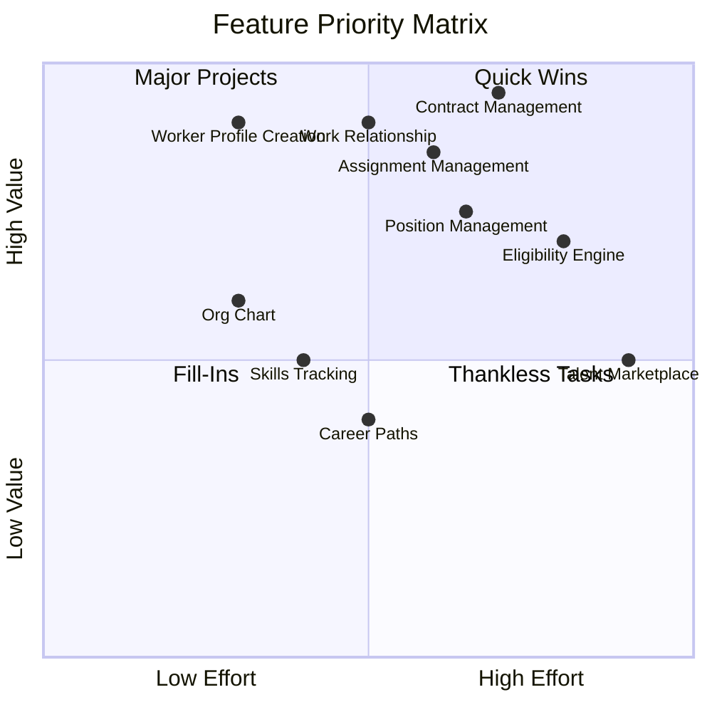

# Core HR Feature Research Report

> **Module**: Core HR (CO)  
> **Research Type**: Solution Architecture Feature Analysis  
> **Date**: 2026-01-19

---

## 1. Executive Summary

This research identifies and describes all essential features for the Core HR (CO) module, organized by capability domain. Each feature includes business context, requirements, Vietnam-specific considerations, and competitor benchmarks.

### Feature Statistics

| Capability | Features | MUST | SHOULD | COULD |
|------------|----------|------|--------|-------|
| Person Management | 12 | 8 | 3 | 1 |
| Work Relationship Management | 8 | 6 | 2 | 0 |
| Contract Management | 10 | 8 | 2 | 0 |
| Assignment Management | 8 | 6 | 2 | 0 |
| Organization Structure | 10 | 6 | 3 | 1 |
| Job & Position Management | 12 | 7 | 4 | 1 |
| Facility Management | 6 | 3 | 2 | 1 |
| Eligibility Engine | 5 | 3 | 2 | 0 |
| Master Data Management | 8 | 5 | 2 | 1 |
| **Total** | **79** | **52** | **22** | **5** |

---

## 2. Person Management (01-PERSON)

### Business Context

Person management is the foundation of Core HR, establishing the identity of individuals who interact with the organization. In Vietnam, this includes compliance with:
- **Decree 13/2023/NĐ-CP**: Personal data protection
- **Labor Code 2019**: Employment age requirements (18+ for regular work, 15+ for some jobs)
- **BHXH Requirements**: Identification for social insurance

### Features

#### F-PER-001: Worker Profile Creation

| Aspect | Details |
|--------|---------|
| **Description** | Create and maintain lifetime worker identity record |
| **Priority** | MUST |
| **User Story** | As an HR Admin, I want to create a worker profile so that I can track a person's identity across all employment relationships |
| **Business Context** | Worker is the permanent identity. Same person can have multiple employments. Supports rehire, multi-entity employment, and alumni tracking. |
| **Vietnam Compliance** | Collect CCCD/CMND (National ID) per BHXH requirements |
| **Competitor Reference** | Workday Worker, Oracle Person, SAP Employee |

**Requirements**:
- Immutable worker ID (UUID)
- Personal information (name, DOB, gender, nationality)
- Contact information (email, phone, address)
- National ID and passport tracking
- Photo management
- Data classification enforcement

**Business Rules**:
| Rule | Description |
|------|-------------|
| BR-PER-001 | Worker ID is immutable after creation |
| BR-PER-002 | DOB must result in age ≥ 15 (Vietnam law) |
| BR-PER-003 | National ID must be unique within country |
| BR-PER-004 | At least one contact method required |

---

#### F-PER-002: Worker Profile Update

| Aspect | Details |
|--------|---------|
| **Description** | Update worker personal information with audit trail |
| **Priority** | MUST |
| **User Story** | As an Employee, I want to update my personal information so that my records are accurate |
| **Business Context** | Self-service enables employees to maintain their own data. Some fields require approval. |
| **Vietnam Compliance** | Name changes require legal documentation (marriage certificate) |

**Requirements**:
- Self-service update for non-sensitive fields
- Approval workflow for sensitive fields (name, DOB, National ID)
- Complete audit trail for all changes
- Effective dating for historical tracking

---

#### F-PER-003: Contact Management

| Aspect | Details |
|--------|---------|
| **Description** | Manage multiple contact methods (email, phone, address) |
| **Priority** | MUST |
| **User Story** | As an HR Admin, I want to manage employee contacts so that we can reach them |
| **Business Context** | Multiple contact types needed: work, personal, emergency. Validation varies by type. |

**Requirements**:
- Multiple addresses (home, temporary, mailing)
- Multiple phone numbers with type classification
- Email addresses with primary designation
- Emergency contact information
- Address validation per Vietnam format (province/district/ward)

---

#### F-PER-004: Document Management

| Aspect | Details |
|--------|---------|
| **Description** | Store and track identity and employment documents |
| **Priority** | MUST |
| **User Story** | As an HR Admin, I want to manage worker documents so that compliance records are maintained |
| **Business Context** | Vietnam requires retention of ID copies, contracts, certifications for BHXH audits |
| **Vietnam Compliance** | CCCD/CMND copies, work permits for foreigners, degree certificates |

**Requirements**:
- Document upload and storage (encrypted)
- Document type classification
- Expiry date tracking and alerts
- Version management
- Access control per data classification

**Business Rules**:
| Rule | Description |
|------|-------------|
| BR-PER-010 | PII documents encrypted at rest (AES-256) |
| BR-PER-011 | Document access logged for audit |
| BR-PER-012 | Expiry alerts 30/14/7 days before |

---

#### F-PER-005: Family & Dependent Management

| Aspect | Details |
|--------|---------|
| **Description** | Track family members and dependents for benefits and tax |
| **Priority** | MUST |
| **User Story** | As an Employee, I want to register my dependents so that they can be enrolled in benefits |
| **Business Context** | Vietnam PIT allows dependent deductions (4.4M VND/dependent/month). Benefits eligibility depends on relationship. |
| **Vietnam Compliance** | Dependent registration for PIT deductions per Circular 111/2013/TT-BTC |

**Requirements**:
- Relationship types (spouse, child, parent, sibling)
- Dependent status (active, inactive)
- Tax dependent eligibility tracking
- Beneficiary designation with percentage allocation
- Emergency contact designation

**Business Rules**:
| Rule | Description |
|------|-------------|
| BR-PER-020 | Beneficiary allocation must sum to 100% |
| BR-PER-021 | Tax dependents require supporting documents |
| BR-PER-022 | Child dependents limited by age (18, or 23 if student) |

---

#### F-PER-006: Skills Management

| Aspect | Details |
|--------|---------|
| **Description** | Track worker skills and proficiency levels |
| **Priority** | SHOULD |
| **User Story** | As a Manager, I want to track team skills so that I can plan projects and development |
| **Business Context** | Skills data feeds talent marketplace, project staffing, training recommendations |
| **Competitor Reference** | Workday Skills Cloud, LinkedIn Skills |

**Requirements**:
- Skills from master dictionary
- Proficiency levels (1-5 or Beginner to Expert)
- Self-declared vs verified skills
- Skill endorsements
- Skill gap analysis

---

#### F-PER-007: Competency Management

| Aspect | Details |
|--------|---------|
| **Description** | Track behavioral competencies for performance management |
| **Priority** | SHOULD |
| **User Story** | As an HR Admin, I want to define competency models so that performance can be assessed |
| **Business Context** | Competencies differ from skills - they are observable behaviors. Used for performance reviews, succession planning. |

**Requirements**:
- Competency frameworks by job family
- Behavioral indicators per level
- Assessment methods (self, manager, 360)
- Link to performance goals

---

#### F-PER-008: Qualification & Certification Tracking

| Aspect | Details |
|--------|---------|
| **Description** | Track education, certifications, and professional licenses |
| **Priority** | MUST |
| **User Story** | As an HR Admin, I want to track qualifications so that job requirements can be verified |
| **Business Context** | Certain roles require specific certifications. Expiry tracking critical for compliance. |
| **Vietnam Compliance** | Some roles require government-issued licenses (e.g., accountant, lawyer) |

**Requirements**:
- Education history (institution, degree, field, year)
- Professional certifications with expiry
- License tracking with renewal alerts
- Verification status

---

#### F-PER-009: Worker Interest Tracking

| Aspect | Details |
|--------|---------|
| **Description** | Track career interests and development preferences |
| **Priority** | COULD |
| **User Story** | As an Employee, I want to indicate my career interests so that I can receive relevant opportunities |
| **Business Context** | Supports internal mobility, talent marketplace, mentoring programs |

**Requirements**:
- Job family interests
- Location preferences
- Development interests (skills to acquire)
- Mobility preferences (willingness to relocate)

---

## 3. Work Relationship Management (02-WORK-RELATIONSHIP)

### Business Context

Work Relationship defines HOW a person is engaged with the organization. This is critical for:
- **Legal classification**: Determines applicable labor law
- **Tax treatment**: Employee vs contractor taxes
- **Benefits eligibility**: Only EMPLOYEE type gets benefits
- **Social insurance**: Only EMPLOYEE type requires BHXH

### Features

#### F-WR-001: Work Relationship Creation

| Aspect | Details |
|--------|---------|
| **Description** | Establish work relationship between worker and legal entity |
| **Priority** | MUST |
| **User Story** | As an HR Admin, I want to create a work relationship so that I can track how a person is engaged |
| **Business Context** | 4 types: EMPLOYEE, CONTINGENT, CONTRACTOR, NON_WORKER. Type determines downstream processing. |
| **Vietnam Compliance** | Type must align with actual legal relationship per Labor Code |

**Requirements**:
- Link to Worker and LegalEntity
- Relationship type selection
- Start date and expected end date
- Primary relationship designation
- Status tracking (ACTIVE, SUSPENDED, TERMINATED)

**Business Rules**:
| Rule | Description |
|------|-------------|
| BR-WR-001 | One active EMPLOYEE relationship per legal entity per worker |
| BR-WR-002 | EMPLOYEE type requires Employee entity creation |
| BR-WR-003 | Start date cannot be in future (for ACTIVE status) |

---

#### F-WR-002: Work Relationship Type Change

| Aspect | Details |
|--------|---------|
| **Description** | Convert between relationship types (e.g., contractor to employee) |
| **Priority** | SHOULD |
| **User Story** | As an HR Admin, I want to convert a contractor to employee so that we can onboard them permanently |
| **Business Context** | Common scenario: contractor performs well, company wants to hire. Requires ending old relationship, creating new. |

**Requirements**:
- End current relationship
- Create new relationship of new type
- Transfer relevant data
- Maintain historical link

---

#### F-WR-003: Work Relationship Suspension

| Aspect | Details |
|--------|---------|
| **Description** | Temporarily suspend work relationship (e.g., leave of absence, disciplinary) |
| **Priority** | MUST |
| **User Story** | As an HR Admin, I want to suspend a work relationship so that we can track unpaid leave or disciplinary hold |
| **Business Context** | Different from termination - suspension can be reversed. Status = SUSPENDED, endDate remains null. |
| **Vietnam Compliance** | Disciplinary suspension per Article 124 Labor Code (max 15 days) |

**Requirements**:
- Suspension reason tracking
- Expected return date
- Reactivation workflow
- Impact on payroll/benefits

---

#### F-WR-004: Work Relationship Termination

| Aspect | Details |
|--------|---------|
| **Description** | End work relationship permanently |
| **Priority** | MUST |
| **User Story** | As an HR Admin, I want to terminate a work relationship so that we can process offboarding |
| **Business Context** | Terminal state - no reactivation. Sets endDate. Triggers offboarding workflows. |
| **Vietnam Compliance** | 24 termination grounds per Article 34-36 Labor Code. Notice periods required. |

**Requirements**:
- Termination reason (structured)
- Termination date
- Last working date
- Notice period calculation
- Final settlement trigger

**Business Rules**:
| Rule | Description |
|------|-------------|
| BR-WR-010 | Termination reason required from allowed list |
| BR-WR-011 | Notice period per contract type and tenure |
| BR-WR-012 | Termination triggers Employee status update |

---

#### F-WR-005: Rehire Management

| Aspect | Details |
|--------|---------|
| **Description** | Handle returning workers (boomerang employees) |
| **Priority** | MUST |
| **User Story** | As an HR Admin, I want to rehire a former employee so that we can bring back talent |
| **Business Context** | Same Worker, new WorkRelationship. Seniority policy determines if prior service counts. |

**Requirements**:
- Detect prior employment
- Link new relationship to same Worker
- Seniority calculation options (reset vs continuous)
- Prior employment visibility

---

## 4. Contract Management (02-CONTRACT)

### Business Context

Employment contracts are the legal foundation of employment in Vietnam. The Labor Code 2019 specifies:
- **Two contract types**: Indefinite-term and Definite-term (max 36 months)
- **Renewal limits**: Max 2 consecutive fixed-term, 3rd must be indefinite
- **Probation rules**: 6-180 days depending on job level

### Features

#### F-CON-001: Contract Creation

| Aspect | Details |
|--------|---------|
| **Description** | Create employment contract with legal terms |
| **Priority** | MUST |
| **User Story** | As an HR Admin, I want to create an employment contract so that terms are documented |
| **Business Context** | Legal requirement per Vietnam Labor Code. Must include: salary, position, working hours, location, term. |
| **Vietnam Compliance** | Article 21 Labor Code specifies required contract content |

**Requirements**:
- Contract type (INDEFINITE, FIXED_TERM)
- Contract number generation
- Start date and end date (for fixed-term)
- Salary and compensation terms
- Working hours and schedule
- Position and work location
- Probation terms (if applicable)

**Business Rules**:
| Rule | Description |
|------|-------------|
| BR-CON-001 | FIXED_TERM max 36 months |
| BR-CON-002 | Contract number unique |
| BR-CON-003 | Start date required, end date for FIXED_TERM |

---

#### F-CON-002: Contract Template Management

| Aspect | Details |
|--------|---------|
| **Description** | Define reusable contract templates with standard terms |
| **Priority** | SHOULD |
| **User Story** | As an HR Admin, I want to use contract templates so that contracts are consistent |
| **Business Context** | Templates ensure legal compliance and speed up contract creation |

**Requirements**:
- Template by contract type
- Default probation periods by job level
- Standard clauses
- Variable placeholders (salary, name, position)
- Template versioning

---

#### F-CON-003: Probation Management

| Aspect | Details |
|--------|---------|
| **Description** | Track probation period and outcomes |
| **Priority** | MUST |
| **User Story** | As an HR Admin, I want to track probation so that we can evaluate new hires |
| **Business Context** | Probation allows either party to terminate with 3 days notice. Salary minimum 85% of official. |
| **Vietnam Compliance** | Article 24-27 Labor Code governs probation |

**Requirements**:
- Probation start and end date
- Probation salary (≥85% of official)
- Probation evaluation workflow
- Confirmation or termination outcome
- Extension (if allowed by law)

**Business Rules**:
| Rule | Description |
|------|-------------|
| BR-CON-010 | Probation max by job level (180/60/30/6 days) |
| BR-CON-011 | Probation salary ≥ 85% of official |
| BR-CON-012 | Only one probation per job per worker |

---

#### F-CON-004: Contract Amendment

| Aspect | Details |
|--------|---------|
| **Description** | Modify contract terms (salary change, position change) |
| **Priority** | MUST |
| **User Story** | As an HR Admin, I want to amend a contract so that changes are documented |
| **Business Context** | Any change to material terms requires written amendment |
| **Vietnam Compliance** | Article 33 requires written amendment for changes |

**Requirements**:
- Amendment types (salary, position, schedule)
- Link to parent contract
- Effective date
- Changed terms tracking
- Audit trail

---

#### F-CON-005: Contract Renewal

| Aspect | Details |
|--------|---------|
| **Description** | Renew expiring fixed-term contract |
| **Priority** | MUST |
| **User Story** | As an HR Admin, I want to renew a contract so that employment continues |
| **Business Context** | Max 2 consecutive FIXED_TERM. Third must be INDEFINITE per Labor Code. |
| **Vietnam Compliance** | Article 20 limits to 2 renewals |

**Requirements**:
- Track renewal count
- Alert before expiry (30 days)
- Auto-convert prompt after 2nd renewal
- 30-day grace period handling
- Renewal reason

**Business Rules**:
| Rule | Description |
|------|-------------|
| BR-CON-020 | Max 2 consecutive FIXED_TERM renewals |
| BR-CON-021 | Alert at 30 days before expiry |
| BR-CON-022 | 3rd renewal must be INDEFINITE |

---

#### F-CON-006: Contract Expiry Handling

| Aspect | Details |
|--------|---------|
| **Description** | Manage contract end-of-term scenarios |
| **Priority** | MUST |
| **User Story** | As an HR Admin, I want to handle contract expiry so that we take appropriate action |
| **Business Context** | If work continues 30+ days without new contract, becomes INDEFINITE per law |
| **Vietnam Compliance** | Article 20 auto-conversion rule |

**Requirements**:
- Expiry notification workflow
- Decision tracking (renew, terminate, convert)
- 30-day countdown tracking
- Auto-status update if no action

---

## 5. Assignment Management (02-ASSIGNMENT)

### Business Context

Assignments link employees to organizational structure (position, department, location, manager). This determines:
- **Reporting line**: Who they report to
- **Cost center**: Where costs are allocated
- **Time policies**: Which schedule/rules apply
- **Access**: What systems/data they can access

### Features

#### F-ASG-001: Assignment Creation

| Aspect | Details |
|--------|---------|
| **Description** | Assign employee to position and organizational unit |
| **Priority** | MUST |
| **User Story** | As an HR Admin, I want to create an assignment so that the employee has a role |
| **Business Context** | Assignment is the operational placement. Connects employee to job, position, department, location, manager. |

**Requirements**:
- Link to Employee
- Position assignment (optional for job-based staffing)
- Business unit assignment (required)
- Work location assignment
- Supervisor assignment
- FTE allocation
- Primary/secondary designation
- Start date and reason

**Business Rules**:
| Rule | Description |
|------|-------------|
| BR-ASG-001 | Exactly one primary assignment per employee |
| BR-ASG-002 | Business unit required |
| BR-ASG-003 | Total FTE ≤ 1.0 across all assignments |

---

#### F-ASG-002: Assignment Transfer

| Aspect | Details |
|--------|---------|
| **Description** | Move employee to new position or department |
| **Priority** | MUST |
| **User Story** | As an HR Admin, I want to transfer an employee so that they can move to a new role |
| **Business Context** | Creates new assignment, ends old. May or may not change salary/grade. |

**Requirements**:
- End current assignment
- Create new assignment
- Transfer reason
- Effective date
- Compensation change option
- Manager notification

---

#### F-ASG-003: Assignment Promotion

| Aspect | Details |
|--------|---------|
| **Description** | Promote employee to higher level position |
| **Priority** | MUST |
| **User Story** | As an HR Admin, I want to promote an employee so that their advancement is recorded |
| **Business Context** | Special case of transfer with grade/level increase. May require contract amendment for salary change. |

**Requirements**:
- New position at higher level
- Salary adjustment
- Effective date
- Promotion reason
- Link to contract amendment (if salary changes)

---

#### F-ASG-004: Secondary Assignment Management

| Aspect | Details |
|--------|---------|
| **Description** | Manage additional assignments (matrix organizations) |
| **Priority** | SHOULD |
| **User Story** | As an HR Admin, I want to assign an employee to a project so that matrix reporting is captured |
| **Business Context** | Supports matrix organizations where employee reports to multiple managers |

**Requirements**:
- Multiple concurrent assignments
- Primary vs secondary designation
- Dotted-line vs solid-line reporting
- FTE allocation per assignment
- Project-based assignments

---

#### F-ASG-005: Reporting Chain Management

| Aspect | Details |
|--------|---------|
| **Description** | Define and display reporting relationships |
| **Priority** | MUST |
| **User Story** | As an Employee, I want to see my reporting chain so that I know escalation paths |
| **Business Context** | Supervisor chain built from assignments. Used for approvals, org chart, delegation. |

**Requirements**:
- Supervisor assignment (by assignment, not person)
- Reporting chain calculation (recursive)
- Org chart generation
- Span of control metrics
- Acting manager designation

---

## 6. Organization Structure (03-ORGANIZATION)

### Business Context

Organization structure defines the legal and operational framework:
- **Legal Entity**: Company, branch, subsidiary
- **Business Unit**: Department, team, cost center
- **Hierarchy**: Reporting relationships

### Features

#### F-ORG-001: Legal Entity Management

| Aspect | Details |
|--------|---------|
| **Description** | Configure legal entities (companies, branches) |
| **Priority** | MUST |
| **User Story** | As a System Admin, I want to configure legal entities so that multi-company is supported |
| **Business Context** | Legal entity determines tax jurisdiction, labor law, statutory reporting. All employees belong to one LE. |
| **Vietnam Compliance** | LE must have MST (tax ID) for statutory reporting |

**Requirements**:
- Entity types (COMPANY, BRANCH, SUBSIDIARY, REPRESENTATIVE)
- Vietnamese and English names
- Tax ID (MST)
- Country and currency
- Legal representative
- Entity hierarchy (parent-child)

#### F-ORG-002: Business Unit Management

| Aspect | Details |
|--------|---------|
| **Description** | Manage operational units (departments, teams) |
| **Priority** | MUST |
| **User Story** | As an HR Admin, I want to manage business units so that org structure is defined |
| **Business Context** | BU is operational structure (separate from legal). Defines cost centers, manager responsibility. |
| **Competitor Reference** | Workday Supervisory Organization |

**Requirements**:
- Unit code and name
- Unit type (Division, Department, Team)
- Parent hierarchy
- Owning legal entity
- Manager assignment
- Cost center link
- Active/inactive status

---

#### F-ORG-003: Organization Hierarchy Management

| Aspect | Details |
|--------|---------|
| **Description** | Define and maintain org hierarchies |
| **Priority** | MUST |
| **User Story** | As an HR Admin, I want to define hierarchies so that reporting is clear |
| **Business Context** | Multiple hierarchy types possible (operational, cost center, geographic) |

**Requirements**:
- Hierarchy types (reporting, cost center, location)
- Tree structure with no cycles
- Effective dating
- Hierarchy visualization
- Reorganization support

---

#### F-ORG-004: Organization Chart Visualization

| Aspect | Details |
|--------|---------|
| **Description** | Display interactive organization chart |
| **Priority** | MUST |
| **User Story** | As an Employee, I want to view the org chart so that I understand the structure |
| **Business Context** | Essential for navigation, understanding reporting, finding colleagues |

**Requirements**:
- Interactive tree view
- Search and filter
- Click to view profile
- Export to PDF/image
- Multiple views (by BU, by manager)

---

## 7. Job & Position Management (04-JOB-POSITION)

### Business Context

Jobs and Positions are the foundation of workforce planning:
- **Job**: Generic role definition (e.g., "Software Engineer")
- **Position**: Specific seat in org (e.g., "SE #1234 in Team A")

### Features

#### F-JOB-001: Job Catalog Management

| Aspect | Details |
|--------|---------|
| **Description** | Define and maintain job definitions |
| **Priority** | MUST |
| **User Story** | As an HR Admin, I want to define jobs so that positions can be created |
| **Business Context** | Job defines the role independent of who fills it. Includes requirements, responsibilities, compensation band. |
| **Competitor Reference** | Workday Job Profile |

**Requirements**:
- Job code and title
- Job family and subfamily
- Job level (grade)
- Job description
- Required skills and competencies
- Salary range
- Status (active/inactive)

---

#### F-JOB-002: Job Taxonomy Management

| Aspect | Details |
|--------|---------|
| **Description** | Define job families and hierarchies |
| **Priority** | SHOULD |
| **User Story** | As an HR Admin, I want to organize jobs into families so that career paths are clear |
| **Business Context** | Taxonomy enables career path definition, reporting by function |

**Requirements**:
- Job families (Engineering, Sales, HR)
- Job subfamilies
- Hierarchy visualization
- Job mapping to families

---

#### F-JOB-003: Position Management

| Aspect | Details |
|--------|---------|
| **Description** | Create and manage position records |
| **Priority** | MUST |
| **User Story** | As an HR Manager, I want to create positions so that hiring can proceed |
| **Business Context** | Position Management model: position created first, then filled. Enables headcount control. |
| **Competitor Reference** | Workday Position Management |

**Requirements**:
- Position code and title
- Link to Job
- Business unit
- Work location
- Max incumbents (usually 1)
- Reports-to position
- Status (open, filled, frozen, closed)
- FTE

---

#### F-JOB-004: Position Hierarchy Management

| Aspect | Details |
|--------|---------|
| **Description** | Define reporting relationships between positions |
| **Priority** | MUST |
| **User Story** | As an HR Admin, I want to define position reporting so that org chart is position-based |
| **Business Context** | Position hierarchy independent of incumbents. When person changes, hierarchy unchanged. |

**Requirements**:
- Reports-to position link
- No circular reporting
- Hierarchy visualization
- Bulk position creation

---

#### F-JOB-005: Career Path Definition

| Aspect | Details |
|--------|---------|
| **Description** | Define career progression routes |
| **Priority** | SHOULD |
| **User Story** | As an HR Admin, I want to define career paths so that employees can plan development |
| **Business Context** | Links jobs in progression sequence. Shows employees how to advance. |
| **Competitor Reference** | Workday Career Hub |

**Requirements**:
- Path name and description
- Job sequence (levels)
- Required skills/certifications per step
- Typical time in role
- Skill gap identification

---

## 8. Facility Management (06-FACILITY)

### Business Context

Facility management tracks physical locations where employees work:
- **Place**: Building, campus, site
- **Location**: Floor, room within a place
- **WorkLocation**: Where employees are assigned

### Features

#### F-FAC-001: Place Management

| Aspect | Details |
|--------|---------|
| **Description** | Manage physical sites |
| **Priority** | SHOULD |
| **User Story** | As a Facilities Admin, I want to manage places so that sites are tracked |

**Requirements**:
- Place types (BUILDING, CAMPUS, SITE, WAREHOUSE)
- Address and coordinates
- Parent hierarchy (building within campus)
- Capacity

---

#### F-FAC-002: Location Management

| Aspect | Details |
|--------|---------|
| **Description** | Manage spaces within places |
| **Priority** | SHOULD |
| **User Story** | As a Facilities Admin, I want to manage locations so that spaces are tracked |

**Requirements**:
- Location within place
- Location types (floor, room, zone)
- Capacity
- Amenities

---

#### F-FAC-003: Work Location Management

| Aspect | Details |
|--------|---------|
| **Description** | Define where employees work |
| **Priority** | MUST |
| **User Story** | As an HR Admin, I want to define work locations so that assignments have locations |

**Requirements**:
- Work location types (OFFICE, FACTORY, REMOTE, SITE)
- Link to physical location
- Timezone
- Owning legal entity
- Capacity and current headcount
- Status (active/inactive)

---

## 9. Eligibility Engine (07-ELIGIBILITY)

### Business Context

Eligibility engine determines who qualifies for programs, benefits, and features based on rules.

### Features

#### F-ELG-001: Eligibility Profile Creation

| Aspect | Details |
|--------|---------|
| **Description** | Define eligibility rules for programs |
| **Priority** | MUST |
| **User Story** | As an HR Admin, I want to create eligibility profiles so that programs are targeted |
| **Competitor Reference** | Workday Eligibility Rule |

**Requirements**:
- Profile name and description
- Rule conditions (AND/OR logic)
- Criteria types (tenure, level, location, type)
- Target program/benefit

---

#### F-ELG-002: Real-time Eligibility Evaluation

| Aspect | Details |
|--------|---------|
| **Description** | Evaluate eligibility in real-time |
| **Priority** | MUST |
| **User Story** | As a System, I want to evaluate eligibility so that users see appropriate options |

**Requirements**:
- On-demand evaluation
- Caching for performance
- Override capability
- Evaluation history

---

## 10. Master Data Management (05-MASTER-DATA)

### Features

#### F-MDM-001: Code List Management

| Aspect | Details |
|--------|---------|
| **Description** | Manage lookup values (dropdowns) |
| **Priority** | MUST |
| **User Story** | As a System Admin, I want to manage code lists so that form options are correct |

**Requirements**:
- Code list groups (GENDER, MARITAL_STATUS, etc.)
- Code values with localization
- Sort order
- Active/inactive status
- Import/export

---

#### F-MDM-002: Skills Dictionary

| Aspect | Details |
|--------|---------|
| **Description** | Maintain master list of skills |
| **Priority** | SHOULD |
| **User Story** | As an HR Admin, I want to maintain skills so that tracking is consistent |

**Requirements**:
- Skill categories
- Skill definitions
- Proficiency scale
- Approval workflow for new skills

---

#### F-MDM-003: Competency Framework

| Aspect | Details |
|--------|---------|
| **Description** | Define competency models |
| **Priority** | SHOULD |
| **User Story** | As an HR Admin, I want to define competencies so that performance can be assessed |

**Requirements**:
- Competency categories
- Behavioral indicators per level
- Job family mapping
- Assessment methods

---

## 11. Feature Priority Matrix

---

## 12. Implementation Phases

| Phase | Features | Timeline |
|-------|----------|----------|
| **Phase 1** | Worker, WorkRelationship, Employee, Contract (basic), Assignment (basic), LegalEntity, BusinessUnit | 8-10 weeks |
| **Phase 2** | Position Management, Job Catalog, Contract (full), Facility | 6-8 weeks |
| **Phase 3** | Skills, Competencies, Career Paths, Eligibility | 6-8 weeks |
| **Phase 4** | Talent Marketplace, Advanced Analytics | 8-10 weeks |
