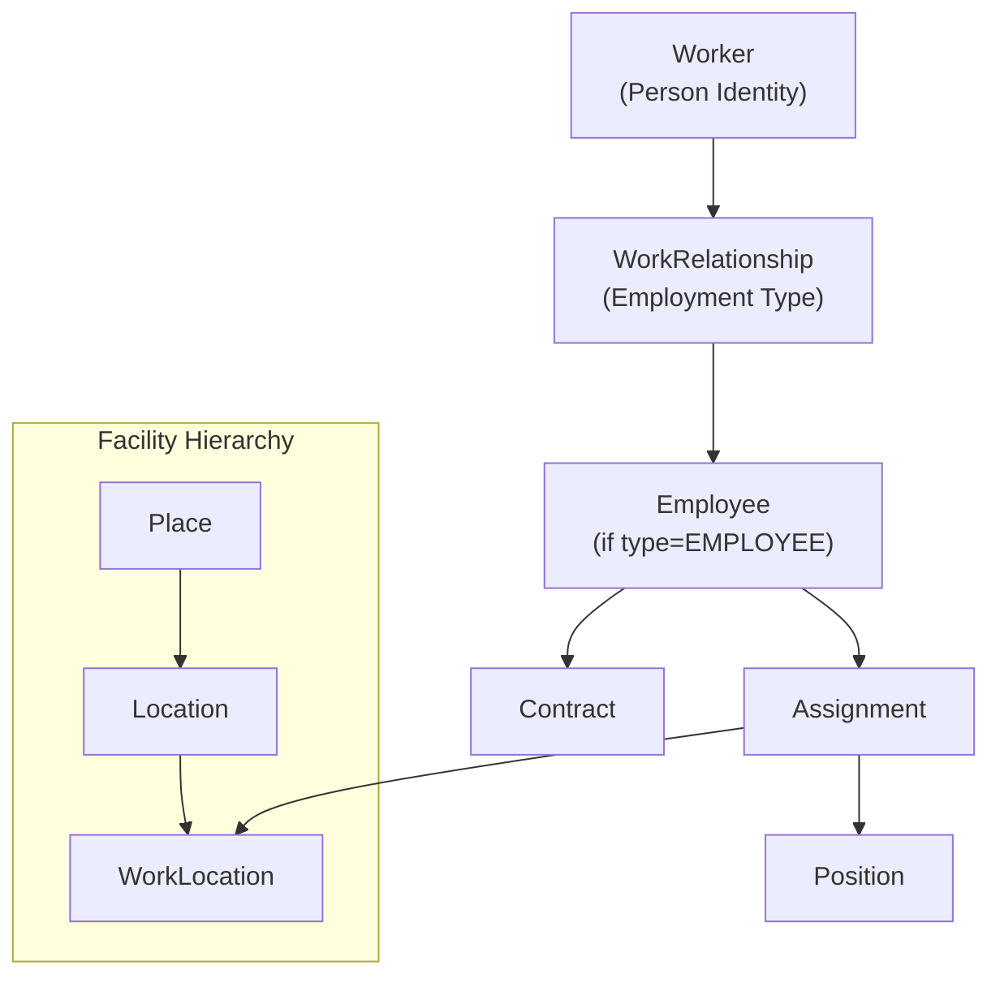

# Solution Architecture Research: Core HR Module (Re-Initiation)

## Purpose

Re-analyze Core HR (CO) module using the `solution-architecture-researcher` skill to produce enterprise-grade architecture documentation. This is a **re-initiation** to clean up thinking while aligning with existing ontology foundations.

---

## IMPORTANT: Existing Ontology Reference

Path: /Users/nguyenhuyvu/Library/CloudStorage/OneDrive-VNGCorporation/Apps/mygit/a4b-doc-xtalent/product/xTalent/docs/01-modules

### Core Concepts (MUST align with these)

| Concept | Definition | Source |
|---------|------------|--------|
| **Worker** | Lifetime identity of a person (name, DOB, nationality). Independent of employment. | `person/worker.onto.md` |
| **WorkRelationship** | Type of employment relationship (EMPLOYEE, CONTINGENT, CONTRACTOR, NON_WORKER) | `work-relationship/work-relationship.onto.md` |
| **Employee** | Person with EMPLOYEE type WorkRelationship to a LegalEntity | `work-relationship/employee.onto.md` |
| **WorkerRelationship** | Family/dependent relationships (spouse, child, emergency contact) | `person/worker-relationship.onto.md` |
| **Assignment** | Links Employee to Position and WorkLocation | `work-relationship/assignment.onto.md` |
| **Contract** | Employment contract (HĐLĐ/HĐTT) | `work-relationship/contract.onto.md` |
| **Place** | Physical site (building, campus) | `facility/place.onto.md` |
| **Location** | Specific space within a Place | `facility/location.onto.md` |
| **WorkLocation** | Where employees work (office, factory, remote) | `facility/work-location.onto.md` |

### Relationship Hierarchy (CRITICAL)



### Module Structure

| Module | Full Name | Scope |
|--------|-----------|-------|
| **CO** | Core HR | Worker, Employment, Organization, Position, Facility |
| **TA** | Time & Absence | Time Tracking, Leave, Attendance |
| **TR** | Total Rewards | Compensation, Benefits |
| **PR** | Payroll | Salary, Tax, Social Insurance |

---

## Input Specification

```yaml
# ============================================================
# 1. PRODUCT CONTEXT
# ============================================================
domain: HR
module: Core HR (CO)
sub_scope:
  # Person Domain
  - Worker (identity, skills, competencies)
  - WorkerRelationship (family, dependents, emergency contacts)
  
  # Work Relationship Domain
  - WorkRelationship (EMPLOYEE/CONTINGENT/CONTRACTOR/NON_WORKER)
  - Employee (employment record per Legal Entity)
  - Contract (HĐLĐ, HĐTT, addendums)
  - Assignment (position + work location link)
  
  # Organization Domain
  - LegalEntity (company structure)
  - BusinessUnit (organizational units)
  - OrgRelation (hierarchies, reporting lines)
  
  # Job & Position Domain
  - Job (generic role definition)
  - Position (specific seat in organization)
  - JobTaxonomy (job family, function, subfamily)
  - JobProfile (skills, competencies requirements)
  
  # Facility Domain
  - Place (building, campus, site)
  - Location (floor, room)
  - WorkLocation (office, factory, remote)
  
  # Supporting Domains
  - Eligibility (rule-based eligibility profiles)
  - TalentMarket (internal opportunity marketplace)

# ============================================================
# 2. OBJECTIVE
# ============================================================
objective: re_initiation
business_goal: "Re-architect Core HR module with clean ontology foundation, aligning with Workday/SAP concepts"
success_criteria:
  - Clean separation: Worker vs WorkRelationship vs Employee
  - Clear distinction: WorkRelationship types (EMPLOYEE, CONTINGENT, CONTRACTOR, NON_WORKER)
  - Proper facility hierarchy: Place → Location → WorkLocation
  - Integration readiness with TA, TR, PR modules

# ============================================================
# 3. ORGANIZATIONAL CONTEXT
# ============================================================
organization_type: Enterprise
industry: Multi-industry (Manufacturing, Tech, Retail, Services)
geography: Multi-country (Vietnam primary, SEA expansion)
employee_scale: 100-10000+ (scalable)
regulatory_sensitivity: High
  # Vietnam Labor Code 2019
  # BHXH/BHYT/BHTN (Social Insurance)
  # Data Privacy (PDPA)

# ============================================================
# 4. SYSTEM CONTEXT
# ============================================================
existing_ontology:
  location: /Users/nguyenhuyvu/Library/CloudStorage/OneDrive-VNGCorporation/Apps/mygit/a4b-doc-xtalent/product/xTalent/docs/01-modules/CO/00-ontology/domain
  key_files:
    - entity-index.yaml           # Master entity list
    - person/worker.onto.md       # Worker aggregate
    - work-relationship/work-relationship.onto.md
    - work-relationship/employee.onto.md
    - work-relationship/assignment.onto.md
    - work-relationship/contract.onto.md
    - facility/place.onto.md
    - facility/work-location.onto.md
  status:
    completed: 23 entities (Phase 1: Worker + child entities + master data)
    planned: 47 entities

related_modules:
  - TA: Time & Absence (consumes Assignment, WorkLocation)
  - TR: Total Rewards (consumes Employee, Position, Eligibility)
  - PR: Payroll (consumes Employee, Contract, WorkRelationship)
  
integration_patterns:
  - API Sync: Employee lookup, Real-time queries
  - Event-Driven: Lifecycle events → TA, TR, PR
  - Batch: Reporting, Compliance exports

# ============================================================
# 5. MARKET & REFERENCE
# ============================================================
reference_solutions:
  - Workday HCM (Worker-centric model, Work Relationship)
  - SAP SuccessFactors (Employee Central)
  - Oracle HCM Cloud (Person + Assignment model)
  - Darwinbox (SEA regional player)

competitive_intent: exceed
  # Target: Match Workday Worker/WorkRelationship concepts
  # Differentiation: Vietnam compliance depth, SEA focus

# ============================================================
# 6. DEPTH & OUTPUT
# ============================================================
analysis_depth: architecture_grade

expected_outputs:
  - executive_brief        # Overall strategy summary
  - capability_map         # Aligned with existing ontology domains
  - regulatory_matrix      # Vietnam Labor Code mapping
  - benchmark_matrix       # vs Workday, SAP, Oracle
  - feature_analysis       # WHY/WHAT/WHEN for key capabilities
  - roadmap               # NOW/NEXT/LATER phases
  - adr                   # Key architecture decisions
```

---

## Research Focus Areas

### Priority 1: Ontology Alignment Review
**Goal**: Validate and refine existing ontology

Key questions:
- Is Worker vs Employee vs WorkRelationship separation correct?
- Is WorkRelationship type mapping complete (EMPLOYEE, CONTINGENT, CONTRACTOR, NON_WORKER)?
- Is Place → Location → WorkLocation hierarchy appropriate?
- Are entity phases (1-4) logically ordered for implementation?

### Priority 2: Vietnam Labor Code Compliance
**Focus areas**:
- Contract types per law (Indefinite, Fixed-term, Seasonal, Probation)
- WorkRelationship mapping to legal categories
- Probation rules by job level (max 60/90/120 days)
- BHXH/BHYT/BHTN integration points

### Priority 3: Cross-Module Integration
**How CO feeds other modules**:
- CO → TA: Assignment determines time rules, WorkLocation determines attendance
- CO → TR: Employee + Position determines compensation eligibility
- CO → PR: WorkRelationship type determines payroll processing

### Priority 4: Capability Architecture Refinement
**By Domain**:
- Person: Skill tracking, Competency management
- Work Relationship: Lifecycle management (hire → terminate)
- Organization: Hierarchy management, Org charts
- Job & Position: Career paths, Succession planning
- Facility: Capacity planning, Location-based policies

---

## Existing Research to Reference

| Document | Location | Content |
|----------|----------|---------|
| Entity Index | [entity-index.yaml](file:///Users/nguyenhuyvu/Library/CloudStorage/OneDrive-VNGCorporation/Apps/mygit/a4b-doc-xtalent/product/xTalent/docs/01-modules/CO/00-ontology/domain/entity-index.yaml) | Master entity list with phases |
| Worker Ontology | [worker.onto.md](file:///Users/nguyenhuyvu/Library/CloudStorage/OneDrive-VNGCorporation/Apps/mygit/a4b-doc-xtalent/product/xTalent/docs/01-modules/CO/00-ontology/domain/person/worker.onto.md) | Worker aggregate definition |
| WorkRelationship | [work-relationship.onto.md](file:///Users/nguyenhuyvu/Library/CloudStorage/OneDrive-VNGCorporation/Apps/mygit/a4b-doc-xtalent/product/xTalent/docs/01-modules/CO/00-ontology/domain/work-relationship/work-relationship.onto.md) | Employment types, lifecycle |
| Employee | [employee.onto.md](file:///Users/nguyenhuyvu/Library/CloudStorage/OneDrive-VNGCorporation/Apps/mygit/a4b-doc-xtalent/product/xTalent/docs/01-modules/CO/00-ontology/domain/work-relationship/employee.onto.md) | Employee entity details |
| Previous Research | [_research-report.md](file:///Users/nguyenhuyvu/Library/CloudStorage/OneDrive-VNGCorporation/Apps/mygit/a4b-doc-xtalent/product/xTalent/docs/Axiom-Codex/xTalent/CO/_research-report.md) | Original domain research |

---

## Expected Output Files

All outputs saved in: `/Users/nguyenhuyvu/Library/CloudStorage/OneDrive-VNGCorporation/Apps/mygit/a4b-doc-xtalent/product/xTalent/docs/_research/re-initation/CO/`

| File | Template | Phase | Focus |
|------|----------|-------|-------|
| `01-executive-brief.md` | Executive Brief | 8 | Re-initiation strategy |
| `02-regulatory-matrix.md` | Regulatory Matrix | 2 | Vietnam Labor Code → System Rules |
| `03-ontology-review.md` | Custom | 5 | Validate existing ontology structure |
| `04-capability-map.md` | Capability Map | 5 | By domain (Person, WorkRel, Org, Job, Facility) |
| `05-benchmark-analysis.md` | Benchmark Matrix | 4 | vs Workday/SAP Worker concepts |
| `06-feature-analysis.md` | Feature Analysis | 6 | Key entity capabilities |
| `07-integration-map.md` | Custom | 5 | CO → TA, TR, PR connections |
| `08-roadmap.md` | Roadmap | 7 | Aligned with entity phases |
| `09-adr.md` | ADR | All | Key decisions |

---

## Prompt to Execute

```
Using the solution-architecture-researcher skill, conduct a RE-INITIATION analysis 
of the Core HR (CO) module for xTalent HCM platform.

CRITICAL CONTEXT:
- This is RE-INITIATION - cleaning up thinking while preserving good foundations
- MUST align with existing ontology at:
  /Users/nguyenhuyvu/Library/CloudStorage/OneDrive-VNGCorporation/Apps/mygit/a4b-doc-xtalent/product/xTalent/docs/01-modules/CO/00-ontology/domain/

KEY CONCEPTS TO VALIDATE:
- Worker (person identity) vs WorkRelationship (employment type) vs Employee (employment record)
- WorkRelationship types: EMPLOYEE, CONTINGENT, CONTRACTOR, NON_WORKER
- Facility hierarchy: Place → Location → WorkLocation
- Cross-module integration: CO → TA, TR, PR


Output directory:
/Users/nguyenhuyvu/Library/CloudStorage/OneDrive-VNGCorporation/Apps/mygit/a4b-doc-xtalent/product/xTalent/docs/_research/re-initation/CO/

Execute all 8 phases. Start by reading entity-index.yaml and key *.onto.md files.
```

sử dụng skill solution-architecture-researcher để thực hiện nghiên cứu cho giải pháp HCM, module Core (CO), tìm hiểu tất cả các feature cần thiết, mô tả feature, và xác định các yêu cầu, business context,... cần thiết cho mỗi feature.

---

## Notes

- **Re-initiation mindset**: Clean thinking, not starting from scratch
- **Ontology respect**: Build on existing entity definitions, not recreate
- **Cross-module awareness**: CO is foundation for TA, TR, PR
- **Vietnam focus**: All constraints based on Vietnam Labor Code 2019
- **Workday alignment**: Worker/WorkRelationship concepts from Workday
