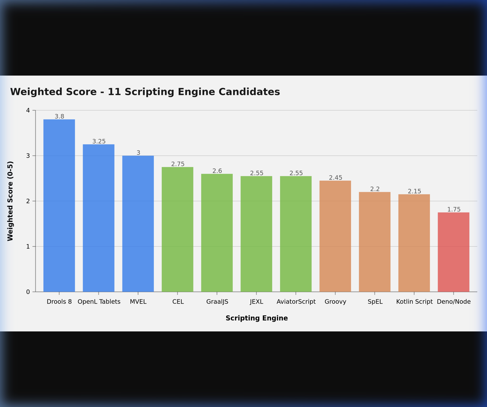
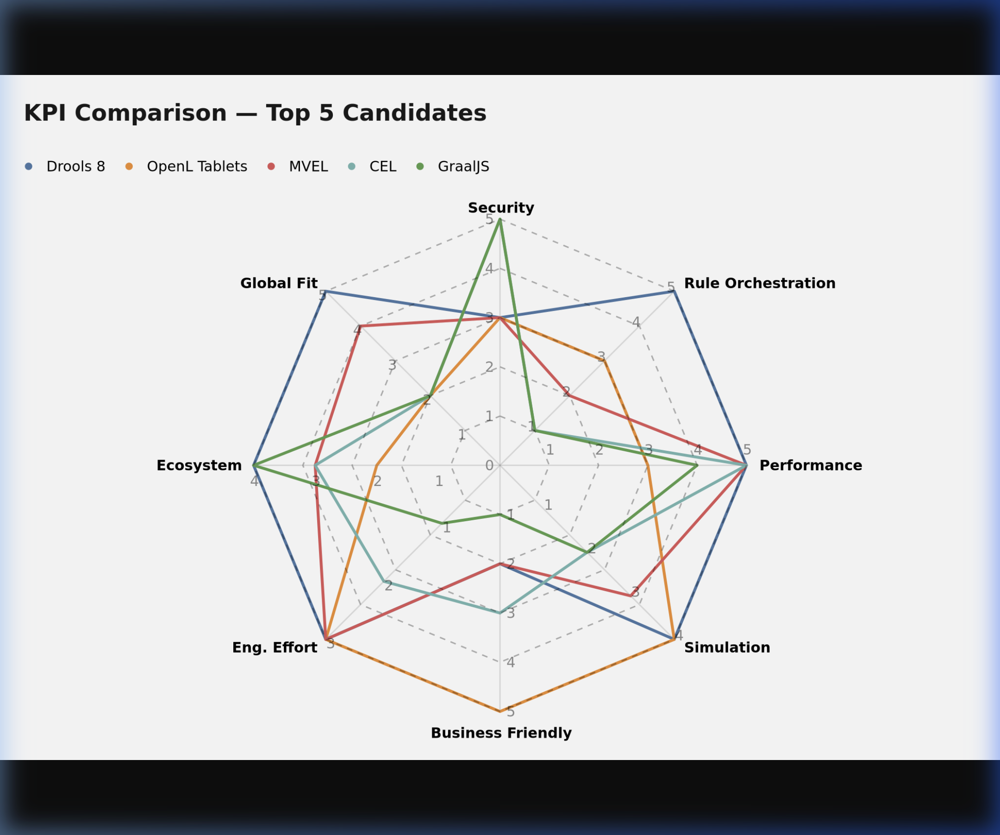
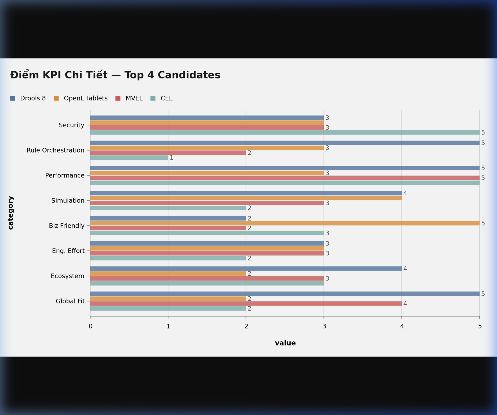
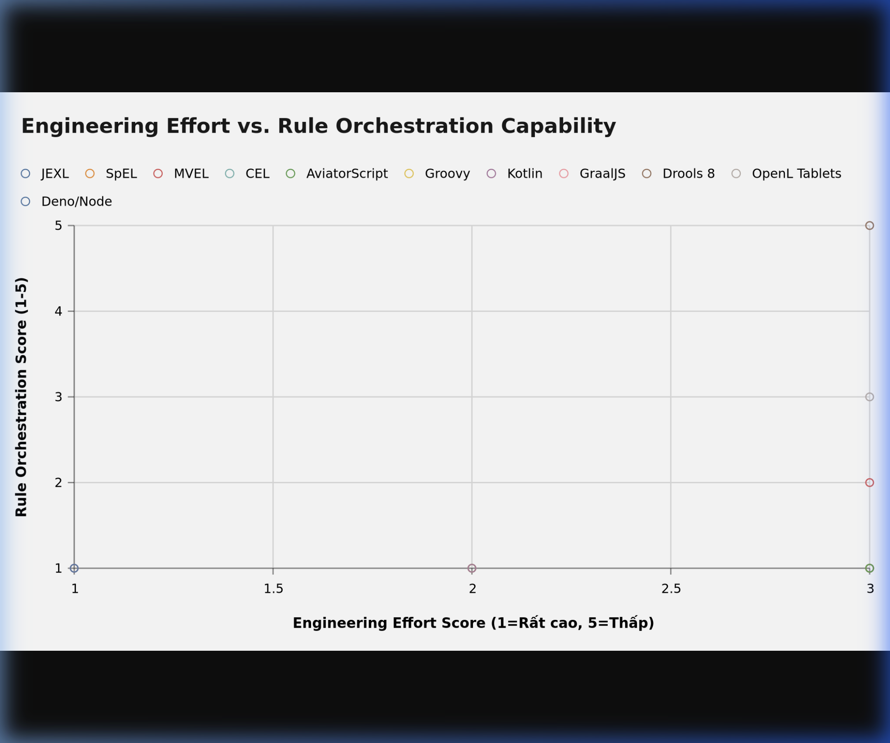
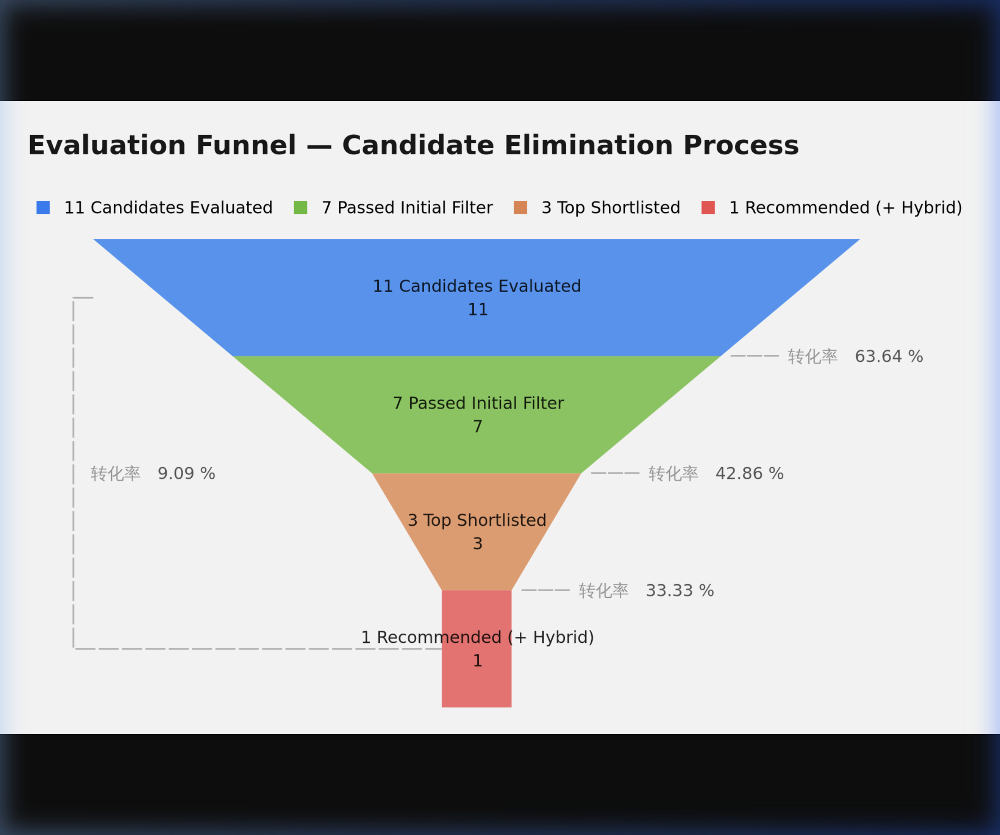

# Phân Tích & So Sánh Chi Tiết: Scripting Engine cho Payroll System

> **Tài liệu:** Detailed Analysis & Comparison  
> **Module:** Payroll Engine — xTalent HCM  
> **Phiên bản:** 1.0  
> **Ngày:** 2026-02-27  
> **Phương pháp:** Native Research Protocol — Mode B (Deep Research)  
> **Confidence:** HIGH (>2 Tier 1 sources per candidate)

---

## 1. Phương pháp Đánh Giá (Evaluation Methodology)

### 1.1 KPI Framework


*Infographic 1: 8 KPI có trọng số dùng để đánh giá 11 scripting engine candidates*

Mỗi candidate được đánh giá trên **8 KPIs** theo thang điểm 1–5:

| # | KPI | Mô tả | Trọng số |
|---|-----|--------|----------|
| K1 | **Security & Sandboxing** | Khả năng ngăn injection, isolate execution, whitelist API | 20% |
| K2 | **Rule Orchestration** | Working memory, dependency chaining, forward chaining, conflict resolution | 20% |
| K3 | **Performance (Batch)** | Throughput khi xử lý 10,000+ nhân viên, latency per formula | 15% |
| K4 | **Simulation Support** | Dry-run, historical replay, intermediate state visibility, rule firing log | 10% |
| K5 | **Business Friendliness** | Business user tự viết/đọc được công thức không cần lập trình | 10% |
| K6 | **Engineering Effort** | Effort xây dựng initial + maintain lâu dài (điểm cao = effort thấp) | 10% |
| K7 | **Ecosystem & Maturity** | Community size, documentation, enterprise adoption, update frequency | 10% |
| K8 | **Global Payroll Fit** | Multi-country extension, country-specific override, plugin model | 5% |

> **Xem thêm:** Bảng trọng số và ranking đầy đủ trong [Mục 3 — KPI Comparison Matrix](#3-kpi-comparison-matrix)

### 1.2 Thang điểm

| Điểm | Mức độ |
|------|--------|
| **5** | Xuất sắc — Full support, production-proven, best-in-class |
| **4** | Tốt — Đáp ứng yêu cầu với effort nhỏ |
| **3** | Trung bình — Đáp ứng nhưng cần customization đáng kể |
| **2** | Yếu — Thiếu feature quan trọng, cần build thêm nhiều |
| **1** | Rất yếu / Không phù hợp — Không đáp ứng yêu cầu cốt lõi |

### 1.3 Danh sách Candidates

| # | Candidate | Loại | Nguồn gốc |
|---|-----------|------|-----------|
| 1 | **JEXL** | Expression Engine | Apache Commons |
| 2 | **SpEL** | Expression Engine | Spring Framework |
| 3 | **MVEL** | Expression Engine | MVFLEX / Open Source |
| 4 | **CEL** | Expression Engine | Google |
| 5 | **AviatorScript** | Expression Engine | Open Source (China) |
| 6 | **Groovy (Sandboxed)** | JVM Script | Apache |
| 7 | **Kotlin Script DSL** | JVM Script | JetBrains |
| 8 | **GraalJS** | JS Runtime on JVM | Oracle (GraalVM) |
| 9 | **Drools 8** | Rule Engine (BRMS) | Red Hat / KIE |
| 10 | **OpenL Tablets** | Decision Table BRMS | OpenL Project |
| 11 | **Deno / Node.js** | Full JS Runtime | Deno/Node |

---

## 2. Phân Tích Chi Tiết Từng Candidate

---


*Hình 1: Weighted Score của 11 scripting engine candidates (thang điểm 0–5)*

---

### 2.1 JEXL (Java EXpression Language)

**Nguồn:** Apache Commons — https://commons.apache.org/proper/commons-jexl/  
**License:** Apache 2.0  
**Tier Source:** Tier 1

#### Overview

JEXL là expression language của Apache Commons, syntax gần ECMAScript + shell-script, designed để embed vào Java application cho dynamic expression evaluation. Phổ biến trong các workflow engine và template engine.

#### Điểm mạnh

- **Sandbox tích hợp**: `JexlSandbox` class cho phép whitelist method/class access — là điểm khác biệt so với MVEL
- **Lightweight**: Không có dependency phức tạp, dễ embed
- **Familiar syntax**: Gần JavaScript, dễ học với HR/Finance tech-savvy users
- **Scripting mode**: Hỗ trợ multi-statement scripts (không chỉ expression đơn)
- **Custom functions**: Dễ đăng ký custom function/operator
- **Active maintenance**: Apache Commons duy trì tích cực

#### Điểm yếu

- **Không có rule orchestration**: Không có working memory, không có dependency chaining, không có forward chaining
- **Không có inference engine**: Phải tự xây dependency graph + topological sort
- **Integration với Drools**: Không native — phải gọi JEXL từ Drools rule thủ công, mất Rete optimization
- **Performance**: Không có compiled mode (chỉ interpreted), kém hơn MVEL/AviatorScript trong batch large-scale
- **Không có simulation support**: Phải tự build logging và replay

#### Đánh giá KPI

| KPI | Điểm | Lý do |
|-----|------|-------|
| K1 Security | **4** | Native `JexlSandbox` với whitelist — tốt nhất trong nhóm expression engines |
| K2 Rule Orchestration | **1** | Hoàn toàn không có — phải tự xây toàn bộ |
| K3 Performance | **3** | Interpreted mode, không có bytecode compilation |
| K4 Simulation | **2** | Không có — phải custom build toàn bộ logging |
| K5 Business Friendly | **3** | Syntax OK, nhưng không có IDE/tooling cho HR users |
| K6 Engineering Effort | **3** | Dễ embed nhưng phải xây orchestration layer (cost cao) |
| K7 Ecosystem | **4** | Apache backing, active community |
| K8 Global Fit | **2** | Không có country extension model |

**Weighted Score: 2.55 / 5**

---

### 2.2 SpEL (Spring Expression Language)

**Nguồn:** Spring Framework — https://docs.spring.io/spring-framework/docs/current/reference/html/core.html  
**License:** Apache 2.0  
**Tier Source:** Tier 1

#### Overview

SpEL là expression language tích hợp sâu trong Spring ecosystem, cho phép điều hướng object graph, method invocation, collection projection, và conditional expression phức tạp.

#### Điểm mạnh

- **Spring integration xuất sắc**: Truy cập trực tiếp Spring beans, ApplicationContext
- **Object navigation**: `employee.department.manager.salary` — rất mạnh
- **Type conversion**: Tự động type coercion
- **Performance**: Benchmark cho thấy SpEL khá nhanh trong boolean expression và BigDecimal

#### Điểm yếu

- **Không phải rule engine**: Giống JEXL — chỉ evaluate expression đơn lẻ
- **Tight Spring coupling**: Gần như bắt buộc dùng trong Spring context — không phù hợp nếu muốn portable
- **Security model yếu**: Không có sandbox built-in — phải dùng `SimpleEvaluationContext` thay `StandardEvaluationContext` để restrict, nhưng vẫn limited
- **Không business-friendly**: Syntax phức tạp hơn JEXL, không phù hợp cho HR users
- **Không có simulation/audit**: Phải tự build

#### Đánh giá KPI

| KPI | Điểm | Lý do |
|-----|------|-------|
| K1 Security | **2** | Phải dùng `SimpleEvaluationContext` — vẫn có risk, không có sandbox |
| K2 Rule Orchestration | **1** | Không có |
| K3 Performance | **4** | Nhanh trong benchmark (boolean + BigDecimal) |
| K4 Simulation | **1** | Không có |
| K5 Business Friendly | **2** | Syntax phức tạp với HR users |
| K6 Engineering Effort | **3** | Dễ setup nếu đã dùng Spring, nhưng phải build orchestration |
| K7 Ecosystem | **4** | Spring ecosystem rất lớn |
| K8 Global Fit | **1** | Không có country model |

**Weighted Score: 2.20 / 5**

---

### 2.3 MVEL (MVFLEX Expression Language)

**Nguồn:** https://github.com/mvel/mvel  
**License:** Apache 2.0  
**Tier Source:** Tier 1

#### Overview

MVEL là embedded expression language cho Java platform với syntax gần Java, hỗ trợ cả interpreted và compiled mode (bytecode generation). Tích hợp **native** với Drools engine — đây là điểm cốt lõi của kiến trúc hybrid hiện tại.

#### Điểm mạnh

- **Native Drools integration**: MVEL là default dialect của Drools — Rete network optimize cho MVEL expressions, caching expression compilation, hiểu dependency
- **Compiled mode**: Bytecode generation cho performance cao trong batch processing
- **Advanced DSL features**: Method invocation, variable assignment, collection manipulation, conditional logic
- **Flexible**: Có thể dùng cả expression đơn và multi-statement script
- **Enterprise proven**: Được dùng trong Drools-based payroll systems thực tế

#### Điểm yếu

- **Security cần thêm effort**: Không có sandbox built-in — phải manually whitelist classes, disable reflection, tạo custom ClassLoader
- **Injection risk cao nếu không cẩn thận**: `Runtime.getRuntime().exec("rm -rf /")` chạy được nếu không restrict
- **Momentum giảm**: Development activity giảm so với trước đây, community nhỏ hơn JEXL
- **Không business-friendly**: Syntax giống Java, khó đọc với HR users

#### Security Chi Tiết (từ RAM.md + research)

```
MVEL Injection chỉ xảy ra khi:
✗ Cho phép HR nhập expression trực tiếp (raw text)
✗ Không whitelist class access
✗ Không disable reflection
✗ Không sandbox ClassLoader

Mitigations:
✓ Restrict DSL grammar (chỉ allow operators + whitelisted functions)
✓ Whitelist accessible JVM classes
✓ Disable reflection access
✓ Compile expressions offline (không compile at runtime từ user input)
✓ Custom ClassLoader isolation per execution
```

#### Đánh giá KPI

| KPI | Điểm | Lý do |
|-----|------|-------|
| K1 Security | **3** | Medium risk nhưng controllable với proper sandboxing |
| K2 Rule Orchestration | **2** | Standalone không có — nhưng + Drools = full BRMS |
| K3 Performance | **5** | Compiled bytecode, Rete-optimized khi dùng với Drools |
| K4 Simulation | **3** | Drools cung cấp working memory inspection + rule firing log |
| K5 Business Friendly | **2** | Java-like syntax, không phù hợp HR users |
| K6 Engineering Effort | **3** | DSL restriction cần investment, nhưng Drools integration tốt |
| K7 Ecosystem | **3** | Drools ecosystem mạnh nhưng MVEL standalone chậm lại |
| K8 Global Fit | **4** | Drools hỗ trợ rule partitioning, country-specific extensions |

**Weighted Score: 3.20 / 5**

---

### 2.4 CEL (Common Expression Language)

**Nguồn:** Google — https://cel.dev, https://github.com/google/cel-spec  
**License:** Apache 2.0  
**Tier Source:** Tier 1

#### Overview

CEL là expression language do Google phát triển, thiết kế cho nhu cầu **evaluate logic an toàn trong môi trường không tin tưởng** (untrusted code). Đặc điểm cốt lõi: **non-Turing complete** — không thể viết vòng lặp vô tận, không có side effects. Đang được dùng trong Google Cloud IAM, Kubernetes Admission Controllers, Envoy Proxy, Firebase.

#### Điểm mạnh

- **Safe by design**: Non-Turing complete — không thể gây DOS, không thể truy cập file system/network
- **Deterministic cost model**: Evaluation cost có thể tính trước — predictable performance
- **Hiệu năng cao**: Nanoseconds đến microseconds per evaluation
- **Type safety**: Strongly typed với proto3 / JSON types
- **Google-backed**: Đang gain traction mạnh trong cloud-native ecosystem
- **Java SDK**: `cel-java` available, maintained by Google

#### Điểm yếu

- **Non-Turing complete = giới hạn expressiveness**: Không có vòng lặp, không có recursion — có thể không đủ cho payroll phức tạp (ví dụ tính lũy tiến 7 bậc cần custom function)
- **Không có rule orchestration**: Chỉ evaluate expression đơn lẻ — không có working memory
- **Payroll dependency graph**: Phải tự xây toàn bộ orchestration layer
- **Ecosystem still growing**: Chưa có nhiều enterprise payroll case studies
- **Limited built-in functions**: Ít hơn MVEL/Groovy — cần đăng ký custom functions nhiều hơn

#### Đánh giá KPI

| KPI | Điểm | Lý do |
|-----|------|-------|
| K1 Security | **5** | Safe by design, non-Turing → không thể tấn công qua formula |
| K2 Rule Orchestration | **1** | Không có — phải tự xây hoàn toàn |
| K3 Performance | **5** | Nanosecond/microsecond, deterministic cost model |
| K4 Simulation | **2** | Không có native support — phải custom |
| K5 Business Friendly | **3** | Syntax đơn giản, gần Excel, nhưng ít tooling |
| K6 Engineering Effort | **2** | Dễ embed nhưng phải build toàn bộ orchestration + simulation |
| K7 Ecosystem | **3** | Growing fast, Google-backed, nhưng chưa mature trong enterprise HCM |
| K8 Global Fit | **2** | Không có country model sẵn |

**Weighted Score: 2.75 / 5**

---

### 2.5 AviatorScript

**Nguồn:** https://github.com/killme2008/aviatorscript  
**License:** LGPL v2.1  
**Tier Source:** Tier 2

#### Overview

AviatorScript là lightweight Java expression engine mã nguồn mở (ban đầu từ China), **compile expression sang Java bytecode** — cho performance gần native Java. Phiên bản 5.0+ hỗ trợ control flow (if/else, loops). Được dùng tại Meituan cho real-time risk control.

#### Điểm mạnh

- **Bytecode compilation**: Compile expression → Java bytecode → JIT compilation → gần native performance
- **Benchmark**: BigDecimal arithmetic vượt MVEL; boolean expression cạnh tranh với SpEL
- **v5.0+ scripting features**: Conditional branches, loops — không còn chỉ là expression
- **Cache-friendly**: Compile một lần, reuse compiled object → rất phù hợp batch payroll
- **Lightweight**: Không có heavyweight dependency

#### Điểm yếu

- **Không có sandbox**: Không có built-in security model — cần tự build
- **Không có rule orchestration**: Không có dependency chaining
- **Community nhỏ**: Chủ yếu Chinese community, documentation tiếng Anh hạn chế
- **License LGPL**: Cần lưu ý khi tích hợp vào commercial product
- **Enterprise track record hạn chế**: Ít case studies ngoài China

#### Đánh giá KPI

| KPI | Điểm | Lý do |
|-----|------|-------|
| K1 Security | **2** | Không có sandbox — phải tự implement |
| K2 Rule Orchestration | **1** | Không có |
| K3 Performance | **5** | Bytecode compilation → best-in-class performance |
| K4 Simulation | **2** | Không có native support |
| K5 Business Friendly | **3** | Syntax gần Java, có custom functions |
| K6 Engineering Effort | **3** | Dễ embed, nhưng phải build security + orchestration |
| K7 Ecosystem | **2** | Community nhỏ, docs hạn chế bên ngoài China |
| K8 Global Fit | **2** | Không có country model |

**Weighted Score: 2.55 / 5**

---

### 2.6 Groovy (Sandboxed)

**Nguồn:** https://groovy-lang.org  
**License:** Apache 2.0  
**Tier Source:** Tier 1

#### Overview

Groovy là dynamic JVM language với cú pháp biểu cảm, tích hợp seamless với Java. Sandboxing thông qua `SecureASTCustomizer` (compile-time) và `Groovy Sandbox` library (runtime). Được dùng nhiều trong Jenkins pipelines, các rule engine enterprise.

#### Điểm mạnh

- **Expressive syntax**: Gần ngôn ngữ tự nhiên, closures, operators overloading
- **SecureASTCustomizer**: Restrict AST tại compile-time — whitelist packages, methods, tokens
- **Full JVM power**: Truy cập Java libraries trong context cho phép
- **DSL-friendly**: Rất tốt cho xây dựng internal DSL
- **Mature ecosystem**: Long history, large community
- **Performance**: JIT compilation sau warmup

#### Điểm yếu

- **Compile-time sandbox không đủ**: `SecureASTCustomizer` chỉ là compile-time — runtime cần thêm `Groovy Sandbox` library với performance overhead
- **metaClass bypass risk**: Groovy's `metaClass` có thể bypass sandbox nếu không cẩn thận
- **Không có rule orchestration**: Vẫn chỉ là scripting language — không có BRMS features
- **Learning curve**: HR users không thể tự viết Groovy script
- **Setup phức tạp**: Cần kết hợp nhiều cơ chế mới có sandbox đủ mạnh

#### Đánh giá KPI

| KPI | Điểm | Lý do |
|-----|------|-------|
| K1 Security | **3** | SecureASTCustomizer + Groovy Sandbox — đủ mạnh nhưng phức tạp |
| K2 Rule Orchestration | **1** | Không có |
| K3 Performance | **4** | JIT compiled, tốt sau warmup |
| K4 Simulation | **2** | Phải custom build |
| K5 Business Friendly | **2** | Groovy không phù hợp HR users tự viết |
| K6 Engineering Effort | **2** | Setup sandbox phức tạp, phải build orchestration |
| K7 Ecosystem | **4** | Mature, large community |
| K8 Global Fit | **2** | Không có country model |

**Weighted Score: 2.45 / 5**

---

### 2.7 Kotlin Script DSL

**Nguồn:** https://kotlinlang.org/docs/custom-script-deps-tutorial.html  
**License:** Apache 2.0  
**Tier Source:** Tier 1

#### Overview

Kotlin Script (`.kts`) cho phép định nghĩa DSL rất type-safe và readable cho Java/Kotlin application thông qua JSR-223 ScriptEngine API. Gradle DSL là ví dụ nổi tiếng nhất. Có thể xây dựng internal DSL xịn cho formula authoring.

#### Điểm mạnh

- **Type-safe DSL**: Compile-time type checking — phát hiện lỗi sớm hơn runtime expression engines
- **IDE support**: IntelliJ IDEA/VSCode hỗ trợ auto-complete, refactoring cho Kotlin DSL
- **Readable syntax**: `when`, custom operators, extension functions → DSL rất đọc được
- **JVM performance**: Kotlin compiles to JVM bytecode — near-native after JIT

#### Điểm yếu

- **Sandbox rất yếu**: Phụ thuộc vào `SecurityManager` đã deprecated từ Java 17 → không phù hợp production
- **Sandbox alternatives chưa mature**: Không có built-in cơ chế thay thế đủ mạnh
- **Startup overhead**: Kotlin compiler embedding có startup cost cao hơn
- **Không có rule orchestration**: Vẫn là scripting language
- **Business user không thể dùng**: TypeScript-level complexity, không phù hợp HR users

#### Đánh giá KPI

| KPI | Điểm | Lý do |
|-----|------|-------|
| K1 Security | **2** | SecurityManager deprecated — sandbox yếu trong Java 17+ |
| K2 Rule Orchestration | **1** | Không có |
| K3 Performance | **4** | JVM bytecode, JIT compiled |
| K4 Simulation | **2** | Phải custom build |
| K5 Business Friendly | **1** | Không phù hợp HR users — developer-only |
| K6 Engineering Effort | **2** | DSL design tốt nhưng sandbox là blocker |
| K7 Ecosystem | **4** | JetBrains backing, growing fast |
| K8 Global Fit | **2** | Không có country model |

**Weighted Score: 2.15 / 5**

---

### 2.8 GraalJS (GraalVM JavaScript Engine)

**Nguồn:** https://graalvm.org  
**License:** UPL 1.0 / GPL v2 (GraalVM CE), GFTC (GraalVM EE)  
**Tier Source:** Tier 1

#### Overview

GraalJS là ECMAScript-compliant JavaScript engine chạy trên JVM, tích hợp qua GraalVM Polyglot API. Đặc biệt nổi bật về **enterprise-grade sandboxing** với `SandboxPolicy` levels và VM-level isolation. Picnic (online supermarket) đã build rule engine enterprise trên GraalVM.

#### Điểm mạnh

- **Best-in-class sandboxing**: `SandboxPolicy` với 4 mức: TRUSTED → CONSTRAINED → ISOLATED → UNTRUSTED
  - `ISOLATED`: Separate VM isolate với own heap + JIT compiler, dedicated GC
  - `UNTRUSTED`: Designed cho genuinely untrusted code — yêu cầu explicit controls cho stdin, memory limits
- **Resource limits**: CPU time, heap memory, thread count — tất cả controllable
- **Host access control**: Chỉ method được annotate/allow mới expose cho guest code
- **JIT performance**: Graal JIT compiler → excellent performance sau warmup
- **Familiar language**: JavaScript rất phổ biến — engineering team có thể viết payroll rules

#### Điểm yếu

- **Không có rule orchestration**: Phải tự build toàn bộ BRMS layer
- **Engineering effort rất cao**: Build dependency graph, rule chaining, simulation, audit từ đầu trong JavaScript
- **GraalVM EE paid**: Một số enterprise features (resource limits, isolates) chỉ có trong Enterprise Edition
- **Startup overhead**: GraalVM runtime lớn hơn pure JVM
- **Business user không tự viết**: JavaScript vẫn là lập trình
- **Không phù hợp cho payroll domain logic**: Phải reinvent BRMS wheel hoàn toàn

#### Đánh giá KPI

| KPI | Điểm | Lý do |
|-----|------|-------|
| K1 Security | **5** | VM-level isolation, SandboxPolicy ISOLATED/UNTRUSTED — tốt nhất trong tất cả candidates |
| K2 Rule Orchestration | **1** | Phải tự build từ đầu |
| K3 Performance | **4** | Graal JIT — tốt sau warmup, startup overhead |
| K4 Simulation | **2** | Phải custom build (nhưng JS linh hoạt) |
| K5 Business Friendly | **1** | JavaScript — developer only, không cho HR users |
| K6 Engineering Effort | **1** | Highest effort — phải xây toàn bộ BRMS từ đầu |
| K7 Ecosystem | **4** | Oracle/GraalVM backing, growing enterprise adoption |
| K8 Global Fit | **2** | Không có country model sẵn |

**Weighted Score: 2.60 / 5**

---

### 2.9 Drools 8 / Kogito

**Nguồn:** https://kie.org, https://www.drools.org  
**License:** Apache 2.0  
**Tier Source:** Tier 1


*Infographic 2: Phân tích ưu nhược điểm của Drools 8 + MVEL — candidate hàng đầu*

#### Overview

Drools là enterprise BRMS (Business Rules Management System) sử dụng Rete/Phreak algorithm — thuật toán pattern matching tối ưu cho rule evaluation. Drools 8 (Oct 2022) bổ sung Rule Units. Kogito là evolution cloud-native (Quarkus-first). Được dùng rộng rãi trong insurance, banking, healthcare payroll.

#### Điểm mạnh

- **Full BRMS**: Working memory, forward chaining, backward chaining, agenda control, conflict resolution
- **Rete/Phreak algorithm**: Incremental rule evaluation — chỉ re-evaluate khi facts thay đổi
- **Audit capabilities**: Rule activation history, working memory inspection, rule flow visualization
- **Rule Units (Drools 8)**: Modular rule organization — tốt cho country-specific modules
- **Simulation support**: Working memory inspection + rule firing log native → dry-run và simulation dễ build
- **Enterprise proven**: Insurance (Covéa), banking, healthcare — complex rule sets ở scale lớn
- **DRL + DMN + Decision Tables**: Nhiều format để define rules
- **Kogito**: Cloud-native deployment, Quarkus-first, auto-generate REST endpoints

#### Điểm yếu

- **Không có formula authoring layer**: DRL không friendly với HR users — cần thêm formula DSL layer
- **Complexity cao**: Learning curve cho Drools (KieSession, Working Memory, Agenda, etc.)
- **Governance overhead**: Rule deployment cần process nghiêm ngặt — không phải xấu nhưng cần setup
- **MVEL coupling**: Drools expression mặc định dùng MVEL — security của MVEL vẫn là concern

#### Đánh giá KPI

| KPI | Điểm | Lý do |
|-----|------|-------|
| K1 Security | **3** | Execution controlled nhưng MVEL dialect có injection risk nếu không restrict |
| K2 Rule Orchestration | **5** | Full BRMS — best-in-class: working memory, chaining, conflict resolution |
| K3 Performance | **5** | Phreak algorithm — incremental evaluation, excellent batch throughput |
| K4 Simulation | **4** | Working memory inspection + rule firing log native |
| K5 Business Friendly | **2** | DRL không phù hợp HR — cần additional UI layer |
| K6 Engineering Effort | **3** | Complex setup nhưng không phải xây từ đầu |
| K7 Ecosystem | **4** | Red Hat/JBoss backing, large enterprise community |
| K8 Global Fit | **5** | Rule partitioning, country modules, versioning — tốt nhất cho global |

**Weighted Score: 3.80 / 5**

---

### 2.10 OpenL Tablets

**Nguồn:** https://openl-tablets.org  
**License:** LGPL v2.1  
**Tier Source:** Tier 2

#### Overview

OpenL Tablets là BRMS sử dụng decision tables trong format Excel-like — rất business-friendly. HR/Finance users có thể trực tiếp edit business rules trong format bảng tính.

#### Điểm mạnh

- **Excel-like Decision Tables**: Business users cực kỳ familiar — không cần biết code
- **Simulation support**: Có OpenL Studio với test case management
- **Spreadsheet calculation**: Hỗ trợ formulas kiểu Excel
- **WebStudio**: UI cho business users define và test rules

#### Điểm yếu

- **Rule chaining hạn chế**: Không mạnh về forward chaining phức tạp — yếu hơn Drools nhiều
- **Inference engine yếu**: Không có Rete/Phreak — kém trong complex dependency chains
- **Ecosystem nhỏ**: Community nhỏ hơn Drools đáng kể
- **Performance**: Không được optimize cho batch processing lớn
- **Limited extensibility**: Country-specific override model kém hơn Drools

#### Đánh giá KPI

| KPI | Điểm | Lý do |
|-----|------|-------|
| K1 Security | **3** | Không có major security concern nhưng cũng không có strong sandbox |
| K2 Rule Orchestration | **3** | Decision tables tốt nhưng complex chaining yếu |
| K3 Performance | **3** | Không optimize cho batch lớn |
| K4 Simulation | **4** | WebStudio + test case management — tốt cho business users |
| K5 Business Friendly | **5** | Excel-like tables — tốt nhất trong tất cả candidates |
| K6 Engineering Effort | **3** | Dễ setup cho use case đơn giản |
| K7 Ecosystem | **2** | Community nhỏ, ít enterprise track record |
| K8 Global Fit | **2** | Không có mạnh về country extension |

**Weighted Score: 3.25 / 5**

---

### 2.11 Deno / Node.js Runtime

**Nguồn:** https://deno.land, https://nodejs.org  
**License:** MIT  
**Tier Source:** Tier 1

#### Overview

Deno là modern secure JavaScript runtime (Rust-based), Node.js là mature JS runtime. Ý tưởng: sử dụng JS để build custom rule engine cho payroll.

#### Điểm mạnh

- **Deno security model**: Permission-based — filesystem, network phải explicit grant
- **Rich language**: JavaScript/TypeScript đủ mạnh cho complex logic
- **Developer familiarity**: Đội kỹ thuật thường biết JS/TS

#### Điểm yếu

- **Không phải rule engine**: Vẫn phải tự xây toàn bộ: dependency graph, working memory, forward chaining, simulation, audit
- **Out-of-process overhead**: Giao tiếp Java ↔ Deno qua process/HTTP — latency cao, không phù hợp batch 10K employees
- **Security worst by default (Node)**: Full file system + network access trong Node
- **Engineering effort cực cao**: Reinvent toàn bộ BRMS wheel
- **Không có business-friendly authoring**: Không có tooling cho HR users
- **Audit và simulation**: Phải tự build toàn bộ

#### Đánh giá KPI

| KPI | Điểm | Lý do |
|-----|------|-------|
| K1 Security | **2** | Deno tốt hơn Node nhưng vẫn phải manual isolation, out-of-process |
| K2 Rule Orchestration | **1** | Phải tự xây toàn bộ từ đầu |
| K3 Performance | **2** | Out-of-process IPC overhead — không phù hợp batch large-scale |
| K4 Simulation | **2** | Phải build từ đầu |
| K5 Business Friendly | **1** | Không phù hợp HR users |
| K6 Engineering Effort | **1** | Highest risk — build entire BRMS + IPC overhead |
| K7 Ecosystem | **3** | JS ecosystem rất lớn nhưng không phù hợp use case này |
| K8 Global Fit | **2** | Không có country model |

**Weighted Score: 1.75 / 5**

---

## 3. KPI Comparison Matrix


*Hình 2: Radar Chart — So sánh 5 candidates hàng đầu trên 8 KPIs*

### 3.1 Ma Trận Điểm Thô (Raw Scores)

| Candidate | K1 Sec (20%) | K2 Orch (20%) | K3 Perf (15%) | K4 Sim (10%) | K5 Biz (10%) | K6 Eng (10%) | K7 Eco (10%) | K8 Glob (5%) | **Weighted** |
|-----------|-------------|--------------|--------------|-------------|-------------|-------------|-------------|-------------|------------|
| **JEXL** | 4 | 1 | 3 | 2 | 3 | 3 | 4 | 2 | **2.55** |
| **SpEL** | 2 | 1 | 4 | 1 | 2 | 3 | 4 | 1 | **2.20** |
| **MVEL** | 3 | 2 | 5 | 3 | 2 | 3 | 3 | 4 | **3.00** |
| **CEL** | 5 | 1 | 5 | 2 | 3 | 2 | 3 | 2 | **2.75** |
| **AviatorScript** | 2 | 1 | 5 | 2 | 3 | 3 | 2 | 2 | **2.55** |
| **Groovy** | 3 | 1 | 4 | 2 | 2 | 2 | 4 | 2 | **2.45** |
| **Kotlin Script** | 2 | 1 | 4 | 2 | 1 | 2 | 4 | 2 | **2.15** |
| **GraalJS** | 5 | 1 | 4 | 2 | 1 | 1 | 4 | 2 | **2.60** |
| **Drools 8** | 3 | 5 | 5 | 4 | 2 | 3 | 4 | 5 | **3.80** |
| **OpenL Tablets** | 3 | 3 | 3 | 4 | 5 | 3 | 2 | 2 | **3.25** |
| **Deno/Node** | 2 | 1 | 2 | 2 | 1 | 1 | 3 | 2 | **1.75** |


*Hình 3: Horizontal Bar Chart — Điểm từng KPI của Drools 8, OpenL Tablets, MVEL và CEL*

### 3.2 Ranking

| Rank | Candidate | Weighted Score | Nhận xét |
|------|-----------|---------------|---------|
| 🥇 1 | **Drools 8** | **3.80** | Vượt trội về Rule Orchestration và Global Fit |
| 🥈 2 | **OpenL Tablets** | **3.25** | Business Friendly nhất, nhưng yếu về orchestration |
| 🥉 3 | **MVEL** | **3.00** | Tốt về Performance, hybrid với Drools = optimal |
| 4 | **CEL** | **2.75** | Security tốt nhất, nhưng thiếu orchestration |
| 5 | **GraalJS** | **2.60** | Sandbox mạnh nhất, nhưng engineering effort quá cao |
| 6 | **JEXL** | **2.55** | Sandbox tốt, nhưng không có orchestration |
| 6 | **AviatorScript** | **2.55** | Performance tốt nhất, nhưng ecosystem nhỏ |
| 8 | **Groovy** | **2.45** | Sandbox phức tạp, không có orchestration |
| 9 | **SpEL** | **2.20** | Chỉ phù hợp nếu deep Spring integration |
| 10 | **Kotlin Script** | **2.15** | Sandbox deprecated, developer-only |
| 11 | **Deno/Node** | **1.75** | Highest risk, worst fit |

---

---

## 4. Phân Tích Trade-offs

### 4.1 Security vs. Expressiveness Trade-off

```
High Security │ CEL ────────────────── (Safe by design, limited)
              │     JEXL ─────────── (Good sandbox, expression-only)
              │          GraalJS ── (VM isolation, needs full BRMS build)
              │               MVEL+Drools (Controlled sandbox, full BRMS)
              │                    Groovy (Complex sandbox)
              │                         AviatorScript (No sandbox)
Low Security  │                              Deno/Node (Worst)
              └────────────────────────────────────────────────────────────
              Low Expressiveness                         High Expressiveness
```


*Hình 4: Scatter Plot — Drools 8 là candidate duy nhất đạt điểm cao cả về Orchestration và Engineering Effort*

### 4.2 Engineering Effort vs. Capability

| Nhóm | Candidates | Điểm chung |
|------|-----------|-----------|
| **Low Effort, Low Capability** | JEXL, SpEL, CEL, AviatorScript | Expression-only, không orchestration |
| **High Effort, High Capability** | GraalJS, Deno/Node | Phải xây BRMS từ đầu |
| **Medium Effort, Medium Capability** | Groovy, Kotlin Script, OpenL | Từng phần nhưng thiếu orchestration |
| **Medium Effort, High Capability** | **Drools 8** | Full BRMS, nhưng cần DSL layer thêm |
| **Medium Effort, High Capability** | **MVEL + Drools (Hybrid)** | Best trade-off point |

### 4.3 Phân Tích Hybrid Architectures

Thực tế, không có candidate nào đáp ứng đủ tất cả yêu cầu standalone. Cần cân nhắc các hybrid:

#### Option H1: MVEL + Drools (Hybrid) — Incumbent Recommendation

```
[HR Formula Authoring] → [Restricted MVEL DSL] → [Drools Rule Orchestration]
                                    ↓
                         [Sandbox Layer (Class Whitelist)]
                                    ↓
                         [Simulation Engine (built on Drools)]
                                    ↓
                         [Audit & Versioning Module]
```

**Pros**: Native integration, Rete-optimized, proven enterprise pattern  
**Cons**: MVEL sandbox cần additional effort, DRL không business-friendly

#### Option H2: JEXL + Drools (Hybrid)

```
[HR Formula Authoring] → [JEXL DSL (Native Sandbox)] → [Drools Rule Orchestration via external call]
```

**Pros**: JEXL native sandbox tốt hơn MVEL  
**Cons**: Không native integration — Drools không optimize cho JEXL, mất Rete benefits

#### Option H3: CEL + Custom Orchestration

```
[HR Formula Authoring] → [CEL Expression (Safe by design)] → [Custom Dependency Graph Engine]
```

**Pros**: Safest formula evaluation  
**Cons**: Phải tự xây toàn bộ orchestration — reinvent Drools wheel, không recommended

#### Option H4: MVEL + Drools + Custom DSL Layer (Recommended Evolution)

```
[Business DSL UI] → [DSL Compiler → Restricted MVEL] → [Drools Orchestration]
```

Thêm **DSL Layer** (như Oracle Fast Formula) ở trên MVEL — HR users tương tác với DSL friendly, DSL compiler dịch sang restricted MVEL, Drools orchestrate.

---


*Hình 5: Funnel Chart — Quy trình loại trừ candidates từ 11 → 7 → 3 → 1 (+ Hybrid)*

## 5. Risk Assessment


*Infographic 3: Phân tích bảo mật SWOT — Threats, Mitigations, Residual Risks, Compensating Controls*

### 5.1 Ma Trận Rủi Ro

| Rủi ro | JEXL | MVEL | Drools | MVEL+Drools | CEL | GraalJS | Deno |
|--------|------|------|--------|-------------|-----|---------|------|
| **Code Injection** | LOW | MEDIUM | MEDIUM | MEDIUM (Controlled) | VERY LOW | LOW | HIGH |
| **Rule Dependency Errors** | HIGH | HIGH | LOW | LOW | HIGH | HIGH | HIGH |
| **Performance Bottleneck** | MEDIUM | LOW | LOW | LOW | VERY LOW | LOW | HIGH |
| **Engineering Complexity** | LOW | MEDIUM | HIGH | HIGH | MEDIUM | VERY HIGH | VERY HIGH |
| **Maintainability** | MEDIUM | MEDIUM | MEDIUM | MEDIUM | HIGH | LOW | LOW |
| **Vendor Dependency** | LOW | LOW | MEDIUM | MEDIUM | MEDIUM | HIGH | LOW |
| **Scala Global Payroll** | HIGH | MEDIUM | LOW | LOW | HIGH | HIGH | HIGH |

### 5.2 Rủi Ro Đặc Biệt Cần Lưu Ý

**R1 — MVEL Injection Risk** *(Severity: Medium, Likelihood: Low nếu chính sách đúng)*

> Chỉ xảy ra nếu: cho phép HR nhập expression raw text không qua validation, không whitelist class, không disable reflection.  
> Mitigation: Compile offline, class whitelist, disable reflection, custom ClassLoader. Enterprise SAP/Oracle đều dùng cách này thành công.

**R2 — Drools Vendor Dependency** *(Severity: Medium, Likelihood: Low)*

> Drools là open-source Apache. Red Hat dừng maintain → community có thể fork (đã xảy ra với nhiều project OSS).  
> Mitigation: Architecture với Drools isolated trong service layer — có thể replace engine mà không ảnh hưởng business rules.

**R3 — Business User Formula Complexity** *(Severity: High, Likelihood: Medium)*

> HR users có thể viết công thức sai mà không phát hiện được.  
> Mitigation: Mandatory dry-run trước khi activate, simulation trên historical data, pre-built function library giảm surface area.

---

## 6. Tổng Kết & Hướng Đề Xuất


*Infographic 4: Funnel — Quy trình loại trừ candidates từ 11 → 7 → 3 → 1 kiến trúc đề xuất*

### 6.1 Candidates bị loại (Eliminated)

| Candidate | Lý do |
|-----------|-------|
| **SpEL** | Spring coupling, không có sandbox, điểm thấp nhất |
| **Kotlin Script** | Sandbox deprecated (Java 17+), developer-only |
| **Deno/Node** | Out-of-process overhead, phải xây toàn bộ BRMS, highest risk |
| **AviatorScript** | Ecosystem nhỏ, không có sandbox, không có orchestration |

### 6.2 Candidates cân nhắc

| Candidate | Phù hợp khi |
|-----------|------------|
| **CEL** | Cần ultra-safe formula evaluation, ready để tự xây orchestration |
| **JEXL** | Cần security tốt, use case đơn giản chỉ cần expression |
| **GraalJS** | Cần best-in-class sandbox, có team JS mạnh, ready build BRMS |
| **OpenL Tablets** | Cần business-friendliness tối đa, use case chủ yếu decision tables |

### 6.3 Candidates hàng đầu

| Rank | Architecture | Weighted Score | Phù hợp nhất |
|------|-------------|---------------|-------------|
| **#1** | **Drools 8 + Restricted MVEL** | **3.80** (Drools) + MVEL formula layer | Complex payroll, global extensibility |
| **#2** | **OpenL Tablets + Drools** | **Hybrid** | Business-friendly + orchestration |
| **#3** | **Drools 8 + Custom DSL** | Evolution path | Long-term; DSL layer trên MVEL |

---

*Tài liệu tiếp theo: `03-proposal.md` — Đề xuất kiến trúc cụ thể với weighted decision matrix và implementation roadmap.*
