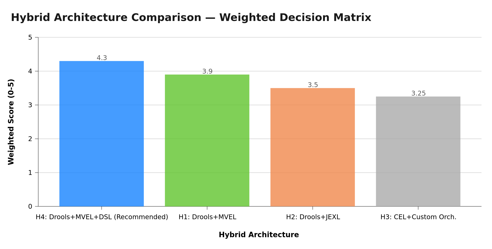
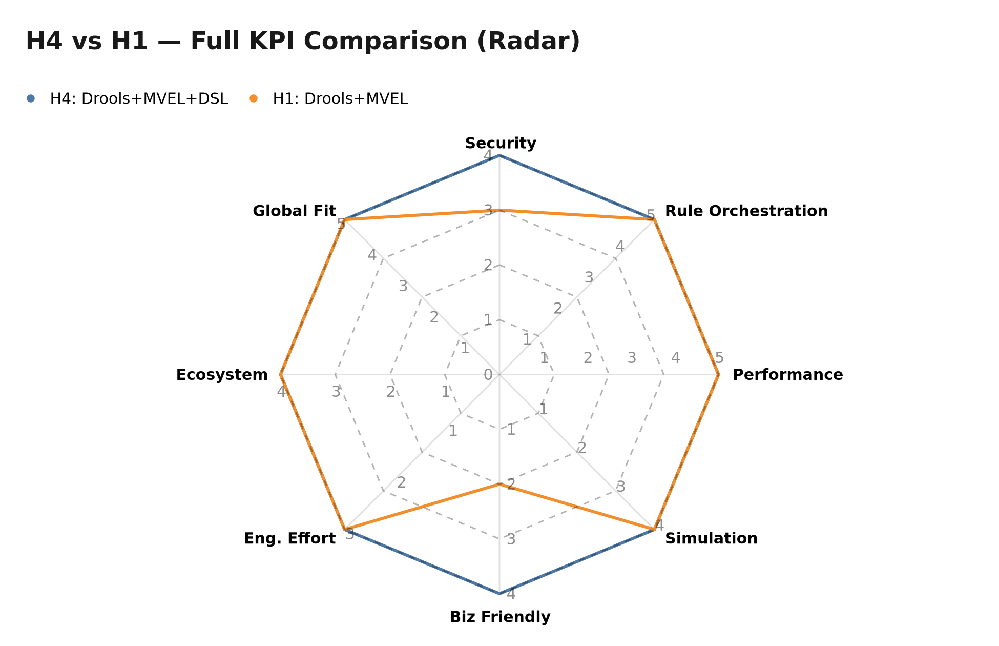
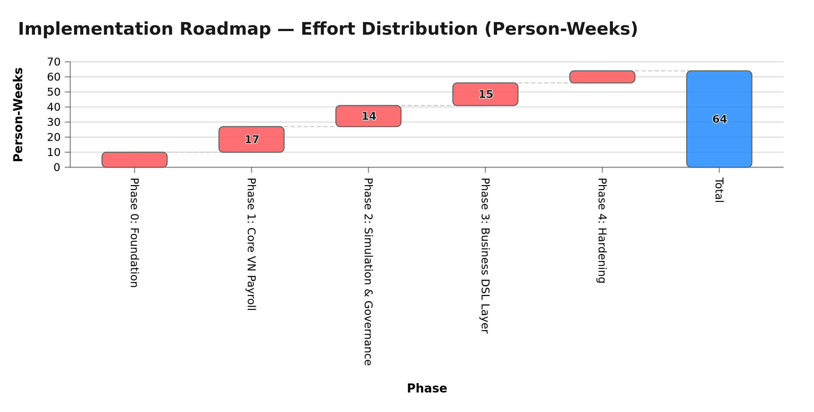

# Proposal: Payroll Scripting & Formula Engine Architecture

> **Tài liệu:** Architecture Proposal & Recommendation  
> **Module:** Payroll Engine — xTalent HCM  
> **Phiên bản:** 1.0  
> **Ngày:** 2026-02-27  
> **Trạng thái:** Proposed — Chờ Architecture Board Approval  
> **Tài liệu tham chiếu:** `01-problem-statement.md`, `02-detailed-analysis.md`, `adr.md`

---

## 1. Executive Summary

Sau khi phân tích 11 scripting engine candidates theo 8 KPIs có trọng số, nghiên cứu kiến trúc của Oracle/SAP/Workday, và đánh giá các hybrid architecture, **đề xuất kiến trúc cuối cùng là:**

> **"Drools 8 Rule Engine + Restricted MVEL Formula DSL + Business DSL Layer"**  
> — Kiến trúc hybrid 3 tầng (H4 Evolution Path)

**Lý do:** Không có candidate đơn lẻ nào đáp ứng đủ tất cả yêu cầu. Kiến trúc hybrid này:
- Giải quyết **Rule Orchestration** bằng Drools (Rete/Phreak, working memory, chaining)
- Giải quyết **Security** bằng Restricted MVEL DSL với class whitelist nghiêm ngặt
- Giải quyết **Business Friendliness** bằng Business DSL Layer (formula UI cho HR users)
- Giải quyết **Simulation & Audit** bằng native Drools capabilities

---

## 2. Weighted Decision Matrix

### 2.1 Ma Trận Phân Tích Cuối Cùng

| KPI | Trọng số | Drools+MVEL (H1) | Drools+JEXL (H2) | CEL+Custom (H3) | **Drools+MVEL+DSL (H4)** |
|-----|----------|-----------------|-----------------|----------------|------------------------|
| K1 Security | 20% | 3 (0.60) | 4 (0.80) | 5 (1.00) | **4** (0.80) |
| K2 Rule Orchestration | 20% | 5 (1.00) | 4 (0.80) | 2 (0.40) | **5** (1.00) |
| K3 Performance | 15% | 5 (0.75) | 4 (0.60) | 5 (0.75) | **5** (0.75) |
| K4 Simulation | 10% | 4 (0.40) | 3 (0.30) | 2 (0.20) | **4** (0.40) |
| K5 Business Friendly | 10% | 2 (0.20) | 2 (0.20) | 3 (0.30) | **4** (0.40) |
| K6 Engineering Effort | 10% | 3 (0.30) | 2 (0.20) | 2 (0.20) | **3** (0.30) |
| K7 Ecosystem | 10% | 4 (0.40) | 4 (0.40) | 3 (0.30) | **4** (0.40) |
| K8 Global Fit | 5% | 5 (0.25) | 4 (0.20) | 2 (0.10) | **5** (0.25) |
| **TỔNG** | **100%** | **3.90** | **3.50** | **3.25** | **🏆 4.30** |

> **Winner: H4 — Drools 8 + Restricted MVEL + Business DSL Layer** với weighted score **4.30/5**

### 2.2 So Sánh Hybrid Architectures


*Infographic 5: Quadrant matrix — H4 là lựa chọn tốt nhất: High Capability + Medium Effort*


*Hình 1: So sánh 4 hybrid architectures theo weighted score — H4 dẫn đầu với 4.30/5*

| Architecture | Score | Ưu điểm chính | Điểm yếu chính |
|-------------|-------|--------------|----------------|
| **H4: Drools+MVEL+DSL** | **4.30** | Full spectrum: security + orchestration + business friendly | Engineering effort cao nhất |
| H1: Drools+MVEL | 3.90 | Đã proven, native integration | HR users không tự dùng được |
| H2: Drools+JEXL | 3.50 | JEXL sandbox tốt hơn | Mất Rete optimization, không native |
| H3: CEL+Custom | 3.25 | Safest formula layer | Phải reinvent toàn bộ BRMS |


*Hình 2: H4 cải thiện vượt trội so với H1 ở KPI K5 — Business Friendliness (2→4) nhờ Business DSL Layer*

---

## 3. Kiến Trúc Đề Xuất


*Infographic 6: Hierarchy diagram — Business DSL Layer → Drools 8 Rule Engine → Payroll Execution Core*

### 3.1 Tổng Quan Kiến Trúc 3 Tầng

```
┌─────────────────────────────────────────────────────────────────────┐
│                     TẦNG 1: BUSINESS DSL LAYER                      │
│                                                                       │
│  [Formula Studio UI]  →  [DSL Compiler]  →  [Formula Validator]     │
│      HR users              ↓                     ↓                  │
│  viết công thức        Restricted MVEL      Dry-run sandbox          │
│  dạng Excel-like          formula               check                │
└──────────────────────────────┬──────────────────────────────────────┘
                               │ Compiled Restricted MVEL DSL
                               ▼
┌─────────────────────────────────────────────────────────────────────┐
│                   TẦNG 2: DROOLS 8 RULE ENGINE                      │
│                                                                       │
│  [Rule Units]         [Working Memory]      [Agenda / Phreak]       │
│  Country VN Module  ← Facts: Employee,   → Rule activation          │
│  Country SG Module    Period, Attendance    Conflict resolution      │
│  ...                                                                 │
│                                                                       │
│  [Simulation Engine]  [Audit Logger]    [Dry-Run Engine]            │
│  Historical replay    Rule firing log   Non-persistent exec         │
└──────────────────────────────┬──────────────────────────────────────┘
                               │ Calculation Results
                               ▼
┌─────────────────────────────────────────────────────────────────────┐
│                   TẦNG 3: PAYROLL EXECUTION CORE                    │
│                                                                       │
│  [Batch Processor]  [Transaction Mgr]  [Versioning Store]           │
│  10K employees/run   Commit/Rollback    Formula history              │
│  Parallel partitions All-or-nothing     Immutable audit trail        │
│                                                                       │
│  [Retroactive Engine]  [Approval Workflow]  [Reporting]             │
│  Delta calculation      Multi-level sign-off  Impact reports         │
└─────────────────────────────────────────────────────────────────────┘
```

### 3.2 Chi Tiết Từng Tầng

#### Tầng 1 — Business DSL Layer *(Payroll Formula Studio)*

**Mục đích:** Cho phép HR/Finance users tự định nghĩa công thức mà không cần lập trình.

**Components:**

```
Formula Studio (Web UI)
├── Formula Editor
│   ├── Syntax highlighting (custom DSL)
│   ├── Auto-complete (functions + element references)
│   ├── Real-time validation (compile errors)
│   └── Preview panel (immediate feedback)
│
├── DSL Compiler (Java)
│   ├── Parser: ANTLR4 grammar → AST
│   ├── Semantic analyzer: type check, reference resolution
│   ├── Code generator: AST → Restricted MVEL string
│   └── Security enforcer: whitelist check at compile time
│
└── Formula Validator
    ├── Syntax validation (before save)
    ├── Dependency cycle detection
    ├── Dry-run execution (test with sample data)
    └── Formula diff viewer (compare versions)
```

**Business DSL Syntax (tham chiếu Oracle Fast Formula):**

```
# Khai báo dependencies
element GROSS_SALARY = ...

# Công thức đơn giản
element BHXH_EMPLOYEE =
  min(GROSS_SALARY, BHXH_CEILING) * BHXH_EMPLOYEE_RATE

# Điều kiện phân nhánh
element BHXH_BASE =
  when employeeType == "PROBATION" then 0
  when contractType == "FREELANCE" then 0
  else min(GROSS_SALARY, BHXH_CEILING)

# Gọi hàm built-in
element PIT_TAX =
  progressiveTax(TAXABLE_INCOME, TAX_BRACKET_VN_2024)

# Tính pro-rata
element PRORATED_SALARY =
  proRata(BASE_SALARY, ACTUAL_WORK_DAYS, STANDARD_WORK_DAYS)
```

#### Tầng 2 — Drools 8 Rule Engine *(Orchestration Core)*

**Rule Units Architecture:**

```
Payroll Rule Units (Drools 8)
├── VN_PrePayroll_Unit          ← Validate data, prepare facts
│   ├── validate-attendance.drl
│   ├── prepare-employee-facts.drl
│   └── early-termination-check.drl
│
├── VN_GrossCalculation_Unit    ← Tính gross salary, allowances
│   ├── base-salary.drl
│   ├── allowances.drl
│   └── overtime.drl
│
├── VN_InsuranceCalc_Unit       ← BHXH/BHYT/BHTN
│   ├── bhxh-employee.drl       ← Calls MVEL formula: BHXH_EMPLOYEE
│   ├── bhyt-employee.drl
│   ├── bhtn-employee.drl
│   └── bhxh-employer.drl
│
├── VN_TaxCalculation_Unit      ← Thuế TNCN
│   ├── taxable-income.drl
│   ├── pit-tax-progressive.drl ← Calls MVEL formula: PIT_TAX
│   └── deductions.drl
│
├── VN_NetCalculation_Unit      ← Net salary
│   └── net-salary.drl
│
└── VN_PostProcessing_Unit      ← Làm tròn, chia kỳ, retroactive
    ├── rounding.drl
    └── retroactive-delta.drl
```

**Drools Execution Flow:**

```java
// Ví dụ Drools Rule calling MVEL formula
rule "Calculate BHXH Employee"
   agenda-group "insurance"
   when
      $emp: Employee(status == "ACTIVE", contractType != "PROBATION")
      $gross: PayrollElement(code == "GROSS_SALARY", employeeId == $emp.id)
      $bhxhRate: PolicyConfig(code == "BHXH_EMPLOYEE_RATE", countryCode == "VN")
   then
      // Evaluate MVEL formula trong sandbox
      BigDecimal bhxh = formulaEngine.evaluate(
          "min(GROSS_SALARY, BHXH_CEILING) * BHXH_EMPLOYEE_RATE",
          context.with("GROSS_SALARY", $gross.value)
                 .with("BHXH_CEILING", policyService.getCeiling("BHXH", period))
                 .with("BHXH_EMPLOYEE_RATE", $bhxhRate.value)
      );
      // Insert result vào working memory
      insert(new PayrollElement("BHXH_EMPLOYEE", $emp.id, bhxh));
end
```

#### Tầng 3 — Payroll Execution Core *(Infrastructure)*

**Execution Modes Implementation:**

```
Dry Run Mode:
  KieSession (STATEFUL) → non-transactional
  Working memory → in-memory only
  Output → DryRunResult (intermediate values + rule log)
  Side effect → NONE (không write database)

Simulation Mode:
  Load historical facts from read-only snapshot
  KieSession → run with new formula version
  Compare with baseline results
  Output → SimulationResult (side-by-side deltas)

Production Run Mode:
  KieSession → transactional wrapping
  Batch partition → parallel KieSessions (thread-safe)
  Write → PayrollResult table (immutable)
  Audit → AuditLog table (append-only)
  Lock → PayrollPeriod.status = LOCKED after approval
```

### 3.3 Security Model Chi Tiết

**Multi-layer Defense:**

```
Layer 1 — DSL Grammar Restriction (Compile-time)
  ANTLR grammar CHỈ allow:
  ✓ Arithmetic operators: + - * / %
  ✓ Comparison: == != > < >= <=
  ✓ Logic: && || !
  ✓ Conditional: when/then/else
  ✓ Whitelisted functions: min, max, round, progressiveTax, proRata, lookup
  ✓ Element references (defined elements only)
  ✗ Java class access
  ✗ Method invocation on arbitrary objects
  ✗ Loops (for/while) — không cần trong payroll formula
  ✗ Variable assignment (except element declaration)
  ✗ Import statements

Layer 2 — MVEL Class Whitelist (Compile-time)
  ParserContext allowedImports = whitelistOnly {
    java.math.BigDecimal,
    java.lang.Math,
    vn.xtalent.payroll.functions.BuiltinFunctions
  }

Layer 3 — Sandbox Execution Context (Runtime)
  Custom ClassLoader isolates execution
  No reflection (disable via security policy)
  Timeout: 30s per execution context
  Memory: bounded heap for KieSession

Layer 4 — Pre-activation Validation
  Every formula MUST pass dry-run before activation
  Finance Lead approval required → cannot bypass
```

### 3.4 Data Model Chính

```
PayrollElement (định nghĩa)
  id, code, name, type (EARNING|DEDUCTION|INFO|TAX)
  countryCode (VN | * for global)
  effectiveDate, expiryDate

PayrollFormula (công thức versioned)
  id, elementId, version
  dslSource (Business DSL — what HR writes)
  compiledMvel (output của DSL Compiler)
  status (DRAFT | APPROVED | ACTIVE | DEPRECATED)
  approvedBy, approvedAt, activatedAt

PayrollRun (kỳ tính lương)
  id, period, payrollGroupId
  mode (DRY_RUN | SIMULATION | PRODUCTION)
  formulaVersionSnapshot (map<code, versionId>)
  status, startedAt, completedAt

PayrollResult (kết quả — immutable)
  runId, employeeId
  elementResults: [{code, value, formulaVersion, inputs, executionOrder}]
  hash (SHA-256 của kết quả để verify integrity)

AuditLog (append-only)
  id, timestamp, userId, action
  entityType, entityId
  beforeSnapshot, afterSnapshot
  sessionId
```

---

## 4. Implementation Roadmap

### 4.1 Phân Chia Giai Đoạn

```
PHASE 0 — Foundation (Sprint 1-2 | ~4 tuần)
├── Setup Drools 8 + KieServer
├── Define Rule Unit structure (VN only)
├── Implement MVEL sandbox (class whitelist, ClassLoader)
├── Create basic formula registry (CRUD + versioning)
└── Dry-run engine (non-persistent KieSession)

PHASE 1 — Core Vietnam Payroll (Sprint 3-6 | ~8 tuần)
├── Implement VN payroll rule set:
│   ├── Gross calculation (base salary + allowances + overtime)
│   ├── BHXH/BHYT/BHTN (employee + employer)
│   └── PIT tax (7-bracket progressive)
├── Implement built-in functions (progressiveTax, proRata, lookup)
├── Production Run engine (transactional batch)
└── Basic audit trail

PHASE 2 — Simulation & Governance (Sprint 7-10 | ~8 tuần)
├── Simulation engine (historical data replay)
├── Impact report (side-by-side comparison)
├── Retroactive adjustment engine
├── Formula approval workflow (Draft→Review→Approved→Active)
└── Formula versioning & history viewer

PHASE 3 — Business DSL Layer (Sprint 11-14 | ~8 tuần)
├── ANTLR4 grammar for Business DSL
├── DSL Compiler (ANTLR AST → Restricted MVEL)
├── Formula Studio UI (editor + auto-complete + preview)
├── Real-time validation & dry-run in UI
└── Formula diff viewer

PHASE 4 — Hardening & Global Ready (Sprint 15-16 | ~4 tuần)
├── Performance optimization (batch partition, parallel KieSessions)
├── Global architecture (country-specific Rule Units)
├── Kogito migration path (optional, for cloud-native)
├── Security penetration testing
└── Load testing (10K employees benchmark)
```

### 4.2 Resource Estimate


*Infographic 7: Roadmap timeline — Phase 0 (Foundation) → Phase 1 (VN Payroll MVP) → Phase 2 (Simulation) → Phase 3 (Business DSL) → Phase 4 (Hardening)*


*Hình 3: Phân phối effort theo từng phase — tổng ~64 person-weeks trong 32 tuần*

| Phase | Duration | Backend Dev | Frontend Dev | QA | Notes |
|-------|----------|-------------|--------------|----|----|
| Phase 0 | 4 tuần | 2 | 0 | 1 | Foundation setup |
| Phase 1 | 8 tuần | 3 | 0 | 1 | Core VN payroll logic |
| Phase 2 | 8 tuần | 2 | 1 | 1 | Simulation + governance |
| Phase 3 | 8 tuần | 2 | 2 | 1 | DSL + UI — nhất nhiều FE |
| Phase 4 | 4 tuần | 2 | 0 | 2 | Performance + security |
| **Tổng** | **32 tuần (~8 tháng)** | | | | |

> **MVP Go-live:** Sau Phase 1 (12 tuần) — có thể chạy payroll VN cơ bản  
> **Full Feature:** Sau Phase 3 (28 tuần) — HR users tự cấu hình công thức

---

## 5. Risk Mitigation Plan


*Infographic 8: Waterfall danh sách 8 risks — phân loại theo Probability, Impact và Strategy*

### 5.1 Risk Register

| ID | Rủi ro | Probability | Impact | Strategy | Action |
|----|--------|------------|--------|----------|--------|
| **R1** | MVEL injection qua formula | Low | Critical | Mitigate | ANTLR grammar + class whitelist + offline compile |
| **R2** | Drools vendor risk (Red Hat) | Low | High | Mitigate | Isolate Drools trong service layer, có thể replace engine |
| **R3** | Team không có Drools expertise | Medium | High | Mitigate | Training sprint + external consultant ngắn hạn |
| **R4** | HR users viết formula sai | Medium | Medium | Mitigate | Mandatory dry-run + simulation trước khi activate |
| **R5** | Performance dưới benchmark | Low | Medium | Mitigate | Parallel partition, pre-compile formulas, caching |
| **R6** | DSL Compiler complexity | Medium | Medium | Accept | ANTLR4 mature tool, có thể tăng scope dần |
| **R7** | Data inconsistency khi retroactive | Low | High | Mitigate | Immutable result store, delta-only retroactive records |
| **R8** | MVEL momentum chậm | Low | Low | Accept | MVEL standalone, nếu abandon → replace với JEXL/CEL |

### 5.2 Mitigation Chi Tiết: R1 — MVEL Injection

```
Threat model:
  HR user nhập: baseSalary * (Runtime.getRuntime().exec("rm -rf /"))

Defense layers:
  1. ANTLR Grammar: "Runtime" không phải token hợp lệ → parse error
  2. Class Whitelist: ParserContext chỉ có BigDecimal, Math, BuiltinFunctions
  3. Offline Compile: Formula compile khi DRAFT → APPROVED (không compile at runtime)
  4. ClassLoader Isolation: Custom CL không expose java.lang.Runtime
  5. Pre-activation Review: Finance Lead phải approve trước khi Active

Residual risk: VERY LOW
Nếu cả 5 layers đều bypass → chỉ xảy ra khi có insider threat từ Finance Lead
```

### 5.3 Fallback Strategy

Nếu Drools 8 gặp vấn đề nghiêm trọng (vendor risk, performance):

```
Option A — Migration to Kogito (ưu tiên)
  Kogito = cloud-native evolution của Drools
  Rule files (DRL, DMN) tương thích hoàn toàn
  Effort: ~2 sprint để migrate dependencies + config

Option B — Custom Rule Engine (last resort)
  Giữ toàn bộ MVEL formulas + Business DSL (không đổi)
  Replace Drools bằng custom dependency graph executor
  Effort: ~3-4 months
  Chỉ áp dụng nếu Drools incompatible với infrastructure
```

---

## 6. Cost-Benefit Analysis

### 6.1 Development Cost Estimate

| Component | Effort (person-weeks) | Risk |
|-----------|----------------------|------|
| Drools 8 setup + Rule Units (VN) | 12 | Low |
| MVEL sandbox implementation | 6 | Medium |
| Formula registry + versioning | 4 | Low |
| Simulation engine | 6 | Medium |
| Retroactive engine | 5 | Medium |
| Approval workflow | 3 | Low |
| ANTLR4 DSL grammar + compiler | 8 | Medium-High |
| Formula Studio UI | 10 | Medium |
| Performance optimization + testing | 6 | Low |
| **Tổng** | **~60 person-weeks** | |

### 6.2 Alternatives Comparison (Build vs. Buy)

| Option | Cost | Flexibility | Ownership |
|--------|------|-------------|-----------|
| **Đề xuất H4 (Build)** | ~60 pw | Hoàn toàn tùy chỉnh | Full ownership, open-source được |
| Oracle HCM Fast Formula (License) | $50K-200K/năm | Bị lock-in | Không |
| SAP ECP (License) | $100K-500K/năm | Bị lock-in | Không |
| Camunda Modeler + DMN | ~20 pw + $30K/năm | Partial | Partial |

**Kết luận:** H4 là lựa chọn duy nhất phù hợp với định hướng **open-source** của xTalent.

### 6.3 Business Value

| Lợi ích | Đo lường |
|---------|---------|
| Thời gian onboard customer mới (payroll config) | Giảm từ 3 tháng → 3 tuần |
| Phụ thuộc dev team khi thay đổi policy | Giảm 90% (HR tự làm được) |
| Time-to-market cho Nghị định mới | Giảm từ 2 sprint → 1 ngày |
| Audit compliance | 100% traceable, không cần manual logs |
| Global expansion readiness | Có thể add country trong 1-2 sprint |

---

## 7. Technical Standards & Governance

### 7.1 Formula Lifecycle

```
[DRAFT] → Tạo bởi HR user hoặc developer
    ↓ Dry-run validation (bắt buộc)
[REVIEWED] → Review bởi HR Manager
    ↓
[APPROVED] → Approve bởi Finance Lead
    ↓ Chọn ngày activation
[ACTIVE] → Đang dùng trong production
    ↓ (khi cần thay đổi → tạo version mới)
[DEPRECATED] → Version cũ, không dùng nữa (lưu lại để audit)
```

### 7.2 Drools Rule Governance

- Mỗi Rule Unit phải có **Integration Test** coverage ≥ 80%
- Rule thay đổi phải qua **code review** (y chang formula governance)
- Rule files được version-control trong Git, linked với formula version
- Drools deployment tách biệt khỏi application deployment

### 7.3 Performance SLAs

| Operation | SLA | Enforcement |
|-----------|-----|------------|
| Formula compile | < 500ms | Reject nếu vượt |
| Dry-run 1 employee | < 100ms | Log warning |
| Simulation 1,000 emp. | < 2 phút | Monitor |
| Production 10,000 emp. | < 5 phút | Alert |
| Formula Studio save | < 1s | UI timeout |

---

## 8. Decision Summary

### 8.1 Final Recommendation

> **Adopt Hybrid Architecture H4:**  
> **Drools 8 (Rule Orchestration) + Restricted MVEL (Formula DSL) + Business DSL Layer (HR-facing)**

| Tiêu chí | Đánh giá |
|---------|---------|
| Weighted KPI Score | **4.30 / 5** — Cao nhất trong tất cả architectures |
| Security | **Đạt** — ANTLR grammar + 5-layer defense |
| Rule Orchestration | **Xuất sắc** — Drools Rete/Phreak native |
| Performance | **Đạt** — Compiled MVEL + Drools optimization |
| Business Friendly | **Tốt** — Business DSL Layer cho HR users |
| Simulation | **Tốt** — Drools working memory + historical replay |
| Global Extensibility | **Xuất sắc** — Drools Rule Units per country |
| Open-source Ready | **Có** — Full ownership, Apache-licensed stack |

### 8.2 Known Trade-offs (Accepted)

| Trade-off | Chấp nhận Vì |
|----------|-------------|
| Engineering effort cao nhất | Payroll là core business — worth the investment |
| MVEL momentum chậm | MVEL chỉ là formula layer — có thể replace nếu cần |
| Business DSL cần ANTLR expertise | ANTLR4 là industry standard — team có thể học |
| Drools learning curve | Training 2-3 tuần + có thể thuê consultant ngắn hạn |

### 8.3 Điều Kiện Phê Duyệt (Preconditions)

Trước khi bắt đầu implementation, cần đảm bảo:

- [ ] **Team readiness**: Ít nhất 1 developer phải hoàn thành Drools training
- [ ] **Security review**: Security team review MVEL sandbox design trong Phase 0
- [ ] **Architecture Board**: Approve kiến trúc 3-tầng + dependency stack (Drools 8, ANTLR4, MVEL)
- [ ] **POC validation**: Hoàn thành POC nhỏ (tính BHXH đơn giản qua Drools + MVEL) trước Phase 1

---

## 9. References

- **[01-problem-statement.md](01-problem-statement.md)** — Business requirements, 3 execution modes
- **[02-detailed-analysis.md](02-detailed-analysis.md)** — KPI analysis, 11 candidates, trade-offs
- **[adr.md](adr.md)** — ADR-001: Original architecture decision record
- **[RAM.md](RAM.md)** — Risk Analysis Matrix: MVEL security deep-dive
- **[tech-proposal.md](tech-proposal.md)** — Original technical proposal
- Drools 8 Documentation — https://kie.org
- ANTLR4 — https://www.antlr.org
- Oracle Fast Formula Reference (benchmark DSL design)
- SAP Payroll Architecture (retroactive calculation pattern)

---

*Tài liệu này hoàn thành bộ 3 deliverables của nghiên cứu:  
`01-problem-statement.md` → `02-detailed-analysis.md` → **`03-proposal.md`***
