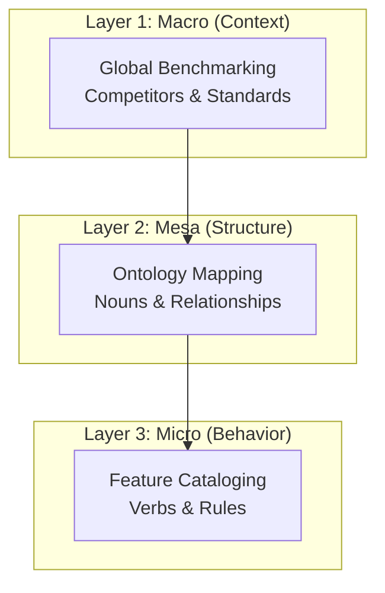
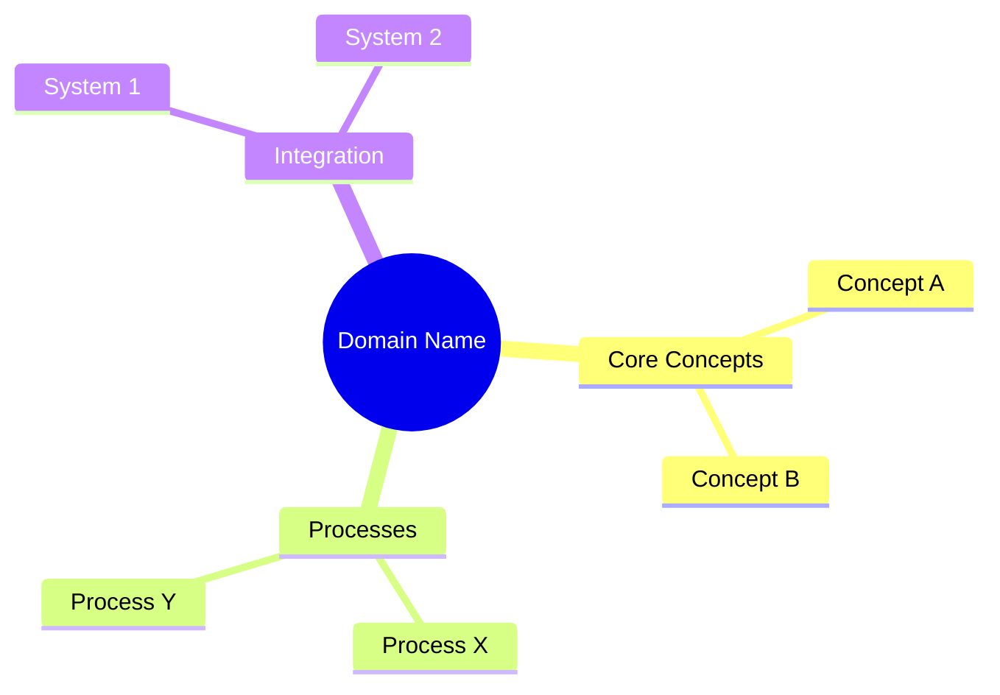

# 18. Domain Research Methodology: The "Product Architect" Standard

> [!NOTE]
> **Mục tiêu**: Tài liệu này phân tích và chuẩn hóa năng lực "Domain Research" (Nghiên cứu nghiệp vụ). Mục tiêu không chỉ là "tìm kiếm thông tin" mà là **tái cấu trúc tri thức (Knowledge Reconstruction)** để phục vụ việc xây dựng Ontology và Feature Spec chất lượng cao.

## 1. Problem Definition (Vấn đề)

Trong quy trình phát triển phần mềm hiện đại (đặc biệt là với sự hỗ trợ của AI), "Research" thường bị hiểu nhầm là google search và tóm tắt lại.
Điều này dẫn đến các vấn đề:
1.  **Thiếu chiều sâu (Lack of Depth)**: Chỉ liệt kê bề mặt, thiếu các business rules ngầm định.
2.  **Thiếu ngữ cảnh (Lack of Context)**: Không biết tại sao các đối thủ (Competitors) lại thiết kế như vậy.
3.  **Rời rạc (Fragmentation)**: Thông tin không được quy hoạch về các Entity/Feature cụ thể.

Do đó, chúng ta cần nâng cấp skill "Domain Research" từ mức độ **"Information Gathering" (Thu thập)** lên mức độ **"Domain Architecture" (Kiến trúc nghiệp vụ)**.

## 2. The Methodology: "Deep Domain Analysis"

Chúng ta áp dụng phương pháp nghiên cứu 3 lớp (3-Layer Research Framework):

### Layer 1: Macro - Benchmarking & Standards
*   **Câu hỏi**: "Thế giới đang làm việc này như thế nào?"
*   **Hoạt động**:
    *   **Competitor Analysis**: Phân tích top 3-5 Global Leaders (Workday, SAP, Salesforce...).
        *   *Ví dụ*: Workday xử lý "Retrospective Salary Change" như thế nào?
    *   **Compliance/Regulations**: ISO, GDPR, Local Laws (Luật lao động, Luật thuế).
    *   **Industry Trends**: Xu hướng mới (e.g., Earned Wage Access trong Payroll).

### Layer 2: Mesa - Ontology Modeling (Nouns)
*   **Câu hỏi**: "Gồm những thực thể gì và chúng quan hệ ra sao?"
*   **Hoạt động**:
    *   Xác định **Core Entities**: Các đối tượng chính (Employee, Contract).
    *   Xác định **Value Objects**: Các cấu trúc dữ liệu đi kèm (Address, Money).
    *   Xác định **Aggregates**: Cụm entity nhất quán (PayrollRun bao gồm RunDetails).
*   **Output**: Mermaid Class Diagram hoặc ERD.

### Layer 3: Micro - Feature Cataloging (Verbs)
*   **Câu hỏi**: "Người dùng tác động gì lên hệ thống?"
*   **Hoạt động**:
    *   Liệt kê **Actions**: Submit, Approve, Cancel, Revert.
    *   Liệt kê **Rules**: Validation, Calculation.
*   **Output**: Danh sách Functional Requirements (Input cho `*.frs.md`).

## 3. Visualization Standard (Chuẩn hóa hiển thị)

Một bài nghiên cứu tốt phải giúp người đọc nắm bắt được "Big Picture" ngay lập tức. Công cụ bắt buộc là **Mermaid Mindmap**.

### Tại sao Mindmap?
*   **Hierarchical**: Phù hợp với cấu trúc Module -> Sub-module -> Feature.
*   **Cognitive Load**: Giảm tải cho não bộ so với đọc liệt kê gạch đầu dòng.

**Template Mindmap:**

## 4. Structured Output Definition (Cấu trúc báo cáo)

Một tài liệu "Domain Analysis Artifact" phải tuân thủ nghiêm ngặt cấu trúc sau để đảm bảo tính "Actionable" (có thể dùng ngay để code/design).

| Section | Content | Purpose |
|---------|---------|---------|
| **1. Executive Summary** | Tổng quan, Value Proposition, Key Competitors. | Định hướng chiến lược. |
| **2. Domain Map** | **Mermaid Mindmap** toàn cảnh. | Định hình phạm vi (Scoping). |
| **3. Entity Catalog** | Bảng danh sách Entities (Master/Transaction). | Input cho team Database/Ontology. |
| **4. Feature Catalog** | Bảng danh sách Features (User Stories). | Input cho team Dev/Feature Spec. |
| **5. Strategic Insights** | Best practices, Gaps, Risks. | Tư vấn giải pháp (SME Role). |

## 5. The "Product Architect" Persona

Khi thực hiện skill này, AI (Agent) không đóng vai trò là "Search Engine". AI đóng vai trò là **Senior Product Architect**.

**Tư duy của Architect:**
*   Không chỉ trả lời "Cái gì", mà phải giải thích "**Tại sao**".
*   Luôn tìm kiếm **Edge Cases** (Trường hợp biên).
*   Luôn nghĩ đến **Scalability** (Mở rộng) và **Configurability** (Cấu hình).

## 6. Conclusion (Kết luận)

Việc chuẩn hóa Skill Domain Research theo hướng này sẽ giúp:
1.  **Đồng bộ hóa tri thức**: Cả team (Người và AI) cùng hiểu chung một domain model.
2.  **Tăng tốc độ development**: Có sẵn blueprint rõ ràng trước khi code.
3.  **Giảm rủi ro**: Phát hiện sớm các thiếu sót về nghiệp vụ nhờ đối chiếu với chuẩn thế giới.
