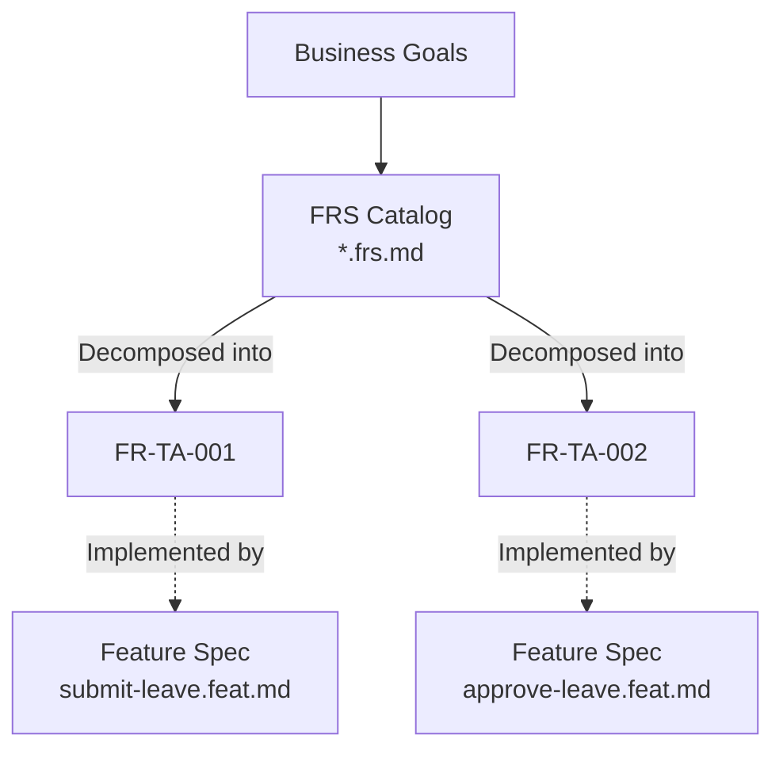
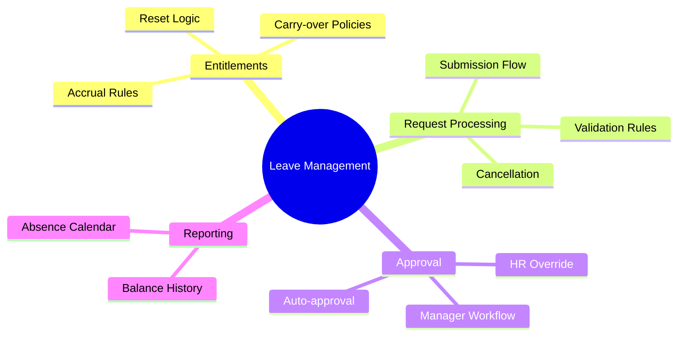
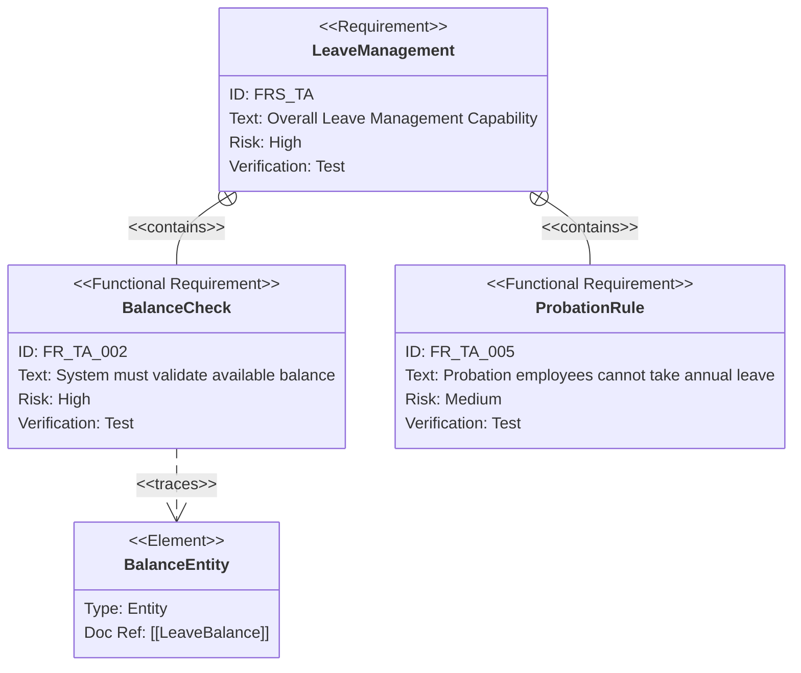
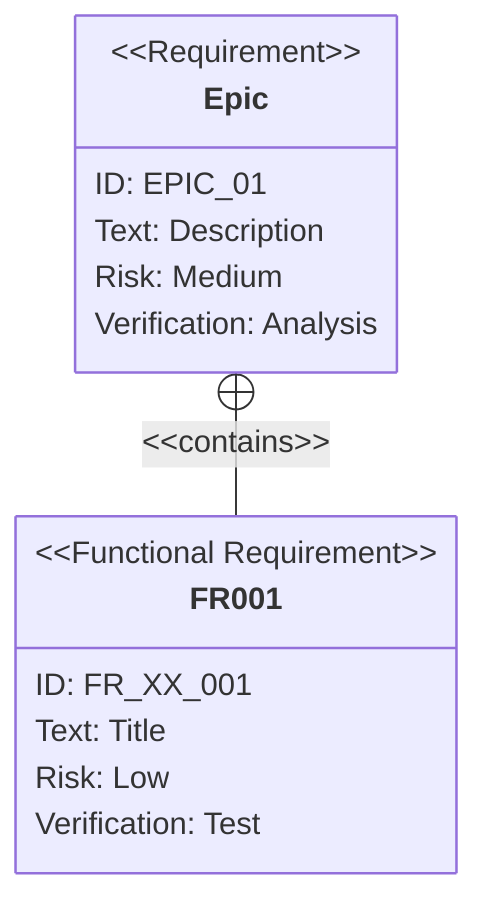

# Functional Requirement Standard (*.frs.md)

> [!NOTE]
> This document defines the standard for **Functional Requirement Specification (FRS)** files. Unlike Feature Specs (`*.feat.md`) which describe *how* a specific user journey works, the FRS (`*.frs.md`) serves as the **Master Catalog** of *what* the system must do for a specific sub-module.

## 1. Concept & Role

**Role**: The FRS file acts as the **Single Source of Truth** for all functional requirements within a sub-module. It bridges the gap between high-level Business Requirements and granular Feature Specifications.

**Scope**: One file per **Sub-Module**.
*   Example: `time-attendance.frs.md`
*   Example: `payroll-calculation.frs.md`

**Relationship to Feature Spec**:


## 2. File Anatomy

### 2.1. YAML Frontmatter (Metadata)

The metadata must define the scope and ownership of this requirement set.

```yaml
---
id: FRS-TA                     # Unique ID for the Requirement Set
module: TIME_ATTENDANCE        # Parent Module
sub_module: LEAVE_MANAGEMENT   # Specific Scope
title: "Leave Management Requirements"
version: "1.2.0"
status: APPROVED               # DRAFT | REVIEW | APPROVED
owner: "HR Product Team"
last_updated: "2024-03-20"
tags:
  - time-off
  - absence
  - compliance
---
```

### 2.2. Section 1: Functional Scope (Mindmap)

**Purpose**: "Quick Glance" understanding. A visual map of what this module covers.
**Tool**: Mermaid `mindmap`.



### 2.3. Section 2: Requirement Catalog (The Core)

**Purpose**: The authoritative list of atomic requirements.
**Format**: Markdown Table (for scanability) or Definition Lists (for detail).

| ID | Title | Priority | Risk | Status |
|----|-------|----------|------|--------|
| `FR-TA-001` | **Submit Leave Request**<br>Allow employees to request time off via portal. | MUST | MED | DONE |
| `FR-TA-002` | **Validate Balance**<br>System must block requests exceeding available balance. | MUST | HIGH | DONE |
| `FR-TA-003` | **Multi-level Approval**<br>Support configurable approval chains based on duration. | SHOULD | MED | DOING |

### 2.4. Section 3: Traceability (Requirement Diagram)

**Purpose**: Show how requirements relate to each other (hierarchy) and to test cases.
**Tool**: Mermaid `requirementDiagram`.



## 3. Template

```markdown
---
id: FRS-{MODULE_CODE}
module: {MODULE_NAME}
sub_module: {SUB_MODULE_NAME}
title: "{Sub-module} Requirements"
version: "1.0.0"
status: DRAFT
owner: "{Team Name}"
---

# Functional Requirements: {Title}

## 1. Functional Scope

> **Summary**: Brief description of what this sub-module does.

```mermaid
mindmap
  root(({Name}))
    Area 1
      Feature A
      Feature B
    Area 2
      Feature C
```

## 2. Requirement Catalog

| ID | Requirement Detail | Priority | Type |
|----|-------------------|----------|------|
| **[[FR-XX-001]]** | **Title of Requirement**<br>Detailed description of the requirement. Must be atomic and testable. | MUST | Functional |
| **[[FR-XX-002]]** | **Title of Requirement**<br>Another description. | SHOULD | UI/UX |

## 3. Detailed Specifications

### [[FR-XX-001]] Title of Requirement

*   **Description**: Full elaboration if the table summary is not enough.
*   **Acceptance Criteria**:
    *   Criterion A
    *   Criterion B
*   **Dependencies**:
    *   Depends on: [[FR-XX-000]]
    *   Blocked by: [[ISSUE-123]]

## 4. Requirement Hierarchy


```

## 4. Key Differences from `*.feat.md`

| Aspect | `*.frs.md` (Functional Requirement) | `*.feat.md` (Feature Spec) |
|--------|------------------------------------|----------------------------|
| **Scope** | Sub-module (Many requirements) | Specific User Flow (One interaction) |
| **Content** | "What" the system must do | "How" the system does it |
| **Granularity** | List of atomic statements | Step-by-step logic & diagrams |
| **Diagrams** | `mindmap`, `requirementDiagram` | `sequenceDiagram`, `flowchart` |
| **Primary User** | Product Owner, BA, Tester | Developer, AI Copilot |

## 5. Storage Convention

Files are stored in the `02-spec/FR` directory, organized by module.

```
02-spec/
├── FR/
│   ├── core-hr/
│   │   ├── organization.frs.md
│   │   └── job-management.frs.md
│   └── time-attendance/
│       ├── leave-management.frs.md
│       └── timesheet.frs.md
```
