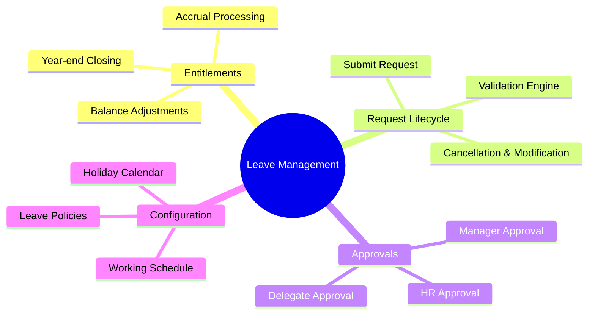

# Functional Requirements: Leave Management

## 1. Functional Scope

> **Summary**: This sub-module handles the end-to-end lifecycle of employee leave, from entitlement calculation and accruals to request processing, approval workflows, and balance tracking.



## 2. Requirement Catalog

| ID | Requirement Detail | Priority | Type |
|----|-------------------|----------|------|
| **[[FR-TA-001]]** | **Submit Leave Request (Self-Service)**<br>Employees can submit leave requests via portal/mobile with real-time validation. | MUST | Functional |
| **[[FR-TA-002]]** | **Real-time Balance Check**<br>System must validate that the request duration does not exceed available balance. | MUST | Validation |
| **[[FR-TA-003]]** | **Probation Logic Enforcement**<br>Block annual leave requests for employees currently in probation period. | MUST | Business Rule |
| **[[FR-TA-004]]** | **Approval Workflow Routing**<br>Automatically route requests to direct manager based on org chart. | MUST | Workflow |
| **[[FR-TA-005]]** | **Holiday & Weekend Exclusion**<br>Automatically exclude non-working days from leave duration calculation. | MUST | Calculation |
| **[[FR-TA-006]]** | **Leave Cancellation**<br>Allow employees to cancel requests before approval or before the leave date. | SHOULD | Functional |

## 3. Detailed Specifications

### [[FR-TA-001]] Submit Leave Request (Self-Service)

*   **Description**: Enable employees to create a new leave request. This is the entry point for the "Time Off" user journey.
*   **Acceptance Criteria**:
    *   User can select leave type from a dropdown of eligible policies.
    *   User can select date range (StartDate, EndDate).
    *   System displays estimated duration immediately (e.g., "2.5 days").
    *   User receives a success notification and Tracking ID upon submission.
*   **Mapped Features**:
    *   Implemented by: [[FEAT-TA-001]] (Submit Leave Request)

### [[FR-TA-002]] Real-time Balance Check

*   **Description**: Prevent negative balance processing.
*   **Acceptance Criteria**:
    *   Check must consider: `Current Balance - Pending Requests = Available`.
    *   If `Requested > Available`, show blocking error.
    *   Display "Insufficient Balance" error message clearly.
*   **Dependencies**:
    *   Depends on [[LeaveBalance]] entity.

### [[FR-TA-005]] Holiday & Weekend Exclusion

*   **Description**: Duration calculation must respect the employee's work schedule and public holidays.
*   **Acceptance Criteria**:
    *   Given a request from Friday to Monday.
    *   If Sat/Sun are non-working days.
    *   Then duration = 2 days (Friday + Monday).
    *   System must lookup [[HolidayCalendar]] and [[WorkSchedule]].

## 4. Requirement Hierarchy

```mermaid
requirementDiagram
    requirement LeaveCapability {
        id: REQ_TA_LEAVE_001
        text: Manage Employee Time Off
        risk: high
        verifymethod: demonstration
    }

    functionalRequirement SubmitReq {
        id: FR_TA_001
        text: Submit Leave Request
        risk: high
        verifymethod: test
    }

    functionalRequirement BalanceVal {
        id: FR_TA_002
        text: Validate Balance
        risk: high
        verifymethod: test
    }

    functionalRequirement HolidayCalc {
        id: FR_TA_005
        text: Exclude Holidays
        risk: medium
        verifymethod: analysis
    }

    element LeaveRequests {
        type: Entity
        docRef: "[[LeaveRequest]]"
    }

    LeaveCapability - contains -> SubmitReq
    SubmitReq - satisfies -> LeaveCapability
    SubmitReq - requires -> BalanceVal
    SubmitReq - requires -> HolidayCalc
    SubmitReq - traces -> LeaveRequests
```
