# So Sánh Chiến Lược: Odoo 18 HR vs. Giải Pháp HCM Hàng Đầu Thế Giới

> **Tài liệu dành cho C-Level** | Phiên bản: Tháng 3/2026
>
> *Mục đích: Giúp ban lãnh đạo hiểu rõ "đang ở đâu" khi dùng Odoo và "cần gì" khi so với các giải pháp enterprise-grade, từ đó đưa ra quyết định đầu tư đúng đắn cho nền tảng quản trị nhân sự.*

---

## TÓM TẮT DÀNH CHO CEO (EXECUTIVE SUMMARY)

**Một câu:**
> Odoo 18 Enterprise là nền tảng ERP tốt cho doanh nghiệp nhỏ-vừa với HR cơ bản. Nhưng khi doanh nghiệp vượt 500+ nhân sự, cần multi-entity, payroll phức tạp theo luật Việt Nam, hoặc insights chiến lược từ AI — khoảng cách giữa Odoo và Workday/SAP SF/Oracle HCM trở thành **vực thẳm**, không phải khoảng trống.

**Ba phát hiện quan trọng nhất:**

| # | Phát hiện | Ý nghĩa cho CEO |
|:--|:---|:---|
| 1 | Odoo 18 "có tất cả" nhưng **không sâu ở bất kỳ đâu** — giống Swiss Army Knife vs bộ dao chuyên nghiệp | Khi quy mô lên, bạn cần dao mổ phẫu thuật, không phải dao gọt táo |
| 2 | **AI của Odoo ≈ trang trí; AI của Big 3 ≈ cơ sở hạ tầng** — Workday có 70M+ employee records huấn luyện AI, Odoo thì không | Bạn đang so sánh chiếc xe có GPS với chiếc xe có autopilot |
| 3 | **Chi phí thấp của Odoo là "ảo"** — TCO thực tế khi scale 1.000+ người + customize cho VN thường vượt budget Oracle/SAP ban đầu | "Tiết kiệm" hôm nay = trả giá gấp 3x sau 3 năm |

---

## I. TỔNG QUAN 4 NỀN TẢNG — "AI LÀ AI?"

### Bảng Nhận Diện Nhanh

| Tiêu chí | **Odoo 18 Enterprise** | **Workday HCM** | **SAP SuccessFactors** | **Oracle HCM Cloud** |
|:---|:---|:---|:---|:---|
| **Bản chất** | ERP mã nguồn mở + gói Enterprise trả phí | Pure-play HCM Cloud | HXM Suite (thuộc SAP) | Fusion Apps HCM (thuộc Oracle) |
| **Khách hàng mục tiêu** | SMB → Mid-market (10 – 500 nhân sự) | Mid → Large Enterprise (1.000 – 100.000+) | Large Enterprise (1.000+), đặc biệt SAP ecosystem | Large Enterprise (1.000+), đặc biệt Oracle ERP |
| **Thị phần Core HR** | Không có ranking toàn cầu (niche/SMB) | **33.8%** — #1 thế giới | ~12.2% — #2-3 thế giới | ~11.8% — #2-3 thế giới |
| **Dữ liệu huấn luyện AI** | Không công bố. Giới hạn trong dữ liệu khách hàng Odoo | **70 triệu+** hồ sơ nhân viên, 625 tỷ giao dịch/năm | Hàng chục triệu hồ sơ qua SAP ecosystem | 60%+ khách hàng Oracle HCM đã dùng AI features |
| **Pricing (list price)** | **~$20 – $31/user/tháng** (all apps) | **$34 – $150/user/tháng** (tùy module + quy mô) | **$8 – $76/user/tháng** (tùy module) | **$15 – $30/user/tháng** (min 1.000 users) |
| **Triển khai minimum** | 1 user | Không giới hạn tối thiểu (đã bỏ $250K/năm minimum) | Hợp đồng từ 1-3 năm | **Tối thiểu 1.000 user licenses** |
| **Compliance toàn cầu** | Localization cơ bản (~70 quốc gia, chất lượng không đều) | Mạnh (190+ quốc gia) | Mạnh nhất (100+ quốc gia, sâu nhất) | Mạnh (200+ quốc gia) |

---

## II. SO SÁNH THEO 8 CHIỀU SÂU — ĐIỀU CEO CẦN BIẾT

### 2.1. 🧠 Trí Tuệ Nhân Tạo (AI) — Khoảng Cách Thế Hệ

**Đây là chiều so sánh quan trọng nhất. Nó quyết định giá trị mà CEO nhận được từ hệ thống trong 5 năm tới.**

| Năng lực AI | Odoo 18 | Workday | SAP SF | Oracle HCM |
|:---|:---|:---|:---|:---|
| **Resume Parsing & Matching** | ✅ Có (cơ bản, so sánh keyword) | ✅ AI Talent Rediscovery, Smart Matching sâu | ✅ AI trích xuất kỹ năng từ CV, auto-gen câu hỏi phỏng vấn | ✅ Career Coach (agentic AI), mock interview |
| **Predictive Turnover** | ❌ Không có | ✅ Dự báo nghỉ việc dựa trên micro-signals, lên tới 95% accuracy | ✅ Workforce Analytics, planned AI agents cho succession | ✅ People Leader Workbench: retention trends + cost modeling |
| **Agentic AI (AI tự hành)** | ❌ Không tồn tại | ✅ **Agent System of Record (ASOR)** — quản lý hạm đội AI agents, cả Workday và 3rd-party | ✅ **Joule AI Agents** — Performance, Succession, Payroll, HR Case (GA mid-2026) | ✅ **AI Studio** — tạo custom AI agents. Role-based agents cho career dev, compensation, onboarding |
| **AI-powered Workforce Planning** | ❌ Không có | ✅ **Adaptive Planning** — gen AI cho headcount planning, auto-reflect changes to budget | ✅ Joule tích hợp 365 Copilot, scenario planning | ✅ Embedded AI trong planning, cost scenario simulation |
| **AI Marketplace/Ecosystem** | Community modules (chất lượng không đảm bảo) | ✅ **Workday AI Marketplace** + Workday Extend API | ✅ **SAP AI Units** ecosystem + SAP BTP | ✅ Oracle AI trong Fusion Apps, không tính phí thêm |
| **Ngôn ngữ hỗ trợ** | Tùy cộng đồng dịch | Đa ngôn ngữ | **Joule hỗ trợ tiếng Việt** (1 trong 11 ngôn ngữ GA) | Đa ngôn ngữ, Redwood UX |

> **📌 Verdict CEO:** AI của Odoo 18 giống "thêm gia vị" — có vài tính năng AI trong tuyển dụng nhưng không có hệ sinh thái. AI của Big 3 giống "đổi động cơ" — là nền tảng kiến trúc, tự hành, học liên tục, và có marketplace. **Khoảng cách này KHÔNG THỂ thu hẹp bằng customization.**

---

### 2.2. 💰 Payroll — Nơi Sự Thật Không Thể Che Giấu

| Năng lực Payroll | Odoo 18 Enterprise | Workday Payroll | SAP EC Payroll | Oracle Payroll Cloud |
|:---|:---|:---|:---|:---|
| **Payroll engine** | Có, nhưng chạy đơn luồng (single-threaded). Đã ghi nhận hiện tượng 24-72h cho 5.000 nhân viên trên phiên bản cũ | Multi-threaded, cloud-native, xử lý hàng triệu phiếu lương | Engine được thừa kế từ SAP Payroll (40+ năm kinh nghiệm), xử lý nhanh | Cloud-native, tích hợp sâu OCI, AI error detection |
| **Localization Việt Nam** | Localization VN tồn tại nhưng **chất lượng cộng đồng** — BHXH, thuế TNCN, lương tối thiểu vùng cần custom nặng | Không có localization VN sâu — phụ thuộc partner | Có partner VN (TalentTeam), nhưng depth tùy implementation | Limited VN-specific payroll — cần partner |
| **Xử lý ngoại lệ (Exception handling)** | Crash toàn batch khi gặp 1 lỗi ở 1 bản ghi | Cô lập lỗi, tiếp tục chạy batch, xuất exception report | Xử lý ngoại lệ riêng biệt, retro-pay tự động | Cô lập lỗi + AI detect anomalies |
| **Tốc độ xử lý** | ~3.5 giây/phiếu (benchmark Odoo 12, Odoo 18 cải thiện nhưng kiến trúc ORM gốc vẫn là bottleneck) | <0.1 giây/phiếu (in-memory processing) | Nhanh, phụ thuộc config | Cloud-native, scalable |
| **Retro-pay / Điều chỉnh hồi tố** | Thủ công hoàn toàn | Tự động, với audit trail đầy đủ | Tự động (Retro-pay engine mạnh nhất) | Tự động |
| **Multi-entity Payroll** | Property field-based (rủi ro rò rỉ chéo — xem Problem Statement) | Hard foreign key, data striping tĩnh | Master data tách biệt theo legal entity | Entity-level data isolation |

> **📌 Verdict CEO:** Payroll không phải nơi để "tiết kiệm". Chỉ cần **1 lần trả lương sai** cho 5.000 người = thảm họa pháp lý + 50% nhân sự bắt đầu tìm việc mới. Odoo payroll **chưa được thiết kế** cho quy mô 1.000+ nhân sự Việt Nam với complexity BHXH/thuế/vùng miền.

---

### 2.3. 🏢 Cấu Trúc Tổ Chức & Multi-Entity

| Năng lực | Odoo 18 | Workday | SAP SF | Oracle HCM |
|:---|:---|:---|:---|:---|
| **Mô hình multi-company** | **Property field** (company_dependent) — dữ liệu phụ thuộc session context | **Supervisory Organization** — cấu trúc cây linh hoạt, real-time | **Employee Central** — entity độc lập, global assignment | **Legal Entity** — hard boundary, deterministic ownership |
| **Data isolation giữa công ty** | ⚠️ Yếu — phụ thuộc record rules, rủi ro cross-company leakage | ✅ Built-in | ✅ Built-in | ✅ Built-in, cấp database |
| **Org chart phẳng / Matrix** | ❌ Chỉ hỗ trợ tree hierarchy | ✅ Matrix org, dotted-line reporting | ✅ Matrix, project-based | ✅ Matrix, flexible |
| **Position Management** | ❌ Không có (chỉ Job-based) | ✅ Cả Job-based & Position-based, mixed model | ✅ Cả hai, industry templates | ✅ Cả hai |

---

### 2.4. 📊 Analytics & Workforce Planning

| Năng lực | Odoo 18 | Workday | SAP SF | Oracle HCM |
|:---|:---|:---|:---|:---|
| **Real-time Dashboard** | Có, nhưng dữ liệu từ Odoo modules — không kéo external data | ✅ Real-time, cross-module, AI-powered | ✅ Stories in People Analytics (đang thay thế legacy reports) | ✅ Fusion Analytics Warehouse |
| **Predictive Analytics** | ❌ | ✅ Skills Cloud, Turnover Prediction, Talent Optimization | ✅ Joule Agents cho workforce analytics (planned) | ✅ AI-driven retention, cost modeling |
| **Scenario Planning** | ❌ | ✅ Adaptive Planning — "What-if" headcount + budget | ✅ Tích hợp SAP Analytics Cloud | ✅ Planning modules |
| **Benchmarking** | ❌ | ✅ **Industry benchmarks** từ 70M+ records — bạn so sánh với thị trường | ✅ Benchmarking từ SAP ecosystem | ✅ Limited |

> **📌 Verdict CEO:** Nếu bạn cần trả lời Board câu hỏi *"Chi phí nhân sự của chúng ta so với industry average là bao nhiêu? Phòng ban nào sẽ mất người tiếp theo?"* — Odoo không có khả năng. Workday trả lời được **trước khi bạn hỏi**.

---

### 2.5. 🎯 Talent Management (Tuyển dụng → Phát triển → Giữ chân)

| Năng lực | Odoo 18 | Workday | SAP SF | Oracle HCM |
|:---|:---|:---|:---|:---|
| **ATS (Applicant Tracking)** | Có, Kanban pipeline. AI parsing cơ bản (Enterprise) | ATS đầy đủ + Smart Matching + Talent Rediscovery + HiredScore + VNDLY (contingent) | Recruiting Marketing + Management + AI gen interview questions + SmartRecruiters acquisition | Career Coach (agentic), talent pool AI agents |
| **Onboarding** | Revamped trong v18, checklist-based | Personalized journey, automated task assignment, cross-module integration | AI-assisted onboarding, tự động hóa | AI New Hire Assistant |
| **Performance Management** | Appraisal module mới (v18), goal tracking, feedback cơ bản | Continuous feedback, AI-driven career path, Skills Cloud | Performance & Goals + Joule Agent đề xuất discussion points cá nhân hóa | Continuous feedback, AI performance assistant |
| **Learning (LMS)** | ❌ Không có LMS tích hợp (cần module bên ngoài) | ✅ Workday Learning | ✅ SAP Learning — enhanced search, real-time content update (1H 2025) | ✅ Oracle Learning |
| **Succession Planning** | ❌ | ✅ Talent pipeline, 9-box grid, AI-powered | ✅ Succession module + Joule succession agent (planned) | ✅ AI-powered succession |

---

### 2.6. ⚙️ Khả Năng Mở Rộng & Tùy Biến

| Tiêu chí | Odoo 18 | Workday | SAP SF | Oracle HCM |
|:---|:---|:---|:---|:---|
| **Customization model** | Full source code access (Community). Module/Studio customization (Enterprise) | Workday Extend (low-code). No source code access | SAP BTP extension. Limited native customization | Oracle Visual Builder Studio. Redwood pages |
| **Pros** | Tự do tối đa, chi phí thấp ban đầu | Ổn định, không bị "phá" bởi custom code | Tích hợp SAP ecosystem rộng lớn | Tích hợp Oracle DB, ERP |
| **Cons** | **Custom = Nợ kỹ thuật vĩnh cửu**. Mỗi upgrade = rewrite custom code. Cộng đồng module chất lượng bất ổn | Giới hạn customization depth. Giá cao cho development | Phức tạp, đắt đỏ, TCO tăng theo quy mô | Learning curve cao, kiến trúc phức tạp |
| **Upgrade path** | ⚠️ Upgrade giữa major versions (12→14→16→18) là **cơn ác mộng** — phải migrate, test lại toàn bộ custom code | Cloud-native, auto-update 2 lần/năm | Cloud, 2 releases/năm (250+ features/release) | Cloud, quarterly updates |

---

### 2.7. 🔒 Bảo Mật & Compliance

| Tiêu chí | Odoo 18 | Workday | SAP SF | Oracle HCM |
|:---|:---|:---|:---|:---|
| **Chứng nhận** | SOC 1 Type II, SOC 2 Type II (Odoo Online) | SOC 1/2/3, ISO 27001/27017/27018, FedRAMP, HIPAA | ISO 27001, SOC 1/2, GDPR-ready, C5 | SOC 1/2, ISO 27001, FedRAMP, HIPAA |
| **GDPR / Data Privacy** | Cơ bản | Enterprise-grade, built-in | Enterprise-grade | Enterprise-grade |
| **Data residency** | EU (Odoo Online). On-prem tùy chọn | Multi-region | Multi-region | Multi-region, OCI global |
| **Vietnam PDPD 2023 compliance** | ❓ Không rõ | ❓ Phụ thuộc configuration | ❓ Phụ thuộc configuration | ❓ Phụ thuộc configuration |

---

### 2.8. 💵 Tổng Chi Phí Sở Hữu (TCO) — Con Số Thật

**Ước tính 3 năm cho doanh nghiệp 1.000 nhân sự:**

| Hạng mục | Odoo 18 Enterprise | Workday | SAP SF | Oracle HCM |
|:---|:---|:---|:---|:---|
| **License/năm** | ~$360K ($30 × 1.000 × 12) | ~$400K – $500K ($34-42 PEPM mid-market) | ~$300K – $400K (modules selected) | ~$180K – $360K ($15-30 PEPM, min 1.000 users) |
| **Implementation** | ~$100K – $300K | ~$400K – $500K (≈100% annual fees) | ~$300K – $500K | ~$200K – $400K |
| **Customization VN (Payroll, BHXH, Tax)** | ⚠️ **$150K – $500K** (custom dev + testing + maintenance) | ~$100K – $200K (partner config) | ~$100K – $200K (partner config) | ~$100K – $200K (partner config) |
| **Annual maintenance & upgrades** | ⚠️ **$50K – $150K/năm** (vì custom code phải maintain riêng) | Included trong subscription | Included | Included |
| **TCO 3 năm ước tính** | **$1.3M – $2.6M** | **$2.0M – $2.5M** | **$1.6M – $2.2M** | **$1.3M – $2.0M** |
| **Hidden cost risk** | 🔴 **RẤT CAO** — upgrade nightmare, custom code debt, payroll risk | 🟢 Thấp — auto-update | 🟡 Trung bình | 🟡 Trung bình |

> **📌 Verdict CEO:** Odoo 18 có vẻ "rẻ" khi nhìn license price. Nhưng khi tính **TCO thực tế** cho 1.000+ nhân sự Việt Nam — bao gồm customization VN, nợ kỹ thuật từ upgrade, maintenance custom code — **chi phí Odoo tiệm cận hoặc vượt** Oracle HCM, trong khi **giá trị nhận được** (AI, analytics, scalability) kém hơn đáng kể.

---

## III. MA TRẬN QUYẾT ĐỊNH — "CHỌN GÌ CHO TÌNH HUỐNG CỦA TÔI?"

### 3.1. Bảng Scoring (1-5 ⭐, 5 = tốt nhất)

| Tiêu chí (trọng số CEO) | Odoo 18 | Workday | SAP SF | Oracle HCM |
|:---|:---:|:---:|:---:|:---:|
| **AI & Predictive Analytics** (25%) | ⭐⭐ | ⭐⭐⭐⭐⭐ | ⭐⭐⭐⭐ | ⭐⭐⭐⭐½ |
| **Payroll cho VN scale** (20%) | ⭐⭐ | ⭐⭐⭐ | ⭐⭐⭐⭐ | ⭐⭐⭐ |
| **Multi-Entity / Tập đoàn** (15%) | ⭐⭐ | ⭐⭐⭐⭐⭐ | ⭐⭐⭐⭐⭐ | ⭐⭐⭐⭐⭐ |
| **Talent Management E2E** (15%) | ⭐⭐½ | ⭐⭐⭐⭐⭐ | ⭐⭐⭐⭐⭐ | ⭐⭐⭐⭐ |
| **Giá license thuần** (10%) | ⭐⭐⭐⭐⭐ | ⭐⭐ | ⭐⭐⭐ | ⭐⭐⭐½ |
| **TCO thực tế (gồm hidden cost)** (10%) | ⭐⭐⭐ | ⭐⭐⭐ | ⭐⭐⭐ | ⭐⭐⭐½ |
| **Ease of upgrade / Future-proof** (5%) | ⭐⭐ | ⭐⭐⭐⭐⭐ | ⭐⭐⭐⭐ | ⭐⭐⭐⭐ |
| **Tổng điểm (weighted)** | **2.5/5** | **4.2/5** | **4.1/5** | **3.9/5** |

### 3.2. Khuyến Nghị Theo Quy Mô

| Quy mô DN | Khuyến nghị | Lý do |
|:---|:---|:---|
| **< 200 nhân sự, đơn pháp nhân** | ✅ **Odoo 18 Enterprise** hoặc giải pháp nội địa VN (Base.vn, 1Office) | Chi phí thấp, đủ dùng, không cần enterprise features |
| **200 – 500 nhân sự, bắt đầu đa pháp nhân** | ⚠️ Odoo 18 Enterprise **có rủi ro** — cần evaluate kỹ customization budget vs migration cost sang nền tảng lớn hơn | "Đầu tư đúng bây giờ" rẻ hơn "chữa cháy sau 3 năm" |
| **500 – 2.000 nhân sự, đa pháp nhân** | ✅ **Giải pháp mới thay thế (xTalent-class)** hoặc **Oracle HCM / SAP SF** | Dead zone: Odoo thiếu depth, Workday đắt. Cần giải pháp mid-market VN-first |
| **2.000 – 10.000+ nhân sự** | ✅ **Workday HCM** hoặc **SAP SuccessFactors** | Enterprise-grade AI, payroll, analytics. ROI chứng minh được |
| **10.000+ nhân sự, tập đoàn đa quốc gia** | ✅ **SAP SF** (nếu đã có SAP ERP) hoặc **Workday** (nếu cloud-first) | Scale + compliance toàn cầu. Không có lựa chọn nào khác |

---

## IV. CÂU HỎI MÀ CEO NÊN TỰ ĐẶT RA

Trước khi quyết định giữ Odoo hay chuyển đổi, hãy trả lời **5 câu hỏi:**

| # | Câu hỏi | Nếu trả lời "Có" → |
|:--|:---|:---|
| 1 | Doanh nghiệp sẽ vượt 500 nhân sự trong 2 năm tới? | Odoo sẽ trở thành nút thắt. Lên kế hoạch migration **ngay bây giờ** |
| 2 | Bạn cần trình Board báo cáo workforce analytics trong real-time? | Odoo không thể. Cần nền tảng có predictive capability |
| 3 | Bạn có hoặc sẽ có cấu trúc đa pháp nhân (công ty con, chi nhánh khác vùng)? | Kiến trúc property-field của Odoo = rủi ro rò rỉ dữ liệu. Cần entity-based isolation |
| 4 | Payroll VN phức tạp (BHXH nhiều loại, vùng miền, OT phức tạp, 1.000+ nhân sự)? | Odoo payroll engine chưa được thiết kế cho volume này. Rủi ro **rất cao** |
| 5 | Bạn muốn AI support cho việc giữ chân nhân tài, dự báo gap kỹ năng, planning? | Odoo 18 AI = basic features. Cần Workday/SAP/Oracle-class AI ecosystem |

---

## V. KẾT LUẬN

Odoo 18 là một **bước tiến lớn** so với Odoo 12/14/16 — với AI trong tuyển dụng, appraisal module mới, attendance cải tiện. Nhưng nó vẫn là **ERP đa năng với module HR**, không phải **nền tảng HCM chuyên biệt**.

Sự khác biệt giống như:

> **Phòng y tế công ty** *(Odoo HR)* vs. **Bệnh viện đa khoa** *(Workday/SAP/Oracle HCM)*
>
> Phòng y tế xử lý được cảm cúm, đo huyết áp. Nhưng khi bệnh nhân cần phẫu thuật — bạn cần bệnh viện.

**Đối với doanh nghiệp Việt Nam đang tăng trưởng**, câu hỏi không phải "Odoo có tốt không?" (có, cho quy mô nhỏ). Câu hỏi là: **"Nền tảng nào giúp tôi quản trị 1.000+ con người — tài sản đắt giá nhất — với sự tự tin, tốc độ, và trí tuệ mà cuộc cạnh tranh bắt buộc?"**

Câu trả lời nằm ở giải pháp **đủ sâu như enterprise HCM, đủ gần như vendor Việt Nam, đủ thông minh để AI-first, và đủ hợp lý về giá cho mid-market** — một phân khúc mà cả Odoo lẫn Big 3 đều **chưa phục vụ trọn vẹn**.

---

*Báo cáo dựa trên nghiên cứu công khai về Odoo 18 (Oct 2024 release), Workday HCM 2025 R1/R2, SAP SuccessFactors 1H/2H 2025, Oracle HCM Cloud Release 25A, cùng phân tích thị trường từ Fortune Business Insights, Mordor Intelligence, OutSail, Futurum Group, và dữ liệu pricing từ các nguồn công khai. Các con số TCO là ước tính dựa trên kịch bản 1.000 nhân sự tại Việt Nam và có thể khác biệt tùy doanh nghiệp cụ thể.*
