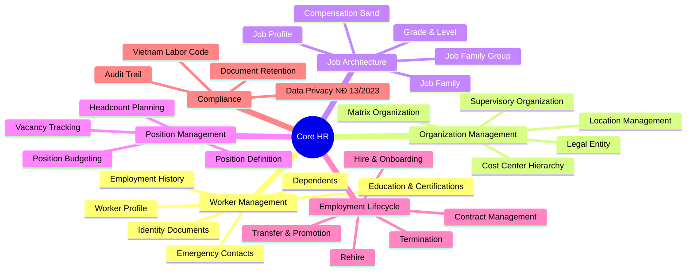
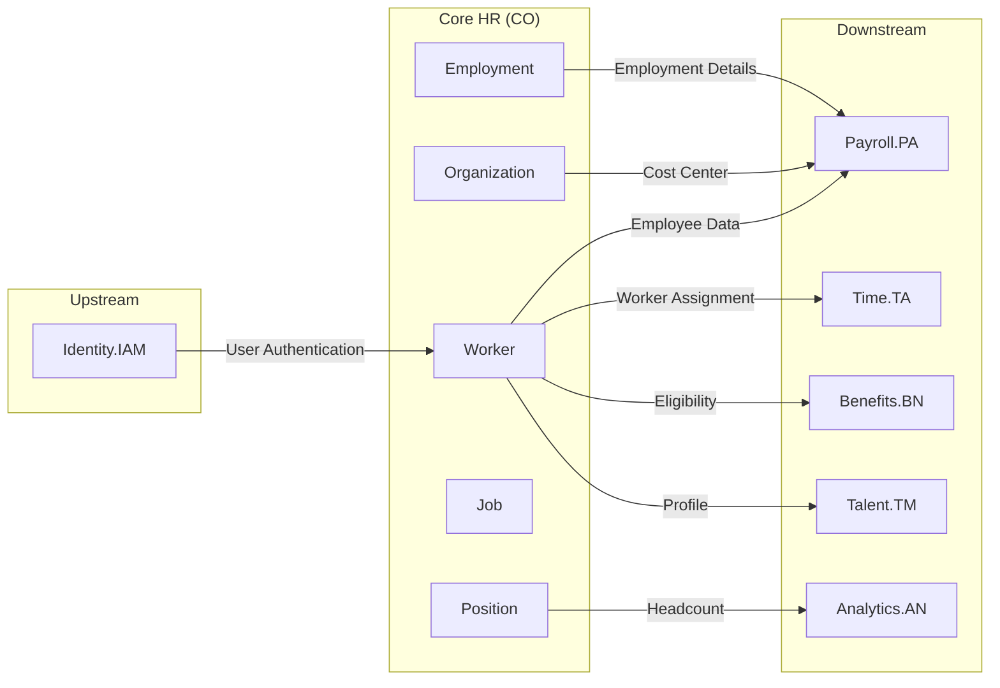

# Architectural Domain Research: Core HR

> Module Code: **CO** | Domain: **Human Capital Management (HCM)**

---

## 1. Executive Summary

**Domain Classification:** **CORE DOMAIN**

| Strategy | Investment | Build/Buy |
|----------|------------|-----------|
| Foundation for entire HCM suite, competitive advantage through data quality and integration | **HIGH** | **BUILD** |

**Value Proposition:**
Core HR là module nền tảng quản lý toàn bộ dữ liệu nhân sự từ Worker, Position, Organization đến Employment Lifecycle. Module này quyết định chất lượng dữ liệu và khả năng tích hợp của toàn bộ hệ thống HCM.

**Critical Constraints:**
- **Regulatory**: Bộ Luật Lao động Việt Nam 2019, Nghị định 13/2023/NĐ-CP về Bảo vệ Dữ liệu Cá nhân
- **Technical**: Single source of truth cho employee data, real-time sync với các modules khác
- **Business**: Hỗ trợ đa công ty, đa ngữ, đa tiền tệ cho enterprise clients

---

## 2. Explicit Non-Goals (Out of Scope)

> *Define what this domain will NOT do. This prevents scope creep and protects long-term architecture.*

| Non-Goal | Rationale | Handled By |
|----------|-----------|------------|
| **Payroll Calculation** | Complex tax/social insurance rules, separate compliance | Module PA (Payroll) |
| **Performance Management** | Goal setting, reviews, 360 feedback | Module TM (Talent Management) |
| **Time & Attendance Tracking** | Clock-in/out, schedules, overtime | Module TA (Time & Attendance) |
| **Learning Management** | Training courses, certifications tracking | Module LM (Learning) |
| **Recruitment & Applicant Tracking** | Job postings, candidate pipeline | Module RC (Recruiting) |
| **Compensation Planning** | Salary reviews, bonus allocation | Module CM (Compensation) |
| **Workforce Analytics Deep-Dive** | Predictive analytics, AI models | Module AN (Analytics) |

**Scope Boundary Rule:** If feature is not in this document → It's out of scope by default.

---

## 3. Domain Evolution Outlook (Temporal Analysis)

> *Forecast how this domain will change over 1-5 years.*

| Horizon | Timeframe | Expected Change | Impact | Architecture Implication |
|---------|-----------|-----------------|--------|-------------------------|
| **H1** | 0-1 year | Vietnam Labor Code 2019 full compliance, basic HRIS | HIGH | Implement contract types, mandatory fields, retention rules |
| **H1** | 0-1 year | Employee Self-Service (ESS) | MEDIUM | Mobile-responsive, profile updates, document requests |
| **H2** | 1-3 years | AI-assisted data entry & validation | MEDIUM | NLP for document extraction, duplicate detection |
| **H2** | 1-3 years | Advanced Org Modeling & Planning | MEDIUM | What-if scenarios, merger simulations |
| **H3** | 3-5 years | Skills-based workforce architecture | UNKNOWN | Skills Cloud integration, dynamic job matching |
| **H3** | 3-5 years | Contingent workforce expansion | UNKNOWN | Gig workers, contractors với different lifecycle |

**Volatility Assessment:**
- **High-volatility areas:** Employment Assignment rules, Country-specific configurations → Require config-driven/rule-engine approach
- **Stable core:** Worker entity, Organization hierarchy → Can invest in strict schema, high test coverage

---

## 4. Domain Confidence Assessment

> *Overall "trustworthiness" of this research before major investment.*

| Dimension | Score | Notes |
|-----------|-------|-------|
| **Regulatory Clarity** | HIGH | Vietnam Labor Code 2019 is well-defined, NĐ 13/2023 provides data protection guidelines |
| **Market Consensus** | HIGH | All 4 competitors (Workday, SAP, Oracle, Microsoft) agree on core patterns |
| **Business Stability** | MEDIUM | Vietnam labor law updates ~every 5 years, social insurance rules change yearly |
| **Technical Maturity** | HIGH | Proven patterns from 20+ years of HCM systems evolution |

**Overall Domain Confidence:** **HIGH**

**Investment Recommendation:**
- **Proceed with confidence, standard timeline**
- Focus on extensibility for Vietnam-specific requirements
- Build with configuration capability for future regulatory changes

---

## 5. Decision Log (Architectural Decision Records)

> *Document major architectural choices and conflict resolutions.*

| ID | Title | Decision | Rationale | Source | Status |
|:---|:------|:---------|:----------|:-------|:-------|
| **ADR-CO-001** | Staffing Model | Hybrid (Position + Job Management) | Match Workday flexibility, support both budgeted positions and flexible hiring | P2 (Workday, SAP) | PROPOSED |
| **ADR-CO-002** | Worker vs Employee | Single Worker entity with work_type attribute | Simplify model, SAP/Oracle approach, handle employee/contractor/intern uniformly | P2 (SAP, Oracle) | PROPOSED |
| **ADR-CO-003** | Organization Types | Configurable org types | Enterprise clients need custom hierarchies (legal, cost center, matrix) | P2 (Workday) | PROPOSED |
| **ADR-CO-004** | Vietnam Localization | Embedded in core with country extension points | Avoid separate module, reduce integration cost | P3 (Internal) | PROPOSED |

### ADR Details

#### ADR-CO-001: Staffing Model Choice

**Status:** PROPOSED  
**Date:** 2026-01-23  
**Source Conflict:** Some clients want strict position control, others want flexibility

**Context:**
- **Position Management**: Detailed budgetary control, track open/filled status (Workday approach)
- **Job Management**: Flexible hiring without position limits (simpler approach)
- Vietnam enterprises vary: government-linked need position control, startups prefer flexibility

**Decision:**
Implement Hybrid model supporting both Position Management and Job Management per organization

**Rationale:**
- Workday và SAP đều support cả hai models
- Allow configuration at Supervisory Organization level
- Future-proof for diverse client needs

**Consequences:**
- **Positive:** Maximum flexibility, competitive with Workday
- **Negative:** Higher implementation complexity
- **Trade-off:** Training cost for administrators

---

#### ADR-CO-002: Worker vs Employee Terminology

**Status:** PROPOSED  
**Date:** 2026-01-23

**Context:**
Cần quyết định có một entity "Worker" chung hay tách riêng Employee, Contractor, Intern

**Decision:**
Single **Worker** entity với attribute `worker_type` (Employee, Contractor, Contingent, Intern)

**Rationale:**
- Oracle HCM dùng "Global Person Record" cho all worker types
- SAP SuccessFactors quản lý all từ Employee Central
- Giảm complexity trong relationships và reporting

**Consequences:**
- **Positive:** Simpler data model, unified reporting
- **Negative:** Need careful role-based access control
- **Trade-off:** Some business logic needs type-checking

---

## 6. Domain Map

---

## 7. Cross-Domain Dependencies

### Dependency Diagram

### Dependency Details

**Upstream Dependencies** (Inputs we consume):
- **Identity & Access Management (IAM)**: User authentication, single sign-on, authorization tokens

**Downstream Dependencies** (Others consuming from us):
- **Payroll (PA)**: Worker data, organization hierarchy, employment assignment, termination dates
- **Time & Attendance (TA)**: Worker assignment, work schedules, location
- **Benefits (BN)**: Worker eligibility, dependents, employment status
- **Talent Management (TM)**: Worker profile, job profile, competencies
- **Analytics (AN)**: All master data for workforce analytics

**Integration Risks:**
- If **Worker.status** changes → Impact on Payroll processing, Benefits eligibility
- If **Organization hierarchy** restructures → Breaks reporting in Payroll, Analytics
- If we change **Position.budget_status** → Affects Workforce Planning in Analytics

---

## 8. Regulatory & Compliance Matrix

| Regulation | Article | Requirement | Design Impact | Source |
|------------|---------|-------------|---------------|--------|
| **Bộ Luật Lao động 2019** | Điều 13 | Hợp đồng lao động bằng văn bản | Must store digital contracts, e-signature support | [thuvienphapluat.vn](https://thuvienphapluat.vn) |
| **Bộ Luật Lao động 2019** | Điều 20 | 3 loại HĐLĐ: Không xác định thời hạn, Xác định thời hạn (≤36 tháng), Theo mùa vụ (≤12 tháng) | Contract entity must support these types | [thuvienphapluat.vn](https://thuvienphapluat.vn) |
| **Bộ Luật Lao động 2019** | Điều 121 | Lưu trữ hồ sơ lao động ≥10 năm sau khi nghỉ việc | Archive strategy instead of hard delete | [thuvienphapluat.vn](https://thuvienphapluat.vn) |
| **Nghị định 13/2023/NĐ-CP** | Điều 9 | Quyền xóa dữ liệu cá nhân | Implement anonymization, respect retention rules | [thuvienphapluat.vn](https://thuvienphapluat.vn) |
| **Nghị định 13/2023/NĐ-CP** | Điều 11 | Đồng ý xử lý dữ liệu | Consent management for personal data processing | [thuvienphapluat.vn](https://thuvienphapluat.vn) |
| **GDPR** (for international clients) | Art. 17 | Right to erasure | Anonymization, not hard delete (conflict with retention) | [gdpr.eu](https://gdpr.eu) |

---

## 9. Strategic Insights

### Best Practices (from Competitors)

| Practice | Source | Adoption Decision |
|----------|--------|-------------------|
| **Single Worker Record** | Oracle, SAP (2/4) | ✅ Adopt - Unified person management |
| **Position + Job Hybrid Staffing** | Workday (1/4) | ✅ Adopt - Maximum flexibility |
| **Interactive Org Charts** | All 4 (4/4) | ✅ Adopt - Table stakes |
| **ESS/MSS Self-Service** | All 4 (4/4) | ✅ Adopt - Reduce HR burden |
| **Skills Cloud / ML** | Workday (1/4) | ❌ Skip H1 - Future consideration |
| **AI Copilot for Data Entry** | Microsoft (1/4) | ⏳ Evaluate H2 - Emerging |
| **200+ Country Localizations** | Oracle (1/4) | ❌ Skip - Focus Vietnam first |
| **MDF Extensibility** | SAP (1/4) | ✅ Adapt - Metadata-driven custom fields |

### Feature Parity Analysis

| Capability | Workday | SAP SF | Oracle | MS Dynamics | xTalent Target |
|------------|---------|--------|--------|-------------|----------------|
| Worker Profile Management | ✅ | ✅ | ✅ | ✅ | **MUST** |
| Organization Hierarchy | ✅ | ✅ | ✅ | ✅ | **MUST** |
| Position Management | ✅ | ✅ | ✅ | ⚠️ | **MUST** |
| Job Architecture | ✅ | ✅ | ✅ | ✅ | **MUST** |
| Employment Lifecycle | ✅ | ✅ | ✅ | ✅ | **MUST** |
| Employee Self-Service | ✅ | ✅ | ✅ | ✅ | **MUST** |
| Manager Self-Service | ✅ | ✅ | ✅ | ✅ | **MUST** |
| Global Compliance | ✅ | ✅ | ✅ | ⚠️ | **MUST (Vietnam)** |
| Workforce Modeling | ✅ | ⚠️ | ✅ | ⚠️ | SHOULD |
| Skills Cloud | ✅ | ⚠️ | ⚠️ | ⚠️ | COULD (H3) |
| AI-Powered Features | ⚠️ | ⚠️ | ✅ | ✅ | COULD (H2) |

**Legend:** ✅ Strong, ⚠️ Limited, ❌ Not Available

### Gaps & Risks

**Identified Gaps:**
- **Gap 1:** Vietnam Labor Code 3-contract-type requirement - Competitors not optimized for Vietnam → **Impact: HIGH** (Competitive advantage)
- **Gap 2:** Vietnamese UI/UX localization - All competitors have generic UX → **Impact: MEDIUM**

**Regulatory Risks:**
- **Risk 1:** Data retention vs privacy deletion conflict - Need clear policy for Vietnam Decree 13/2023

**Technical Debt Risks:**
- **Risk 1:** Starting without Position Management may require refactoring later

### Recommendations

1. **Build single Worker entity with extensible attributes** - Priority: HIGH
   - **Justification:** Unanimous approach from SAP, Oracle
   - **ADR Reference:** ADR-CO-002

2. **Implement Hybrid Staffing Model from start** - Priority: HIGH
   - **Justification:** Avoid technical debt, match Workday
   - **ADR Reference:** ADR-CO-001

3. **Prioritize Vietnam Labor Code compliance** - Priority: CRITICAL
   - **Justification:** Competitive differentiator, mandatory for local market

4. **Design for extensibility (MDF-like custom fields)** - Priority: HIGH
   - **Justification:** Enterprise clients need custom data
   - **ADR Reference:** Future ADR

---

## 10. Next Steps

- [x] Generate `_research-report.md` from this research
- [ ] Generate `entity-catalog.md` from this research
- [ ] Generate `feature-catalog.md` from this research
- [ ] Create ontology files (`*.onto.md`) from Entity Catalog
- [ ] Create FRS files (`*.frs.md`) from Feature Catalog
- [ ] Review ADRs with architecture team
- [ ] Validate dependencies with upstream/downstream teams
- [ ] Present Domain Confidence to leadership for investment approval
