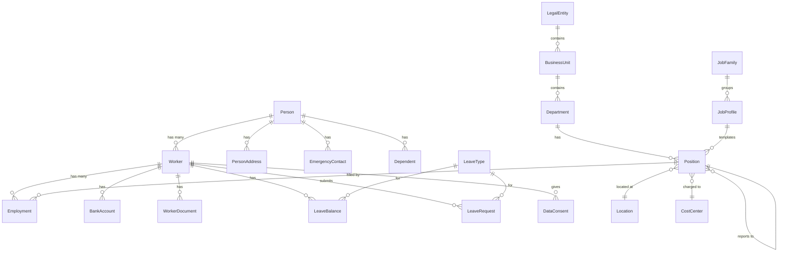

# Entity Catalog: Core HR

> **Note**: YAML above is for AI processing. Tables below for human reading.

## A. Core Master Data - Worker & Person

| ID | Entity | Stability | Frequency | PII | Definition |
|----|--------|-----------|-----------|-----|------------|
| E-CO-001 | **[[Person]]** | HIGH | RARE | HIGH | Unique individual in the system |
| E-CO-002 | **[[Worker]]** | HIGH | RARE | MEDIUM | Employment relationship with organization |
| E-CO-003 | **[[Employment]]** | MEDIUM | YEARLY | LOW | Specific employment instance with effective dates |

**Key Relationships:**
- Person → Worker (one-to-many: rehires)
- Worker → Employment (one-to-many: transfers, promotions)
- Worker → Position (via Employment)

**Competitor Mapping:**
- Workday: Person / Worker / Position Assignment
- SAP: Person / Employee / Employment Record
- Oracle: Person / Worker / Assignment

---

## B. Organization Structure

| ID | Entity | Stability | Frequency | Definition |
|----|--------|-----------|-----------|------------|
| E-CO-010 | **[[LegalEntity]]** | HIGH | RARE | Legally registered business entity |
| E-CO-011 | **[[BusinessUnit]]** | MEDIUM | YEARLY | Division within Legal Entity |
| E-CO-012 | **[[Department]]** | MEDIUM | YEARLY | Functional unit, basis of org chart |
| E-CO-013 | **[[Location]]** | HIGH | YEARLY | Physical/virtual work location |
| E-CO-014 | **[[CostCenter]]** | MEDIUM | YEARLY | Accounting unit for labor costs |

**Dependencies:**
- Downstream: Finance.CostCenter, Payroll, Reporting

---

## C. Position & Job

| ID | Entity | Stability | Frequency | Lifecycle |
|----|--------|-----------|-----------|-----------|
| E-CO-020 | **[[JobProfile]]** | HIGH | RARE | - |
| E-CO-021 | **[[JobFamily]]** | HIGH | RARE | - |
| E-CO-022 | **[[Position]]** | MEDIUM | QUARTERLY | Open → Filled → Vacant → Closed |

**Key Relationships:**
- JobFamily → JobProfile (categorization)
- JobProfile → Position (template)
- Position → Employment (assignment)
- Position → Position (reporting hierarchy)

---

## D. Leave & Time Foundation

| ID | Entity | Stability | Frequency | Lifecycle |
|----|--------|-----------|-----------|-----------|
| E-CO-030 | **[[LeaveType]]** | HIGH | YEARLY | - |
| E-CO-031 | **[[LeaveBalance]]** | MEDIUM | QUARTERLY | - |
| E-CO-032 | **[[LeaveRequest]]** | LOW | REALTIME | Draft → Submitted → Approved → Taken |
| E-CO-033 | **[[HolidayCalendar]]** | HIGH | YEARLY | - |

---

## E. Employee Personal Data

| ID | Entity | Stability | Frequency | PII |
|----|--------|-----------|-----------|-----|
| E-CO-040 | **[[PersonAddress]]** | MEDIUM | YEARLY | HIGH |
| E-CO-041 | **[[EmergencyContact]]** | MEDIUM | YEARLY | HIGH |
| E-CO-042 | **[[Dependent]]** | MEDIUM | YEARLY | HIGH |
| E-CO-043 | **[[BankAccount]]** | MEDIUM | YEARLY | HIGH |

---

## F. Documents & Compliance

| ID | Entity | Stability | Frequency | Lifecycle |
|----|--------|-----------|-----------|-----------|
| E-CO-050 | **[[WorkerDocument]]** | MEDIUM | YEARLY | - |
| E-CO-051 | **[[DataConsent]]** | LOW | QUARTERLY | Pending → Consented → Withdrawn |
| E-CO-052 | **[[AuditLog]]** | LOW | REALTIME | - |

---

## G. Reference Data

| ID | Entity | Frequency | Definition |
|----|--------|-----------|------------|
| E-CO-060 | **[[WorkerType]]** | RARE | Employee, Contractor, Intern |
| E-CO-061 | **[[EmploymentType]]** | RARE | Full-time, Part-time, Fixed-term |
| E-CO-062 | **[[TerminationReason]]** | YEARLY | Resignation, Layoff, etc. |
| E-CO-063 | **[[DocumentType]]** | YEARLY | Contract, ID, Certificate |

---

## H. Entity Relationships

---

## I. Change Frequency Analysis

| Frequency | Count | Entities | Architecture |
|-----------|-------|----------|--------------|
| **RARE** (< 5yr) | 8 | Person, Worker, LegalEntity, JobProfile, JobFamily, WorkerType, EmploymentType, Location | Hard-coded schema |
| **YEARLY** | 10 | Employment, BusinessUnit, Department, CostCenter, LeaveType, PersonAddress, EmergencyContact, Dependent, BankAccount, TerminationReason | Configuration tables |
| **QUARTERLY** | 3 | Position, LeaveBalance, DataConsent | State machine, workflows |
| **REALTIME** | 2 | LeaveRequest, AuditLog | Event stream, eventual consistency |

---

## J. PII Sensitivity Summary

| Level | Count | Entities | Compliance |
|-------|-------|----------|------------|
| **HIGH** | 7 | Person, PersonAddress, EmergencyContact, Dependent, BankAccount, WorkerDocument, AuditLog (contains PII) | PDPL consent, encryption at rest, access logging |
| **MEDIUM** | 1 | Worker | Standard data protection |
| **LOW** | 5 | Employment, LeaveBalance, LeaveRequest, DataConsent, AuditLog | Standard access control |
| **NONE** | 10 | All organizational and reference data | No special handling |
