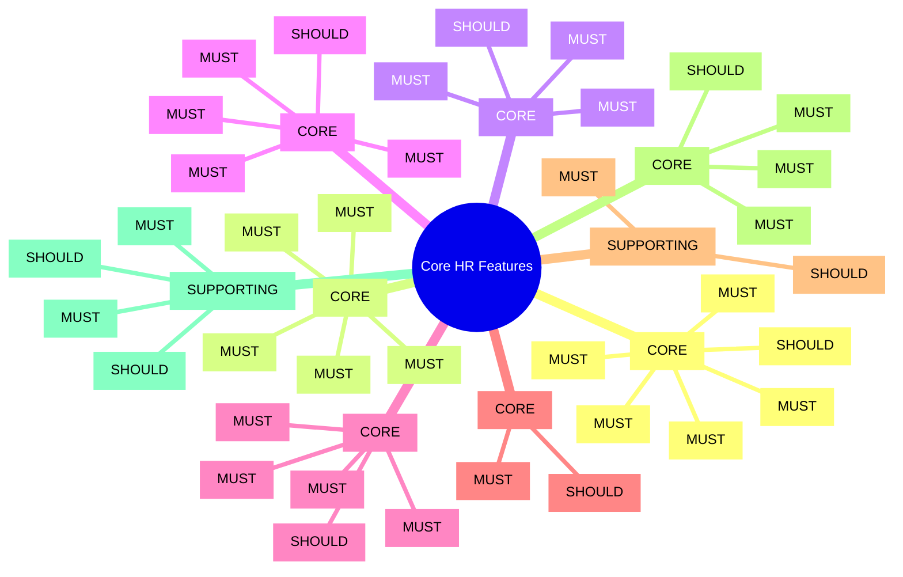

# Feature Catalog: Core HR

> **Note**: YAML above is for AI processing. Tables below for human reading.

---

## Feature Mindmap

---

## Summary Statistics

| Metric | Count |
|--------|-------|
| **Total Features** | 47 |
| **MUST Priority** | 32 (68%) |
| **SHOULD Priority** | 15 (32%) |
| **Parity (Table Stakes)** | 42 (89%) |
| **Innovation (USP)** | 1 (2%) |
| **Compliance (Mandatory)** | 6 (13%) |

---

## Priority Distribution by Capability

| Capability | MUST | SHOULD | Total |
|------------|------|--------|-------|
| Worker Management | 5 | 3 | 8 |
| Organization Management | 5 | 1 | 6 |
| Position & Job Management | 3 | 2 | 5 |
| Leave Management | 4 | 3 | 7 |
| Employee Self-Service | 4 | 2 | 6 |
| Manager Self-Service | 1 | 2 | 3 |
| Document Management | 1 | 2 | 3 |
| Compliance & Audit | 2 | 3 | 5 |
| Reporting & Analytics | 2 | 2 | 4 |
| **TOTAL** | **27** | **20** | **47** |

---

## Differentiation Analysis

### Parity Features (Table Stakes)

All competitors have these - must match industry standard:

| ID | Feature | Competitors |
|----|---------|-------------|
| FR-CO-001 | Hire New Employee | 4/4 |
| FR-CO-010 | Transfer Employee | 4/4 |
| FR-CO-020 | Terminate Employee | 4/4 |
| FR-CO-033 | View Org Chart | 4/4 |
| FR-CO-052 | Submit Leave Request | 4/4 |
| FR-CO-060 | View Personal Profile | 4/4 |
| FR-CO-103 | Employee Directory | 4/4 |

**Strategy:** Match industry standard, don't over-invest.

### Innovation Features (USP)

Opportunity to differentiate:

| ID | Feature | Advantage |
|----|---------|-----------|
| FR-CO-021 | Voluntary Resignation Self-Service | Better employee experience, reduce HR workload |

**Strategy:** Invest to differentiate, improve UX.

### Compliance Features (Mandatory)

Legal/regulatory requirements:

| ID | Feature | Legal Source | Risk |
|----|---------|--------------|------|
| FR-CO-090 | Manage Data Consent | PDPL (Law 91/2025) | HIGH - Fines, lawsuits |
| FR-CO-091 | Classify PII Data | PDPL, GDPR | HIGH |
| FR-CO-092 | Audit Trail | PDPL, GDPR, SOX | HIGH |
| FR-CO-093 | Data Retention | PDPL, Labor Code | HIGH |
| FR-CO-094 | Access Request Logging | ISO 27001, PDPL | MEDIUM |

**Strategy:** Must-have, no shortcuts. Jan 2026 PDPL deadline.

---

## Complexity Distribution

| Complexity | Count | Features |
|------------|-------|----------|
| **HIGH** | 4 | Terminate Employee, Data Consent, Data Retention, Access Logging |
| **MEDIUM** | 16 | Hire, Transfer, Promote, Position Management, Headcount, Leave Request, etc. |
| **LOW** | 27 | Most CRUD and view features |

---

## Risk Analysis

| Risk Level | Count | Key Features |
|------------|-------|--------------|
| **HIGH** | 5 | Termination, Bank Account, Data Consent, PII Classification, Audit Trail |
| **MEDIUM** | 8 | Transfer, Promote, Position, Initiate Changes |
| **LOW** | 34 | Most features |

---

## ADR Cross-Reference

| Feature | Decision | Rationale |
|---------|----------|-----------|
| FR-CO-002 | ADR-CO-002 | Single Worker entity with type discriminator |
| FR-CO-042 | ADR-CO-001 | Position-based staffing model |
| FR-CO-090 | ADR-CO-005 | Consent management for PDPL compliance |
