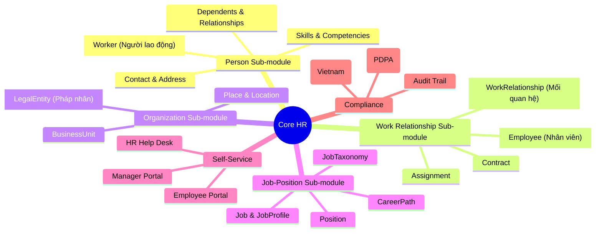
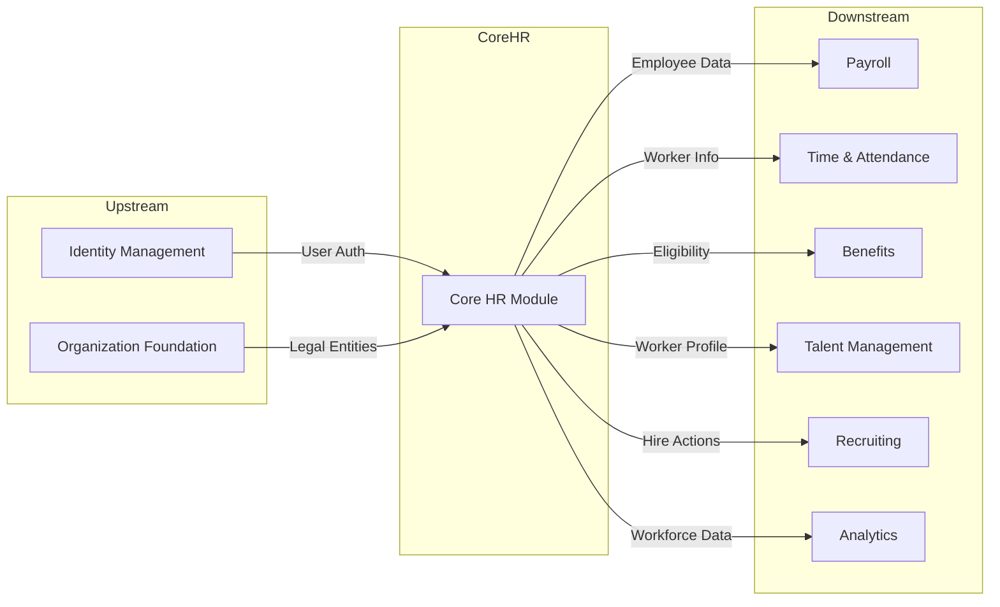

# Architectural Domain Research: Core HR (CO)

---

## 1. Executive Summary

**Domain Classification:** CORE Domain

| Strategy | Investment | Build/Buy |
|----------|------------|-----------|
| Core HR is the foundation of HCM, requires deep customization for competitive advantage | HIGH | Build (with selective integration) |

**Value Proposition:** 
Core HR module provides the foundational workforce administration capabilities that enable organizations to:
- **Manage employee lifecycle** from hire to retire
- **Maintain accurate workforce data** as single source of truth
- **Support organizational agility** through flexible structures
- **Ensure compliance** with labor laws and regulations

**Critical Constraints:**
- **Regulatory:** Vietnam Labor Code 2019, GDPR/PDPA for personal data, Social Insurance regulations
- **Technical:** Must integrate with Payroll, Benefits, Time & Attendance, Talent Management
- **Business:** Must support multi-company, multi-currency, multi-language

---

## 2. Explicit Non-Goals (Out of Scope)

> *Define what Core HR will NOT do. This prevents scope creep and protects long-term architecture.*

| Non-Goal | Rationale | Handled By |
|----------|-----------|------------|
| **Payroll Calculation** | Complex tax/statutory rules, separate domain | Payroll Module (PA) |
| **Time Tracking** | Real-time clock-in/out, scheduling | Time & Attendance Module (TA) |
| **Recruitment/Hiring** | Candidate lifecycle before hire | Recruiting Module (RC) |
| **Performance Reviews** | Goal setting, appraisals | Performance Module (PM) |
| **Learning Management** | Course catalog, training records | Learning Module (LM) |
| **Succession Planning** | Talent pools, career paths | Talent Module (TM) |
| **Workforce Analytics** | Advanced BI, predictive models | Analytics Module (AN) |
| **Document Generation** | Offer letters, contracts | Document Module (DO) |

**Scope Boundary Rule:** If feature is not in this document → It's out of scope by default.

---

## 3. Domain Evolution Outlook (Temporal Analysis)

> *Forecast how Core HR will change over 1-5 years.*

| Horizon | Timeframe | Expected Change | Impact | Architecture Implication |
|---------|-----------|-----------------|--------|-------------------------|
| **H1** | 0-1 year | Vietnam Labor Code amendments (remote work) | HIGH | Configurable employment types |
| **H1** | 0-1 year | Social Insurance digital integration | HIGH | API integration layer |
| **H2** | 1-3 years | AI-driven org design recommendations | MEDIUM | Data lake for ML |
| **H2** | 1-3 years | Gig economy / contingent worker support | MEDIUM | Flexible worker types |
| **H3** | 3-5 years | Blockchain credentials verification | LOW | Plugin architecture |
| **H3** | 3-5 years | Decentralized identity (DID) | UNKNOWN | Isolate identity layer |

**Volatility Assessment:**
- **High-volatility areas:** Worker Types, Employment Contracts, Compliance Rules → Require config-driven/rule-engine approach
- **Stable core:** Worker, LegalEntity, Organization → Can invest in strict schema, high test coverage

---

## 4. Domain Confidence Assessment

> *Overall "trustworthiness" of this research before major investment.*

| Dimension | Score | Notes |
|-----------|-------|-------|
| **Regulatory Clarity** | HIGH | Vietnam Labor Code 2019 well-documented, clear requirements |
| **Market Consensus** | HIGH | All 3 major vendors (Workday, Oracle, MS) agree on core features |
| **Business Stability** | MEDIUM | Occasional restructuring, M&A impacts org structure |
| **Technical Maturity** | HIGH | Proven patterns from enterprise vendors |

**Overall Domain Confidence:** **HIGH**

**Investment Recommendation:**
- **Proceed with confidence, standard timeline**
- Focus on parity features first, then innovation
- Build extensibility for H2/H3 evolution

---

## 5. Decision Log (Architectural Decision Records)

> *Document major architectural choices and conflict resolutions.*

| ID | Title | Decision | Rationale | Source | Status |
|:---|:------|:---------|:----------|:-------|:-------|
| **ADR-CO-001** | Worker vs Employee terminology | **Worker** = Người lao động (person identity), **Employee** = Nhân viên (employment record) | Matches Vietnam terminology, adds WorkRelationship as intermediate layer | P3 (xTalent standard) | ACCEPTED |
| **ADR-CO-002** | WorkRelationship Model | Use **WorkRelationship** to define relationship type (EMPLOYEE, CONTINGENT, CONTRACTOR, NON_WORKER) | Supports multiple relationship types per worker | P3 + P2 | ACCEPTED |
| **ADR-CO-003** | Position-based vs Job-based | Use **Position-based** model with Job as template | Better headcount control, budget management | P2 (Oracle pattern) | PROPOSED |
| **ADR-CO-004** | Org Structure Effective Dating | All org changes must be **effective-dated** | Support historical queries, audit trail | P0 (Compliance) | ACCEPTED |
| **ADR-CO-005** | Worker Type Extensibility | Use **configurable relationship types** via WorkRelationship | Support gig economy, future worker categories | P2 + H2 evolution | ACCEPTED |

### ADR Details

```markdown
## ADR-CO-001: Worker vs Employee Terminology (xTalent Standard)

**Status:** ACCEPTED
**Date:** 2026-01-23
**Source:** Internal ontology design

### Context
Need to define core entities for workforce management.
- Industry standard (Workday/Oracle): Person → Worker → Assignment
- Vietnam context: Need clear Vietnamese terminology

### Decision
Adopt **xTalent model** with WorkRelationship as intermediate layer:

1. **Worker** (Người lao động) - Physical person identity (lifetime)
2. **WorkRelationship** (Mối quan hệ lao động) - Employment relationship type
3. **Employee** (Nhân viên) - Employment record (when type=EMPLOYEE)
4. **Contract**, **Assignment** - Employment details

### Model Diagram
Worker → WorkRelationship → Employee → Contract + Assignment

### WorkRelationship Types
- EMPLOYEE: Có HĐLĐ với công ty
- CONTINGENT: HĐLĐ với agency (outsource)
- CONTRACTOR: Nhà thầu độc lập (HĐDV)
- NON_WORKER: Không quan hệ lao động (intern không lương, HĐQT)

### Rationale
- Matches Vietnam Labor Code terminology
- Supports multiple relationship types per worker
- Clearer than generic Person/Worker pattern

### Consequences
- **Positive:** Clear distinction between person identity and employment
- **Positive:** Supports all Vietnam worker types
- **Trade-off:** Different from Workday/Oracle naming
```

---

## 6. Domain Map



---

## 7. Cross-Domain Dependencies

### Dependency Diagram



### Dependency Details

**Upstream Dependencies** (Inputs we consume):
- **Identity Management**: User authentication, SSO, authorization
- **Organization Foundation**: Legal entities, company structure, locations

**Downstream Dependencies** (Others consuming from us):
- **Payroll (PA)**: Employee data, compensation, bank details
- **Time & Attendance (TA)**: Worker schedules, employment dates
- **Benefits (BN)**: Eligibility criteria, life events, dependents
- **Talent Management (TM)**: Worker profiles, skills, job history
- **Recruiting (RC)**: Position requisitions, hire conversion
- **Analytics (AN)**: Workforce headcount, turnover, demographics

**Integration Risks:**
- If **Identity** schema changes → Impact on user login, authorization
- If we change **Worker** entity → Breaks all downstream modules
- If **Position** structure changes → Impacts headcount reporting

---

## 8. Regulatory & Compliance Matrix

| Regulation | Article | Requirement | Design Impact | Source |
|------------|---------|-------------|---------------|--------|
| **Vietnam Labor Code 2019** | Art. 13 | Written labor contract required | Contract entity with mandatory fields | [Link](https://thuvienphapluat.vn/van-ban/Lao-dong-Tien-luong/Bo-luat-lao-dong-2019-333670.aspx) |
| **Vietnam Labor Code 2019** | Art. 20 | Employment types defined | Configurable worker type lookup | Official |
| **Vietnam Labor Code 2019** | Art. 34 | Termination procedures | Employment lifecycle workflow | Official |
| **GDPR/PDPA** | Art. 17 | Right to deletion | Soft delete + anonymization | EU/SG |
| **Vietnam Labor Law** | Art. 145 | Record retention 10 years | Archive strategy, audit trail | Official |
| **Social Insurance** | Decree 58/2020 | Digital reporting required | API integration with BHXH | Vietnam Gov |

---

## 9. Strategic Insights

### Best Practices (from Competitors)

| Practice | Source | Adoption Decision |
|----------|--------|-------------------|
| **Worker-centric model** | Workday, Oracle (2/3) | ✅ Adopt (standard) |
| **Position-based headcount** | Oracle, Microsoft (2/3) | ✅ Adopt (budget control) |
| **Experience Design Studio** | Oracle only (1/3) | ⚠️ Consider for Phase 2 (differentiation) |
| **Effective dating on all entities** | All 3 vendors | ✅ Adopt (compliance) |
| **Self-service portal** | All 3 vendors | ✅ Adopt (table stakes) |
| **AI-powered org insights** | Workday Illuminate | ⚠️ Phase 3 (innovation) |
| **Digital Assistant/Chatbot** | Oracle, Workday (2/3) | ⚠️ Phase 2 (enhancement) |

### Competitor Feature Matrix

| Feature | Workday | Oracle | MS Dynamics | Priority |
|---------|:-------:|:------:|:-----------:|:--------:|
| Employee Master Data | ✅ | ✅ | ✅ | MUST |
| Position Management | ✅ | ✅ | ✅ | MUST |
| Organization Structure | ✅ | ✅ | ✅ | MUST |
| Employment Lifecycle | ✅ | ✅ | ✅ | MUST |
| Self-Service Portal | ✅ | ✅ | ✅ | MUST |
| Benefits Administration | ✅ | ✅ | ✅ | SHOULD |
| Compensation Management | ✅ | ✅ | ✅ | SHOULD |
| Workforce Modeling | ✅ | ✅ | ❌ | COULD |
| AI Insights | ✅ | ✅ | ❌ | COULD |
| HR Chatbot | ✅ | ✅ | ❌ | COULD |
| Experience Design Studio | ❌ | ✅ | ❌ | COULD |

### Gaps & Risks

**Identified Gaps:**
- **Gap 1:** Vietnam-specific statutory reports - Impact: HIGH (compliance)
- **Gap 2:** Integration with Vietnam Social Insurance portal - Impact: HIGH (compliance)
- **Gap 3:** Local bank payment formats - Impact: MEDIUM (payroll integration)

**Regulatory Risks:**
- **Risk 1:** Labor Code amendments may require contract template changes
- **Risk 2:** PDPA (Personal Data Protection) may require consent management

**Technical Debt Risks:**
- **Risk 1:** Legacy data migration from existing HRIS systems
- **Risk 2:** API versioning for downstream consumer compatibility

### Recommendations

1. **Build Parity Features First** - Priority: HIGH
   - Employee Master, Position, Org Structure, Self-Service
   - **Justification:** Table stakes, required for MVP

2. **Invest in Effective Dating** - Priority: HIGH
   - All entities must support temporal queries
   - **Justification:** Compliance requirement, competitive parity
   - **ADR Reference:** ADR-CO-004

3. **Design for Multi-Employment** - Priority: MEDIUM
   - Person can have multiple Workers (concurrent employment)
   - **Justification:** Gig economy, global mobility trends
   - **ADR Reference:** ADR-CO-002

4. **Plan for AI/Analytics Integration** - Priority: LOW
   - Ensure data model supports ML consumption
   - **Justification:** Competitive differentiation in H2/H3

---

## 10. Feature Clusters Summary

| Cluster | Sub-module | Features | Priority |
|---------|------------|----------|----------|
| **Person Management** | Person | 5 | MUST |
| **Work Relationship Management** | Work Relationship | 5 | MUST |
| **Organization Management** | Organization | 5 | MUST |
| **Job & Position Management** | Job-Position | 5 | MUST |
| **Self-Service** | Cross-cutting | 4 | SHOULD |
| **Compliance & Audit** | Cross-cutting | 4 | MUST |

**Total Features Identified:** ~28 (aligned with ontology sub-modules)

> **Note:** Benefits Admin and Compensation moved to separate modules (BN, CM)

---

## 11. Next Steps

- [x] Create `_research-report.md` (this document)
- [x] Align with existing ontology at `/docs/01-modules/CO/00-ontology/domain/`
- [ ] Update `entity-catalog.md` to match ontology
- [ ] Update `feature-catalog.md` to match ontology
- [ ] Review with architecture team
