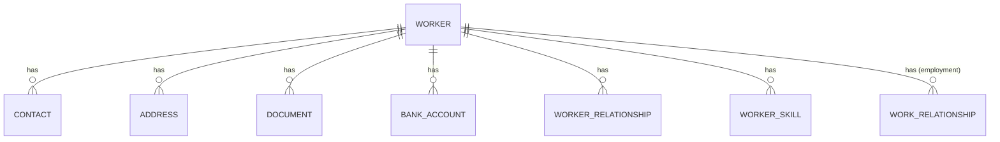
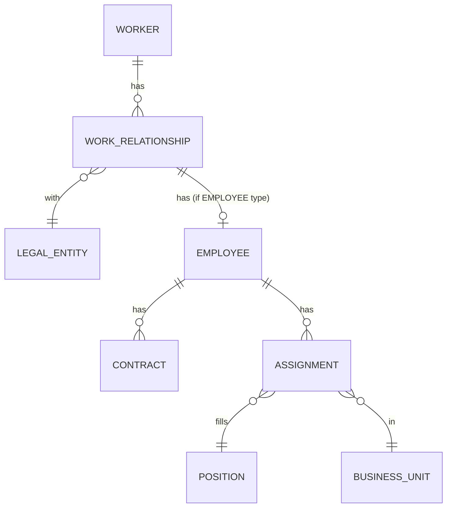
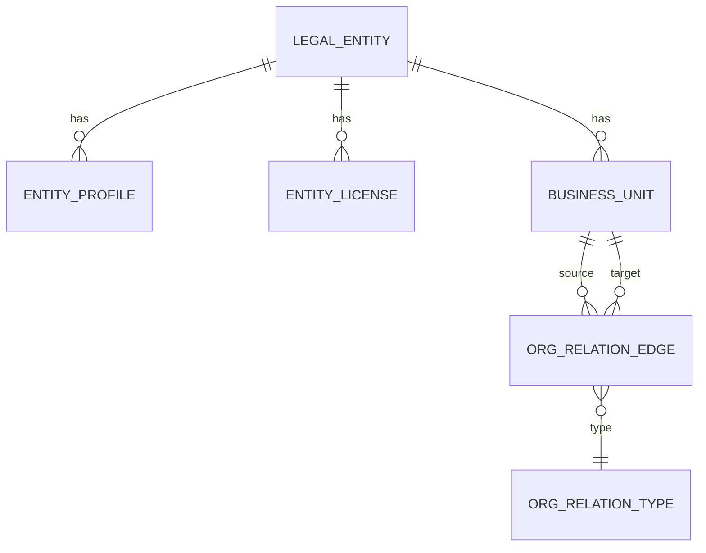
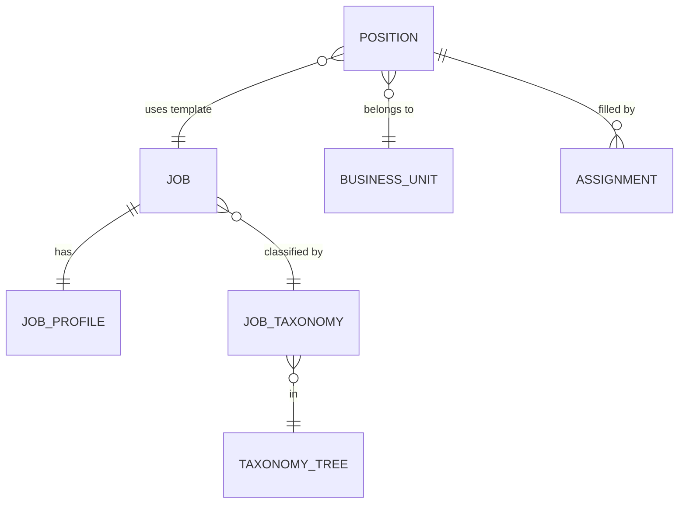
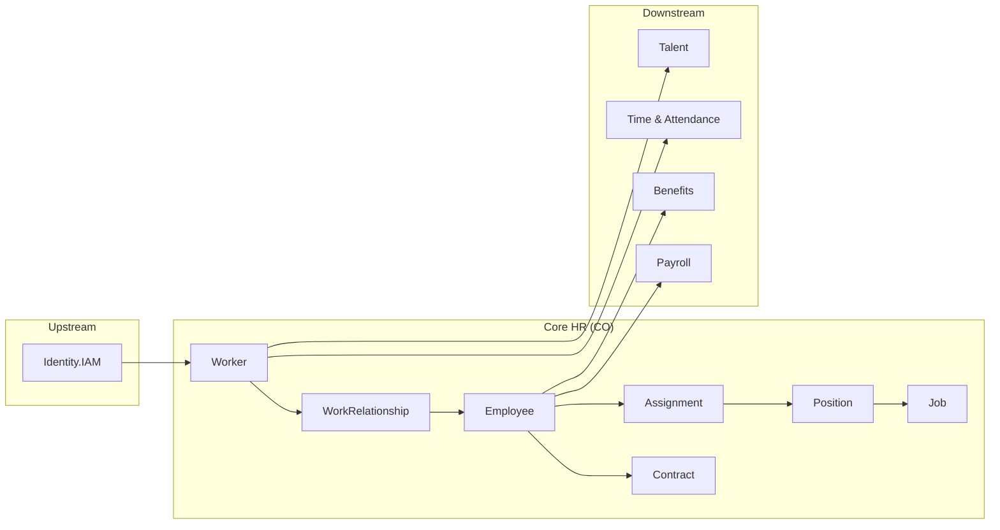

# Entity Catalog: Core HR (CO)

> Aligned với ontology documentation tại `/docs/01-modules/CO/00-ontology/domain/`

---

## Terminology (ADR-CO-001)

| Entity | Vietnamese | Role |
|--------|------------|------|
| **Worker** | Người lao động | Physical person identity (lifetime) |
| **WorkRelationship** | Mối quan hệ lao động | Employment relationship type |
| **Employee** | Nhân viên | Employment record (when type=EMPLOYEE) |
| **LegalEntity** | Pháp nhân | Employer entity |
| **Contract** | Hợp đồng lao động | Employment contract |
| **Assignment** | Phân công công việc | Position assignment |

---

## Sub-module: Person

> Quản lý thông tin cá nhân của người lao động

| ID | Entity | Description | PII |
|----|--------|-------------|-----|
| CO-P01 | **Worker** | Người lao động - lifetime identity | HIGH |
| CO-P02 | Contact | Thông tin liên hệ (phone, email) | HIGH |
| CO-P03 | Address | Địa chỉ (home, mailing) | HIGH |
| CO-P04 | Document | Giấy tờ tùy thân (CMND, hộ chiếu) | HIGH |
| CO-P05 | BankAccount | Tài khoản ngân hàng | HIGH |
| CO-P06 | WorkerRelationship | Quan hệ gia đình (dependents, emergency) | HIGH |
| CO-P07 | WorkerQualification | Bằng cấp, chứng chỉ | LOW |
| CO-P08 | WorkerSkill | Kỹ năng | LOW |
| CO-P09 | WorkerCompetency | Năng lực hành vi | LOW |

### Worker Entity (Aggregate Root)

---

## Sub-module: Work Relationship

> Quản lý mối quan hệ lao động và hồ sơ nhân viên

| ID | Entity | Description | PII |
|----|--------|-------------|-----|
| CO-WR01 | **WorkRelationship** | Mối quan hệ lao động | MEDIUM |
| CO-WR02 | **Employee** | Hồ sơ nhân viên (khi type=EMPLOYEE) | MEDIUM |
| CO-WR03 | Contract | Hợp đồng lao động | MEDIUM |
| CO-WR04 | ContractTemplate | Mẫu hợp đồng | NONE |
| CO-WR05 | Assignment | Phân công vị trí | LOW |
| CO-WR06 | GlobalAssignment | Phân công quốc tế (expatriate) | LOW |

### WorkRelationship Types

| Type | Vietnamese | Has Employee Record? |
|------|------------|---------------------|
| EMPLOYEE | Nhân viên chính thức | ✅ Yes |
| CONTINGENT | Lao động phái cử/outsource | ❌ No |
| CONTRACTOR | Nhà thầu độc lập | ❌ No |
| NON_WORKER | Không lao động (intern, board) | ❌ No |

### Work Relationship Model

---

## Sub-module: Organization

> Quản lý cấu trúc tổ chức

| ID | Entity | Description | PII |
|----|--------|-------------|-----|
| CO-O01 | **LegalEntity** | Pháp nhân (công ty) | NONE |
| CO-O02 | EntityProfile | Thông tin chi tiết pháp nhân | NONE |
| CO-O03 | EntityLicense | Giấy phép kinh doanh | NONE |
| CO-O04 | EntityBankAccount | Tài khoản ngân hàng công ty | NONE |
| CO-O05 | **BusinessUnit** | Đơn vị tổ chức | NONE |
| CO-O06 | OrgRelationType | Loại quan hệ tổ chức | NONE |
| CO-O07 | OrgRelationEdge | Quan hệ giữa các đơn vị | NONE |

### Organization Model

---

## Sub-module: Job-Position

> Quản lý công việc và vị trí

| ID | Entity | Description | PII |
|----|--------|-------------|-----|
| CO-JP01 | **Job** | Công việc | NONE |
| CO-JP02 | JobProfile | Mô tả công việc chi tiết | NONE |
| CO-JP03 | JobTaxonomy | Phân loại công việc (family/level) | NONE |
| CO-JP04 | TaxonomyTree | Cây phân loại chức danh | NONE |
| CO-JP05 | **Position** | Vị trí (seat in org) | NONE |
| CO-JP06 | JobLevel | Cấp bậc | NONE |
| CO-JP07 | JobGrade | Ngạch lương | NONE |
| CO-JP08 | CareerPath | Lộ trình nghề nghiệp | NONE |

### Job-Position Model

---

## Sub-module: Facility (Location)

> Quản lý địa điểm làm việc

| ID | Entity | Description | PII |
|----|--------|-------------|-----|
| CO-F01 | Place | Địa điểm vật lý | NONE |
| CO-F02 | Location | Vị trí (office, branch) | NONE |
| CO-F03 | WorkLocation | Nơi làm việc của nhân viên | NONE |

---

## Sub-module: Reference Data

> Dữ liệu danh mục

| ID | Entity | Description |
|----|--------|-------------|
| CO-R01 | CodeList | Danh mục mã dùng chung |
| CO-R02 | Currency | Loại tiền |
| CO-R03 | TimeZone | Múi giờ |
| CO-R04 | Country | Quốc gia |
| CO-R05 | AdminArea | Đơn vị hành chính (tỉnh/huyện) |
| CO-R06 | Industry | Ngành nghề |
| CO-R07 | SkillCategory | Danh mục kỹ năng |
| CO-R08 | SkillMaster | Danh sách kỹ năng |
| CO-R09 | CompetencyCategory | Danh mục năng lực |
| CO-R10 | CompetencyMaster | Danh sách năng lực |
| CO-R11 | RelationshipType | Loại quan hệ gia đình |
| CO-R12 | ContactType | Loại liên hệ |

---

## Cross-Domain Dependencies

---

## PII Sensitivity Summary

| Level | Count | Entities |
|-------|-------|----------|
| **HIGH** | 7 | Worker, Contact, Address, Document, BankAccount, WorkerRelationship, WorkerQualification |
| **MEDIUM** | 3 | WorkRelationship, Employee, Contract |
| **LOW** | 3 | Assignment, WorkerSkill, WorkerCompetency |
| **NONE** | 17 | Org, Job, Position, Reference Data |

---

## Ontology Reference

All entity definitions available at:
- `/docs/01-modules/CO/00-ontology/domain/person/` - Worker và child entities
- `/docs/01-modules/CO/00-ontology/domain/work-relationship/` - WorkRelationship, Employee
- `/docs/01-modules/CO/00-ontology/domain/organization/` - LegalEntity, BusinessUnit
- `/docs/01-modules/CO/00-ontology/domain/job-position/` - Job, Position
- `/docs/01-modules/CO/00-ontology/domain/facility/` - Place, Location
