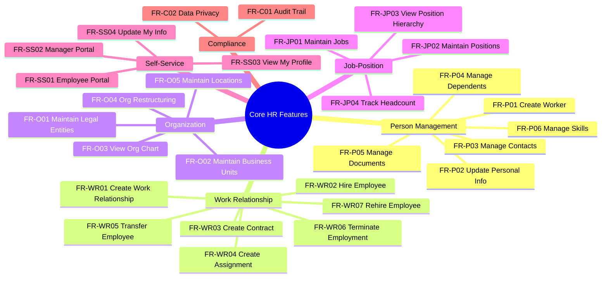

# Feature Catalog: Core HR (CO)

> Aligned với ontology documentation. Leave Management đã chuyển sang module TA.

---

## Feature Mindmap

---

## Capability 1: Person Management

> Sub-module: Person | Managing worker identity and personal information

| ID | Feature | Priority | Type |
|----|---------|----------|------|
| FR-P01 | **Create Worker** | MUST | Workflow |
| FR-P02 | **Update Personal Information** | MUST | Workflow |
| FR-P03 | **Manage Contacts & Addresses** | MUST | Functional |
| FR-P04 | **Manage Dependents & Emergency Contacts** | SHOULD | Functional |
| FR-P05 | **Manage Documents** | SHOULD | Functional |
| FR-P06 | **Manage Skills & Competencies** | SHOULD | Functional |

### FR-P01: Create Worker

**As** HR Admin, **I want to** create a new Worker record **so that** the person's identity is registered in the system.

**Related Entities:** Worker, Contact, Address

**Business Rules:**
- Duplicate check by National ID or Email
- Date of birth validation (≥15 years old per Vietnam law)
- Mandatory fields: firstName, lastName, dateOfBirth, genderCode, nationalityCode

---

## Capability 2: Work Relationship Management

> Sub-module: Work Relationship | Managing employment relationships and contracts

| ID | Feature | Priority | Type |
|----|---------|----------|------|
| FR-WR01 | **Create Work Relationship** | MUST | Workflow |
| FR-WR02 | **Hire Employee** | MUST | Workflow |
| FR-WR03 | **Create/Manage Contracts** | MUST | Functional |
| FR-WR04 | **Create Assignment** | MUST | Functional |
| FR-WR05 | **Transfer Employee** | SHOULD | Workflow |
| FR-WR06 | **Terminate Employment** | MUST | Workflow |
| FR-WR07 | **Rehire Employee** | SHOULD | Workflow |

### FR-WR01: Create Work Relationship

**As** HR Admin, **I want to** create a work relationship **so that** the type of engagement is defined.

**WorkRelationship Types:**
- EMPLOYEE → Creates Employee record
- CONTINGENT → No Employee record (outsource)
- CONTRACTOR → No Employee record (HĐDV)
- NON_WORKER → No Employee record (intern, board)

**Business Rules:**
- Worker can have only one active relationship of each type per legal entity
- Legal entity is required
- Start date required

### FR-WR02: Hire Employee

**As** HR Admin, **I want to** hire an employee **so that** they are officially onboarded.

**Related Entities:** WorkRelationship (type=EMPLOYEE), Employee, Contract, Assignment

**Business Rules:**
- WorkRelationship type must be EMPLOYEE
- Employee code must be unique per Legal Entity
- Contract required per Vietnam Labor Code Art. 13
- Position must be in 'Open' or 'Vacant' status

### FR-WR06: Terminate Employment

**As** HR Admin, **I want to** terminate employment **so that** offboarding is processed.

**Related Entities:** WorkRelationship, Employee, Contract

**Business Rules:**
- Termination date required
- Termination reason required
- Notice period per contract
- Status changes: WorkRelationship → TERMINATED, Employee → TERMINATED
- Triggers: Access revocation, final pay calculation

---

## Capability 3: Organization Management

> Sub-module: Organization | Managing organizational structure

| ID | Feature | Priority | Type |
|----|---------|----------|------|
| FR-O01 | **Maintain Legal Entities** | MUST | Functional |
| FR-O02 | **Maintain Business Units** | MUST | Functional |
| FR-O03 | **View Organization Chart** | MUST | UI/UX |
| FR-O04 | **Organization Restructuring** | SHOULD | Workflow |
| FR-O05 | **Maintain Locations** | SHOULD | Functional |

### FR-O01: Maintain Legal Entities

**As** System Admin, **I want to** manage legal entities **so that** employment and payroll are correctly configured.

**Related Entities:** LegalEntity, EntityProfile, EntityLicense

**Business Rules:**
- Tax ID must be unique
- Currency must be valid ISO code
- Cannot delete if employees exist

---

## Capability 4: Job & Position Management

> Sub-module: Job-Position | Managing jobs and positions

| ID | Feature | Priority | Type |
|----|---------|----------|------|
| FR-JP01 | **Maintain Jobs & Job Profiles** | MUST | Functional |
| FR-JP02 | **Maintain Positions** | MUST | Functional |
| FR-JP03 | **View Position Hierarchy** | SHOULD | UI/UX |
| FR-JP04 | **Track Headcount** | MUST | Calculation |

### FR-JP02: Maintain Positions

**As** HR Admin, **I want to** create and manage positions **so that** headcount can be controlled.

**Related Entities:** Position, Job, BusinessUnit

**Business Rules:**
- Position inherits defaults from Job
- Business Unit required
- Reports-to position required (except top)
- Status: Open → Filled → Vacant → Closed

---

## Capability 5: Self-Service

> Cross-cutting | Employee and Manager portals

| ID | Feature | Priority | Type |
|----|---------|----------|------|
| FR-SS01 | **Employee Self-Service Portal** | MUST | UI/UX |
| FR-SS02 | **Manager Self-Service Portal** | MUST | UI/UX |
| FR-SS03 | **View My Profile** | MUST | UI/UX |
| FR-SS04 | **Update My Information** | SHOULD | Workflow |

### FR-SS01: Employee Self-Service Portal

**As** Employee, **I want** a self-service portal **so that** I can view and update my information.

**Features:**
- View personal profile
- Update contact information (with approval)
- View pay slips (link to Payroll)
- View employment history
- Mobile responsive

---

## Capability 6: Compliance & Audit

> Cross-cutting | Regulatory compliance

| ID | Feature | Priority | Type |
|----|---------|----------|------|
| FR-C01 | **Audit Trail** | MUST | Functional |
| FR-C02 | **Data Privacy Management** | MUST | Functional |

### FR-C01: Audit Trail

**As** Auditor, **I want** a complete audit trail **so that** all changes are tracked.

**Business Rules:**
- Who, What, When, From-To values
- Immutable records
- 10-year retention per Vietnam Labor Code Art. 121
- Access logging for PII

### FR-C02: Data Privacy Management

**As** DPO, **I want** data privacy controls **so that** PDPA/GDPR requirements are met.

**Business Rules:**
- Consent management
- Right to deletion (anonymization, not hard delete)
- Data export capability
- Access control by role

---

## Out of Scope (Moved to Other Modules)

| Feature Area | Target Module | Reason |
|--------------|---------------|--------|
| Leave Management | Time & Attendance (TA) | Per user decision |
| Benefits Administration | Benefits (BN) | Separate domain |
| Compensation Planning | Compensation (CM) | Separate domain |
| Performance Reviews | Performance (PM) | Separate domain |

---

## Priority Summary

| Priority | Count | Features |
|----------|-------|----------|
| **MUST** | 18 | Core workflows, compliance |
| **SHOULD** | 10 | Enhanced features |
| **Total** | **28** | |

---

## Phase Recommendation

### Phase 1 (MVP)

| Sub-module | Features |
|------------|----------|
| Person | FR-P01, FR-P02, FR-P03 |
| Work Relationship | FR-WR01, FR-WR02, FR-WR03, FR-WR04, FR-WR06 |
| Organization | FR-O01, FR-O02, FR-O03 |
| Job-Position | FR-JP01, FR-JP02, FR-JP04 |
| Compliance | FR-C01 |

**Count:** 14 features

### Phase 2 (Extended)

| Sub-module | Features |
|------------|----------|
| Person | FR-P04, FR-P05, FR-P06 |
| Work Relationship | FR-WR05, FR-WR07 |
| Organization | FR-O04, FR-O05 |
| Job-Position | FR-JP03 |
| Self-Service | All (FR-SS01-04) |
| Compliance | FR-C02 |

**Count:** 14 features
