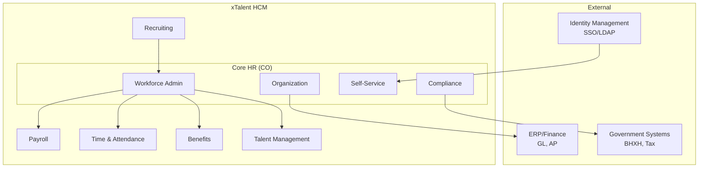
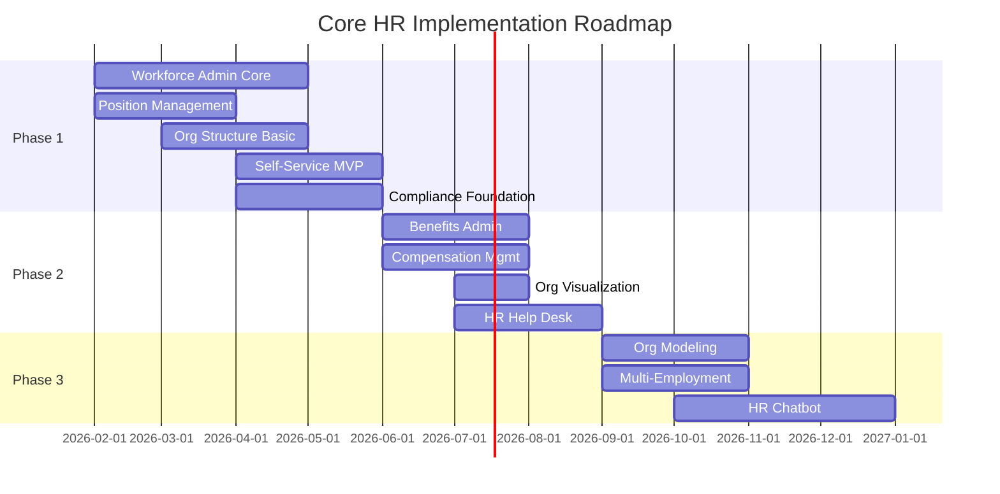

# Solution Blueprint: Core HR Module (CO)

## Executive Summary

### Objective
Build an enterprise-grade Core HR module for xTalent HCM that provides:
- **Workforce Administration** - Employee master data and lifecycle management
- **Organization Design** - Flexible org structure modeling
- **Self-Service Portals** - Employee and manager empowerment
- **Compliance Foundation** - Vietnam Labor Code and GDPR compliance

### Strategic Fit

| Dimension | Assessment |
|-----------|------------|
| **Domain Type** | CORE - Critical for competitive advantage |
| **Build/Buy** | BUILD with selective integration |
| **Confidence** | HIGH - Market consensus, clear requirements |
| **Investment** | HIGH priority |

### Competitive Position

| Capability | Oracle | Workday | MS Dynamics | xTalent Target |
|------------|:------:|:-------:|:-----------:|:--------------:|
| Employee Master | ★★★★★ | ★★★★★ | ★★★★☆ | ★★★★★ |
| Position Management | ★★★★★ | ★★★★★ | ★★★★☆ | ★★★★★ |
| Org Modeling | ★★★★☆ | ★★★★★ | ★★★☆☆ | ★★★★☆ |
| Self-Service | ★★★★★ | ★★★★★ | ★★★★☆ | ★★★★★ |
| Vietnam Localization | ★★★☆☆ | ★★☆☆☆ | ★★☆☆☆ | ★★★★★ |

**Differentiation Strategy:** Vietnam-first localization + AI-native experience

---

## Context Diagram

---

## Architecture Decisions

### Accepted ADRs

| ADR | Decision | Rationale |
|-----|----------|-----------|
| ADR-CO-001 | **Worker** = Người lao động, **Employee** = Nhân viên | xTalent standard terminology |
| ADR-CO-002 | **WorkRelationship** as intermediate layer | Supports EMPLOYEE/CONTINGENT/CONTRACTOR/NON_WORKER |
| ADR-CO-004 | Effective Dating | All entities support temporal queries |
| ADR-CO-005 | Configurable relationship types | Support gig economy |

### Proposed (Pending ARB)

| ADR | Decision | Key Trade-offs |
|-----|----------|----------------|
| ADR-CO-003 | Position-based Headcount | Budget control vs Administrative overhead |

---

## Fit-Gap Analysis Summary

### Feature Coverage

| Priority | Count | Fit | Gap |
|----------|-------|-----|-----|
| **MUST** | 16 | 100% Standard | - |
| **SHOULD** | 14 | 12 Standard | 2 Config |
| **COULD** | 7 | 3 Standard | 4 Extension |

### Gap Classification

| Feature | Gap Type | Strategy | Authority |
|---------|----------|----------|-----------|
| Vietnam Statutory Reports | Config Gap | Localization templates | Solution Architect |
| Vietnam Social Insurance API | Extension Gap | Custom integration | Solution Architect |
| Org Modeling (advanced) | Extension Gap | Phase 3 innovation | ARB review |
| HR Chatbot | Extension Gap | Phase 3 AI integration | ARB review |

**No Core Gaps identified** - All requirements can be met with standard + config + extension approach.

---

## Implementation Roadmap

### Phase Details

| Phase | Timeline | Features | Exit Criteria |
|-------|----------|----------|---------------|
| **Phase 1** | Q1 2026 | 16 MUST features | MVP go-live, core workflows functional |
| **Phase 2** | Q2 2026 | 14 SHOULD features | Benefits/Comp integration, full self-service |
| **Phase 3** | Q3-Q4 2026 | 7 COULD features | AI features, innovation differentiators |

---

## Risk Register

| Risk | Probability | Impact | Mitigation |
|------|-------------|--------|------------|
| Vietnam regulation changes | MEDIUM | HIGH | Config-driven compliance rules |
| Data migration quality | HIGH | MEDIUM | Data validation framework, pilot migration |
| Integration complexity | MEDIUM | MEDIUM | API versioning, anti-corruption layer |
| Performance at scale | LOW | HIGH | Load testing, caching strategy |
| User adoption | MEDIUM | MEDIUM | Change management, training program |

---

## Integration Patterns

### Upstream Integration (Data Sources)

| System | Pattern | Protocol |
|--------|---------|----------|
| Identity (SSO) | Federation | SAML 2.0 / OIDC |
| Organization Foundation | Sync | REST API |
| Legacy HRIS | Migration | ETL + Validation |

### Downstream Integration (Consumers)

| System | Pattern | Protocol |
|--------|---------|----------|
| Payroll | Event-Driven | Kafka/Event Bus |
| Time & Attendance | Real-time | REST API |
| Benefits | Event-Driven | Kafka/Event Bus |
| Analytics | Batch | Data Lake export |
| Government (BHXH) | API | Vietnam e-Gov standards |

---

## Entity Prioritization

### Phase 1 Entities (MVP)

| Entity | Sub-module | Reason |
|--------|------------|--------|
| Worker | Person | Identity foundation |
| WorkRelationship | Work Relationship | Employment type |
| Employee | Work Relationship | Employment record |
| Contract | Work Relationship | Legal requirement |
| Assignment | Work Relationship | Position link |
| LegalEntity | Organization | Employer entity |
| BusinessUnit | Organization | Org structure |
| Job | Job-Position | Job architecture |
| Position | Job-Position | Headcount control |

### Phase 2 Entities (Extended)

| Entity | Sub-module | Reason |
|--------|------------|--------|
| Contact, Address, Document | Person | Personal data |
| Skills, Competencies | Person | Talent integration |
| GlobalAssignment | Work Relationship | Expatriate support |
| Location | Facility | Work locations |

---

## Success Metrics

| Metric | Target | Measurement |
|--------|--------|-------------|
| Time to Hire (system) | < 24 hours | From offer acceptance to active worker |
| Self-Service Adoption | > 80% | Employees using portal monthly |
| Manager Portal Usage | > 70% | Managers using manager tools |
| Data Accuracy | > 99% | Audit validation |
| Compliance Score | 100% | No regulatory violations |

---

## Next Steps

1. ✅ **ADR Review** - ADR-CO-001, 002, 004, 005 accepted
2. ⏳ **ARB Review** - ADR-CO-003 pending
3. ✅ **Ontology** - Detailed definitions at `/docs/01-modules/CO/00-ontology/domain/`
4. [ ] **Feature Specs** - Create `*.feat.md` from feature-catalog
5. [ ] **Integration Design** - Define API contracts
