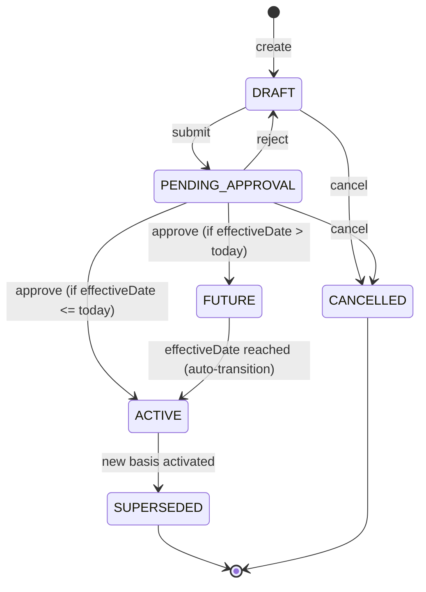

# Schema Standards: CompensationBasis

## 1. Summary

**CompensationBasis** (Mức Lương Hiệu Lực) là entity lưu trữ **mức lương vận hành** (operational salary) của nhân viên - mức lương được sử dụng thực tế cho **payroll**, **BHXH**, và **analytics**. Entity này tách biệt khỏi:

- **Contract.baseSalary**: Mức lương pháp lý (legal basis) - chỉ dùng cho audit và compliance
- **employee_comp_snapshot**: Tất cả compensation components (base + allowance + bonus)

**Confidence**: HIGH - Based on Tier 1 sources from Oracle HCM, SAP SuccessFactors, Workday và aligned với xTalent TotalReward.V5.dbml architecture.

### Key Design Principles

```
┌─────────────────────────────────────────────────────────────────┐
│  GOLDEN RULE: Separation of Concerns                           │
│                                                                 │
│  Contract         = Legal Minimum / Agreement (static)         │
│  CompensationBasis = Operational Effective Value (dynamic)     │
│  TotalRewards      = Formula & Logic (configuration)           │
│                                                                 │
│  Ba lớp KHÔNG ĐƯỢC trùng vai.                                  │
└─────────────────────────────────────────────────────────────────┘
```

---

## 2. Vendor Comparison

### 2.1 Oracle HCM Cloud

**Architecture**: `SalaryBasis` (config) + `Salary` (record)

| Attribute | Type | Required | Description |
|-----------|------|----------|-------------|
| id | uuid | Y | Unique identifier |
| SalaryAmount | decimal | Y | Current salary amount |
| SalaryBasisId | reference | Y | Link to SalaryBasis config |
| AssignmentId | reference | Y | Link to assignment (implicit) |
| StartDate | date | Y | Effective start |
| EndDate | date | N | Effective end (null = current) |
| AdjustmentAmount | decimal | N | Delta from previous |
| AdjustmentPercentage | decimal | N | % change |
| AnnualSalary | decimal | N | Calculated annual |
| NextSalaryReviewDate | date | N | Next review |
| CompaRatio | decimal | N | Market comparison |
| Quartile | enum | N | Position in range (Q1-Q4) |
| ComponentUsage | enum | N | NO_COMPONENT / SELECTED / USER_DECIDES |

**SalaryBasis Configuration**:
| Attribute | Type | Description |
|-----------|------|-------------|
| Name | string | Salary Basis name |
| Frequency | enum | HOURLY / WEEKLY / MONTHLY / ANNUALLY |
| LegislativeDataGroup | reference | Legal context |
| SalaryBasisType | enum | USER_DETERMINED / INCREMENTAL_COMPONENT / RATES_BASED |
| ElementId | reference | Link to Payroll Element |
| AnnualizationFactor | decimal | For annual calculation |

**Source**: [Oracle HCM Cloud Documentation](https://docs.oracle.com/en/cloud/saas/human-resources/)

---

### 2.2 SAP SuccessFactors

**Architecture**: `PayComponent` (building block) + `empPayCompRecurringNav` (employee's compensation)

| Attribute | Type | Required | Description |
|-----------|------|----------|-------------|
| paycompvalue | decimal | Y | Base salary amount |
| currencyCode | string | Y | Currency code |
| startDate | date | Y | Effective start |
| endDate | date | N | Effective end |
| payGroup | reference | N | Pay group |
| frequency | enum | Y | Payment frequency |
| annualizationFactor | decimal | N | For annual calculation |

**Pay Component Definition**:
| Attribute | Type | Description |
|-----------|------|-------------|
| code | string | Unique code |
| name | string | Display name |
| payComponentType | enum | RECURRING / ONE_TIME |
| frequency | enum | Payment frequency |
| valueType | enum | AMOUNT / PERCENTAGE / NUMBER |
| calculationBase | reference | Basis for percentage calculation |
| isTaxable | boolean | Taxability |
| isManagerVisible | boolean | Manager visibility |

**Source**: [SAP SuccessFactors Help](https://help.sap.com/docs/SAP_SUCCESSFACTORS)

---

### 2.3 Workday

**Architecture**: `CompensationPlan` (config) + `EmployeeCompensation` (assigned plans + amounts)

| Attribute | Type | Required | Description |
|-----------|------|----------|-------------|
| Amount | decimal | Y | Compensation amount |
| CurrencyCode | string | Y | Currency |
| EffectiveDate | date | Y | When change takes effect |
| CompensationPlanId | reference | Y | Link to plan |
| Frequency | enum | Y | Payment frequency |
| EmployeeVisibilityDate | date | N | When employee can see |

**Compensation Plan Types**:
| Type | Description |
|------|-------------|
| Salary | Base pay (fixed) |
| Hourly | Hourly rate |
| Allowance | Regular purpose payments |
| Bonus | Variable/performance |
| Merit | Salary increase |
| Commission | Sales-based |
| Stock | Equity |

**Source**: [Workday Community Documentation](https://community.workday.com/)

---

### 2.4 xTalent TotalReward.V5.dbml

**Current Architecture**:

```
comp_core.salary_basis (Configuration)
├── id, code, name
├── frequency (HOURLY | MONTHLY | ANNUAL)
├── currency
├── allow_components
└── effective_start/end

comp_core.employee_comp_snapshot (All Components)
├── employee_id → employment.employee
├── assignment_id → employment.assignment
├── component_id → pay_component_def
├── amount, currency, frequency
├── status (PLANNED | ACTIVE | EXPIRED)
├── source_type (COMP_ADJUSTMENT | OFFER_PACKAGE | MANUAL)
└── effective_start/end
```

**Gap Identified**:
- Missing: Link to WorkRelationship
- Missing: Link to Contract (for legal basis tracing)
- Missing: basisTypeCode (LEGAL vs OPERATIONAL)
- Missing: reasonCode (HIRE, PROBATION_END, ANNUAL_REVIEW)
- Missing: Approval workflow fields
- Missing: SCD chain (previousBasisId)

---

## 3. Common Patterns

### 3.1 Universal Attributes (all 3 vendors)

| Attribute | Oracle | SAP | Workday | Type |
|-----------|--------|-----|---------|------|
| id | ✓ | ✓ | ✓ | uuid |
| amount | SalaryAmount | paycompvalue | Amount | decimal |
| currency | Currency | currencyCode | CurrencyCode | string |
| frequency | Frequency | frequency | Frequency | enum |
| effectiveStartDate | StartDate | startDate | EffectiveDate | date |
| effectiveEndDate | EndDate | endDate | - | date |

### 3.2 Majority Attributes (2 of 3 vendors)

| Attribute | Oracle | SAP | Workday | Recommend |
|-----------|--------|-----|---------|-----------|
| annualizationFactor | ✓ | ✓ | - | INCLUDE |
| adjustmentAmount | ✓ | - | - | INCLUDE (useful) |
| adjustmentPercentage | ✓ | - | - | INCLUDE (useful) |
| planReference | SalaryBasisId | - | CompensationPlanId | INCLUDE |

### 3.3 Vendor-Specific (unique to 1 vendor)

| Attribute | Vendor | Use Case |
|-----------|--------|----------|
| CompaRatio | Oracle | Market comparison (if job grading exists) |
| Quartile | Oracle | Range position (if salary ranges exist) |
| EmployeeVisibilityDate | Workday | When employee can view |
| ComponentUsage | Oracle | How components are used |

---

## 4. Canonical Schema: CompensationBasis

### 4.1 Required Attributes

| Attribute | Type | Description | Justification |
|-----------|------|-------------|---------------|
| id | uuid | Unique identifier | Universal |
| workRelationshipId | reference | Link to WorkRelationship | Employment context (not Employee) |
| effectiveStartDate | date | When this basis starts | All vendors |
| basisAmount | decimal(18,4) | Salary amount in effect | Core purpose |
| currencyCode | string(3) | Currency (ISO 4217) | All vendors |
| frequencyCode | enum | MONTHLY/WEEKLY/DAILY/HOURLY/ANNUALLY | All vendors |
| basisTypeCode | enum | LEGAL_BASE/OPERATIONAL_BASE/MARKET_ADJUSTED | Design decision |
| statusCode | enum | DRAFT/PENDING_APPROVAL/ACTIVE/SUPERSEDED/CANCELLED | Lifecycle |
| isCurrent | boolean | Is this the current effective record | Performance optimization |

### 4.2 Recommended Attributes

| Attribute | Type | Description | Justification |
|-----------|------|-------------|---------------|
| effectiveEndDate | date | When this basis ends (null=current) | All vendors |
| sourceCode | enum | CONTRACT/MANUAL/FORMULA/PROMOTION | Audit trail |
| reasonCode | enum | HIRE/PROBATION_END/ANNUAL_REVIEW/PROMOTION/MARKET_ADJUSTMENT/LATERAL_MOVE | Analytics + Compliance |
| adjustmentAmount | decimal(18,4) | Delta from previous | Oracle pattern |
| adjustmentPercentage | decimal(7,4) | % change from previous | Oracle pattern |
| annualizationFactor | decimal(10,4) | For annual calculation | Oracle, SAP |
| annualEquivalent | decimal(18,4) | Calculated annual amount | Derived field |
| previousBasisId | reference | Link to previous record | SCD chain |
| contractId | reference | Source contract (for LEGAL_BASE) | VN audit requirement |
| salaryBasisId | reference | Link to SalaryBasis config | Oracle pattern |
| approvalStatus | enum | PENDING/APPROVED/REJECTED | Workflow |
| approvedBy | reference | Approver Worker ID | Workflow |
| approvalDate | datetime | When approved | Workflow |
| nextReviewDate | date | Next salary review date | Oracle pattern |
| notes | text | Comments/justification | Audit |

### 4.3 Optional Attributes

| Attribute | Type | When to Include |
|-----------|------|-----------------|
| compaRatio | decimal(7,4) | If job grading and pay ranges exist |
| quartile | enum | If salary ranges exist (Q1/Q2/Q3/Q4) |
| rangePenetration | decimal(7,4) | Position in salary range (0-100%) |
| compensationPlanId | reference | If using TR module compensation plans |
| payGroupCode | string | If multiple pay groups |
| metadata | jsonb | Extension point for custom fields |

### 4.4 Audit Attributes (Standard)

| Attribute | Type | Required | Description |
|-----------|------|----------|-------------|
| createdAt | datetime | Y | Record creation |
| updatedAt | datetime | Y | Last modification |
| createdBy | reference | Y | User who created |
| updatedBy | reference | Y | User who modified |

---

## 5. Canonical Relationships

| Relationship | Target | Cardinality | Justification |
|--------------|--------|-------------|---------------|
| belongsToWorkRelationship | WorkRelationship | N:1 | Core - employment context |
| sourceContract | Contract | N:1 | For LEGAL_BASE tracing |
| previousBasis | CompensationBasis | N:1 | SCD chain (self-referential) |
| nextBasis | CompensationBasis | 1:N | SCD chain (inverse) |
| approver | Worker | N:1 | Approval workflow |
| salaryBasis | SalaryBasis | N:1 | Configuration reference |
| compensationPlan | CompensationPlan | N:1 | TR module link |
| triggeredByAdjustment | CompAdjustment | N:1 | Source from comp cycle |

---

## 6. Lifecycle States

| State | Description | Source |
|-------|-------------|--------|
| DRAFT | Created but not yet submitted | Universal |
| PENDING_APPROVAL | Waiting for approval | Workflow pattern |
| ACTIVE | Currently in effect, isCurrent=true | All vendors |
| SUPERSEDED | Replaced by newer record, isCurrent=false | SCD pattern |
| CANCELLED | Voided before activation | Workflow pattern |
| FUTURE | Approved but effective date in future | Workday pattern |

### State Transitions



---

## 7. Enum Definitions

### 7.1 basisTypeCode

| Code | VN Name | Description |
|------|---------|-------------|
| LEGAL_BASE | Mức lương pháp lý | Copied from Contract.baseSalary for audit |
| OPERATIONAL_BASE | Mức lương vận hành | Current effective salary for payroll |
| MARKET_ADJUSTED | Mức lương điều chỉnh thị trường | After market analysis adjustment |

### 7.2 sourceCode

| Code | Description |
|------|-------------|
| CONTRACT | Initial from contract signing |
| MANUAL_ADJUST | HR manual adjustment |
| FORMULA_RESULT | Output from compensation plan formula |
| PROMOTION | From promotion workflow |
| COMP_CYCLE | From compensation review cycle |
| MASS_UPLOAD | Bulk import |

### 7.3 reasonCode

| Code | VN Name | Description |
|------|---------|-------------|
| HIRE | Tuyển dụng | New hire salary |
| PROBATION_END | Hết thử việc | Salary after probation completion |
| ANNUAL_REVIEW | Xét tăng lương hàng năm | Annual merit increase |
| PROMOTION | Thăng chức | Salary increase due to promotion |
| LATERAL_MOVE | Chuyển vị trí ngang | Transfer without promotion |
| MARKET_ADJUSTMENT | Điều chỉnh thị trường | Market rate adjustment |
| EQUITY_CORRECTION | Cân bằng nội bộ | Internal equity correction |
| COST_OF_LIVING | Điều chỉnh lạm phát | COLA adjustment |
| DEMOTION | Giáng chức | Salary decrease due to demotion |
| CONTRACT_RENEWAL | Gia hạn hợp đồng | Salary change on contract renewal |

### 7.4 frequencyCode

| Code | Factor | Description |
|------|--------|-------------|
| ANNUALLY | 1 | Annual salary |
| MONTHLY | 12 | Monthly salary |
| BI_WEEKLY | 26 | Bi-weekly |
| WEEKLY | 52 | Weekly |
| DAILY | 260 | Daily (assuming 260 working days) |
| HOURLY | 2080 | Hourly (assuming 2080 hours/year) |

---

## 8. Business Rules (Policies)

### 8.1 Validation Rules

| Rule | Expression | Severity |
|------|------------|----------|
| `BasisAmountRequired` | basisAmount IS NOT NULL AND basisAmount >= 0 | ERROR |
| `EffectiveDateRequired` | effectiveStartDate IS NOT NULL | ERROR |
| `CurrencyRequired` | currencyCode IS NOT NULL | ERROR |
| `WorkRelationshipRequired` | workRelationshipId IS NOT NULL | ERROR |
| `LegalBaseMustHaveContract` | basisTypeCode = 'LEGAL_BASE' IMPLIES contractId IS NOT NULL | ERROR |
| `NoOverlappingPeriods` | No two ACTIVE records with overlapping dates for same WorkRelationship | ERROR |

### 8.2 Business Rules

| Rule | Description | Severity |
|------|-------------|----------|
| `BaseSalaryMinWage` | basisAmount >= Regional Minimum Wage for BHXH purposes (VN law) | WARNING |
| `ApprovalRequired` | Salary changes above threshold require manager approval | WARNING |
| `PreviousBasisSuperseded` | When new basis becomes ACTIVE, previous must become SUPERSEDED | INFO |
| `AnnualEquivalentCalculation` | annualEquivalent = basisAmount × annualizationFactor | INFO |

---

## 9. Architecture Mapping

### 9.1 Position in Overall Architecture

```
┌─────────────────────────────────────────────────────────────────┐
│  Contract (Legal Layer)                                         │
│  └── baseSalary (LEGAL, static, signed amount)                 │
│      │                                                         │
│      └── [CREATE] → CompensationBasis.basisTypeCode = LEGAL    │
└─────────────────────────────────────────────────────────────────┘
                                │
                                ▼
┌─────────────────────────────────────────────────────────────────┐
│  WorkRelationship (Employment Context)                          │
│  └── CompensationBasis (OPERATIONAL, date-effective)           │
│      ├── basisAmount (current effective salary)                │
│      ├── frequencyCode (MONTHLY/HOURLY/...)                    │
│      ├── reasonCode (HIRE/PROBATION_END/ANNUAL_REVIEW)         │
│      └── sourceCode (CONTRACT/MANUAL/FORMULA/PROMOTION)        │
│          │                                                     │
│          ├── → Payroll Input (base for payroll calculation)    │
│          ├── → BHXH Calculation (basis for social insurance)   │
│          └── → Analytics (salary trends, compa-ratio)          │
└─────────────────────────────────────────────────────────────────┘
                                ▲
                                │
┌─────────────────────────────────────────────────────────────────┐
│  TotalRewards (Formula Layer)                                   │
│  └── CompensationPlan + Eligibility Rule + Formula Engine      │
│      └── [OUTPUT] → CompensationBasis.sourceCode = FORMULA     │
└─────────────────────────────────────────────────────────────────┘
```

### 9.2 Integration with TotalReward.V5.dbml

```
comp_core.salary_basis (Configuration)
        ↓
        → Referenced by CompensationBasis.salaryBasisId
        
comp_core.comp_cycle + comp_core.comp_adjustment
        ↓ (when APPROVED)
        → Creates new CompensationBasis with sourceCode = COMP_CYCLE
        
CompensationBasis (This entity)
        ↓
        → Feeds comp_core.employee_comp_snapshot (for BASE component)
        → Feeds payroll calculation
```

---

## 10. Local Adaptations (Vietnam)

### 10.1 VN Labor Law Requirements

| Requirement | Implementation |
|-------------|----------------|
| BHXH basis ≥ Regional Minimum Wage (Nghị định 141/2017) | Policy: `BaseSalaryMinWage` |
| Salary must be stated in Contract (Điều 21 BLLĐ 2019) | Contract.baseSalary = legal, CompensationBasis = operational |
| Salary change notification (Điều 99 BLLĐ 2019) | effectiveStartDate must be future, workflow approval |

### 10.2 VN-Specific Attributes

| Attribute | Description |
|-----------|-------------|
| socialInsuranceBasis | If different from basisAmount (for SI calculation) |
| regionalMinWageZone | Reference to regional minimum wage (Vùng I/II/III/IV) |

### 10.3 VN Use Cases

**Use Case: Tuyển dụng mới (New Hire)**
```yaml
CompensationBasis:
  workRelationshipId: "wr-001"
  contractId: "contract-001"
  basisTypeCode: LEGAL_BASE
  sourceCode: CONTRACT
  reasonCode: HIRE
  basisAmount: 15000000
  currencyCode: VND
  frequencyCode: MONTHLY
  effectiveStartDate: "2024-02-01"
  statusCode: ACTIVE
  isCurrent: true
```

**Use Case: Hết thử việc (Probation End)**
```yaml
CompensationBasis:
  workRelationshipId: "wr-001"
  previousBasisId: "cb-001"  # Link to hire basis
  basisTypeCode: OPERATIONAL_BASE
  sourceCode: MANUAL_ADJUST
  reasonCode: PROBATION_END
  basisAmount: 20000000  # Increased from 15M
  adjustmentAmount: 5000000
  adjustmentPercentage: 33.33
  currencyCode: VND
  frequencyCode: MONTHLY
  effectiveStartDate: "2024-04-01"
  approvalStatus: APPROVED
  approvedBy: "manager-001"
  statusCode: ACTIVE
  isCurrent: true
```

**Use Case: Xét lương hàng năm (Annual Review)**
```yaml
CompensationBasis:
  workRelationshipId: "wr-001"
  previousBasisId: "cb-002"
  basisTypeCode: OPERATIONAL_BASE
  sourceCode: COMP_CYCLE
  reasonCode: ANNUAL_REVIEW
  basisAmount: 22000000  # 10% increase
  adjustmentAmount: 2000000
  adjustmentPercentage: 10.00
  currencyCode: VND
  frequencyCode: MONTHLY
  effectiveStartDate: "2025-01-01"
  approvalStatus: APPROVED
  statusCode: ACTIVE
  isCurrent: true
  notes: "Comp Review Cycle 2025, Performance Rating: Exceeds"
```

---

## 11. Sources

| Vendor | Document | URL | Tier |
|--------|----------|-----|------|
| Oracle | HCM Cloud Salary Basis Setup | https://docs.oracle.com/en/cloud/saas/human-resources/ | 1 |
| Oracle | Salary REST API | https://docs.oracle.com/en/cloud/saas/human-resources/24a/farws/ | 1 |
| SAP | SuccessFactors Pay Components | https://help.sap.com/docs/SAP_SUCCESSFACTORS | 1 |
| SAP | Compensation Information API | https://api.sap.com/products/SAP-SuccessFactors | 1 |
| Workday | Compensation Management Guide | https://community.workday.com/ | 1 |
| Workday | Effective Date Management | https://community.workday.com/ | 1 |
| xTalent | TotalReward.V5.dbml | Internal | 1 |
| VN | Bộ Luật Lao Động 2019 | https://thuvienphapluat.vn | 1 |
| VN | Nghị định 141/2017/NĐ-CP (Regional Min Wage) | https://thuvienphapluat.vn | 1 |

---

*Document Status: APPROVED*  
*Created: 2026-01-27*  
*Next Step: Use as input for ontology-builder to create CompensationBasis.onto.md*
