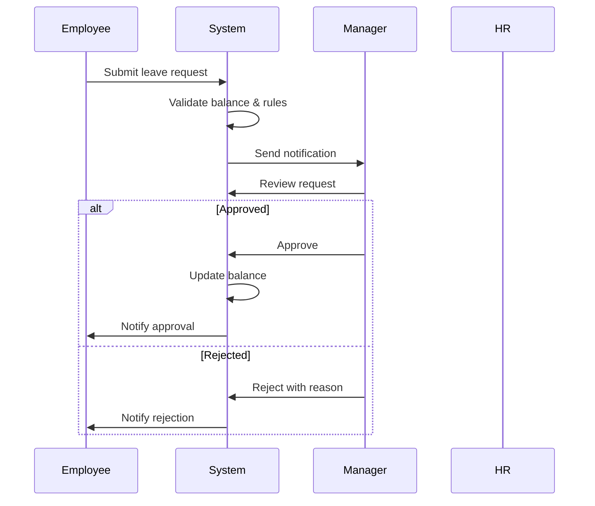
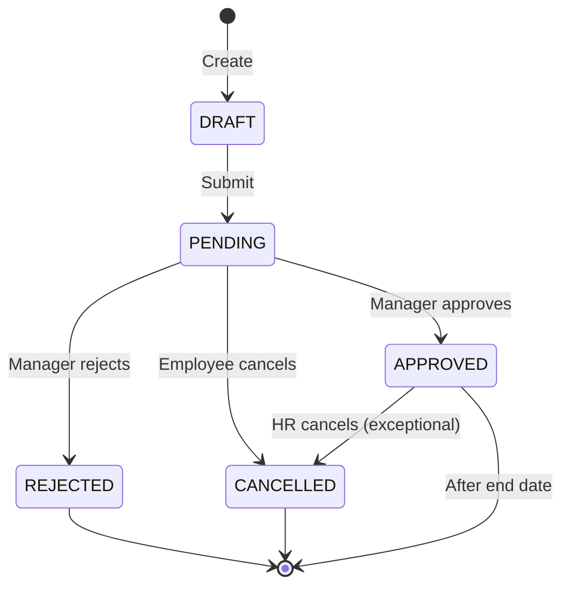
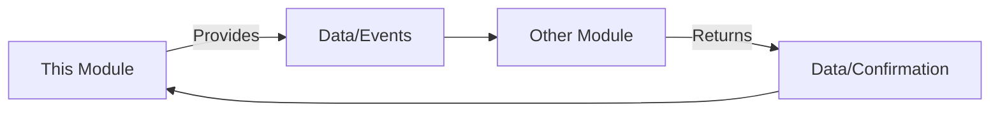

# {Feature/Module Name} - Conceptual Guide

> This document explains HOW the system works at a conceptual level, without diving into technical implementation details.

---

## System Overview

[Provide a high-level explanation of how the system works as a whole.]

**Example**:
> The Leave Management system operates as a self-service platform where employees initiate leave requests, which flow through an approval workflow based on organizational hierarchy. The system maintains real-time balance tracking and enforces policy rules automatically.

---

## Key Workflows

### Workflow 1: {Workflow Name}

#### Overview
[Brief description of what this workflow accomplishes]

#### Actors
- **{Actor 1}**: {Role and responsibilities}
- **{Actor 2}**: {Role and responsibilities}

#### Trigger
[What initiates this workflow?]

#### Steps



**Detailed Steps**:

1. **{Step Name}**
   - What happens: {Description}
   - Who: {Actor}
   - System behavior: {What the system does}
   - Business rules applied: {Rules}

2. **{Step Name}**
   - What happens: {Description}
   - Who: {Actor}
   - System behavior: {What the system does}
   - Business rules applied: {Rules}

#### Decision Points

| Decision | Condition | Outcome |
|----------|-----------|---------|
| Approve/Reject | Manager reviews request | Approved → Update balance<br/>Rejected → No balance change |
| Auto-approve | Request < 1 day AND sick leave | Skip manager approval |

#### Outcomes

- **Success**: {What happens on successful completion}
- **Failure**: {What happens if workflow fails}
- **Partial**: {What happens in edge cases}

#### Variations

**Variation 1: {Name}**
- Condition: {When this variation applies}
- Difference: {How it differs from main flow}

**Example**:
> **Multi-level Approval**: When leave duration > 5 days, requires both direct manager and department head approval.

---

### Workflow 2: {Workflow Name}

[Repeat structure above for each major workflow]

---

## Domain Behaviors

### Behavior 1: {Behavior Name}

**What it does**: {Description}

**When it happens**: {Trigger conditions}

**How it works**:
1. {Step 1}
2. {Step 2}
3. {Step 3}

**Business rules**:
- {Rule 1}
- {Rule 2}

**Example**:
> **Leave Balance Calculation**
> - What: Automatically calculates available leave balance
> - When: After any balance-affecting event (allocation, usage, adjustment)
> - How: Available = Total Allocated - Used - Pending
> - Rules: 
>   - Cannot request more than available balance
>   - Pending requests reduce available balance immediately

---

### Behavior 2: {Behavior Name}

[Repeat structure above]

---

## Entity Interactions

### How {Entity A} and {Entity B} Work Together

[Explain the relationship and interaction between key entities]

**Example**:
> **LeaveRequest and LeaveBalance Interaction**
> 
> When an employee creates a LeaveRequest:
> 1. System checks the employee's LeaveBalance for the requested LeaveType
> 2. Validates that available balance >= requested days
> 3. If valid, creates LeaveRequest with status PENDING
> 4. Updates LeaveBalance: pending += requested days, available -= requested days
> 
> When manager approves:
> 1. LeaveRequest status → APPROVED
> 2. LeaveBalance: used += requested days, pending -= requested days
> 
> When manager rejects:
> 1. LeaveRequest status → REJECTED
> 2. LeaveBalance: pending -= requested days, available += requested days

---

## State Transitions

### {Entity Name} Lifecycle



**State Descriptions**:

| State | Description | Allowed Actions | Next States |
|-------|-------------|-----------------|-------------|
| DRAFT | Employee is composing | Edit, Delete, Submit | PENDING |
| PENDING | Awaiting approval | Cancel, Approve, Reject | APPROVED, REJECTED, CANCELLED |
| APPROVED | Manager approved | View, Cancel (exceptional) | CANCELLED, Completed |
| REJECTED | Manager rejected | View | - |
| CANCELLED | Cancelled by employee/HR | View | - |

---

## Business Rules in Action

### Rule Category 1: {Category Name}

#### Rule 1: {Rule Name}
- **Statement**: {Clear rule statement}
- **Rationale**: {Why this rule exists}
- **Enforcement**: {How/when it's enforced}
- **Example**: {Concrete example}

**Example**:
> **No Overlapping Leave**
> - Statement: An employee cannot have overlapping approved leave requests
> - Rationale: Prevents double-booking and ensures accurate absence tracking
> - Enforcement: System validates date ranges when creating/approving requests
> - Example: If employee has approved leave from Jan 10-15, cannot request Jan 12-17

#### Rule 2: {Rule Name}
[Repeat structure]

---

### Rule Category 2: {Category Name}

[Repeat structure]

---

## Integration Patterns

### Integration with {Other Module/System}

**Purpose**: {Why this integration exists}

**Data Flow**:


**What is shared**:
- {Data type 1}: {Description}
- {Data type 2}: {Description}

**When it happens**: {Trigger conditions}

**Example**:
> **Leave Management → Payroll Integration**
> - Purpose: Provide leave data for payroll deductions
> - Data: Unpaid leave days per employee per pay period
> - When: At payroll period close
> - Flow: Leave system calculates unpaid days → Sends to Payroll → Payroll deducts from salary

---

## Timing and Scheduling

### Scheduled Processes

#### Process 1: {Process Name}
- **Frequency**: {Daily, Weekly, Monthly, etc.}
- **Timing**: {When it runs}
- **Purpose**: {What it does}
- **Steps**: {High-level steps}

**Example**:
> **Annual Leave Allocation**
> - Frequency: Annually
> - Timing: January 1st, 00:00
> - Purpose: Allocate annual leave for all active employees
> - Steps:
>   1. Identify all active employees
>   2. Calculate leave entitlement based on policy
>   3. Create allocation movement
>   4. Update leave balance
>   5. Send notification to employees

---

## Error Handling and Edge Cases

### Common Scenarios

#### Scenario 1: {Scenario Name}
- **Situation**: {What happens}
- **System Response**: {How system handles it}
- **User Experience**: {What user sees/does}
- **Resolution**: {How it's resolved}

**Example**:
> **Insufficient Leave Balance**
> - Situation: Employee requests more days than available
> - System Response: Validation fails, request not created
> - User Experience: Error message showing available vs. requested days
> - Resolution: Employee adjusts request to fit available balance or requests unpaid leave

---

## Notifications and Communications

### Notification Triggers

| Event | Recipient | Message | Timing |
|-------|-----------|---------|--------|
| Leave request submitted | Manager | "New leave request from {employee}" | Immediate |
| Leave request approved | Employee | "Your leave request has been approved" | Immediate |
| Leave request rejected | Employee | "Your leave request was rejected: {reason}" | Immediate |
| Leave balance low | Employee | "You have only {X} days remaining" | When balance < threshold |

---

## Performance and Scale Considerations

### How the System Handles Volume

**Normal Load**:
- {Description of typical usage}

**Peak Load**:
- {Description of peak scenarios}
- {How system handles it}

**Example**:
> **Year-End Leave Rush**
> - Scenario: Many employees request leave in December
> - System behavior: Processes requests in submission order
> - Manager experience: Bulk approval tools available
> - Safeguards: Prevents team from being understaffed (configurable threshold)

---

## Audit and Compliance

### What is Tracked

- **All state changes**: Who, when, what changed
- **Balance movements**: Every credit/debit with reason
- **Approvals**: Approver, timestamp, comments
- **Policy changes**: Effective dates, old vs. new values

### Audit Trail Example

```
LeaveRequest #12345 History:
- 2025-01-10 09:00 | Created by John Doe | Status: DRAFT
- 2025-01-10 09:15 | Submitted by John Doe | Status: PENDING
- 2025-01-10 14:30 | Approved by Jane Manager | Status: APPROVED
  Comment: "Approved. Have a good vacation!"
- 2025-01-15 08:00 | System | Leave period started
- 2025-01-20 08:00 | System | Leave period ended, Status: COMPLETED
```

---

## Glossary of Concepts

| Concept | Definition | Example |
|---------|------------|---------|
| **Accrual** | Earning leave over time | Earn 1.67 days per month |
| **Carryover** | Unused leave moved to next period | 5 days from 2024 → 2025 |
| **Encumbrance** | Pending request reducing available balance | Requested 3 days, available reduced immediately |

---

## Real-World Scenarios

### Scenario 1: {Scenario Title}

**Context**: {Background}

**Story**:
> {Narrative description of how the system is used in this scenario}

**Entities Involved**:
- {Entity 1}
- {Entity 2}

**Workflow**:
1. {Step 1}
2. {Step 2}
3. {Step 3}

**Outcome**: {Result}

**Example**:
> **Employee Plans Vacation**
> 
> Context: Sarah wants to take 2 weeks off in July for a family vacation.
> 
> Story:
> Sarah logs into the system and navigates to Leave Management. She sees she has 15 days of annual leave available. She creates a new leave request for July 15-26 (10 working days). The system validates that she has sufficient balance and no conflicts. She submits the request, which goes to her manager, Mike. Mike receives an email notification and reviews the request in the system. He sees the team calendar and notes that no one else is on leave during that period. He approves the request. Sarah receives a notification and sees her available balance is now 5 days. The approved leave appears on her calendar and the team calendar.
> 
> Entities: Employee (Sarah), LeaveRequest, LeaveBalance, Manager (Mike)
> 
> Outcome: Approved leave request, updated balance, calendar entries created

---

## Related Documents

- [Concept Overview](./01-concept-overview.md) - What and why
- [Ontology](../00-ontology/) - Domain entities and rules
- [Specifications](../02-spec/) - Detailed technical specs
- [API Documentation](../04-api/) - API endpoints

---

**Document Version**: 1.0  
**Last Updated**: [Date]  
**Author**: [Name/Team]  
**Reviewers**: [Names]
